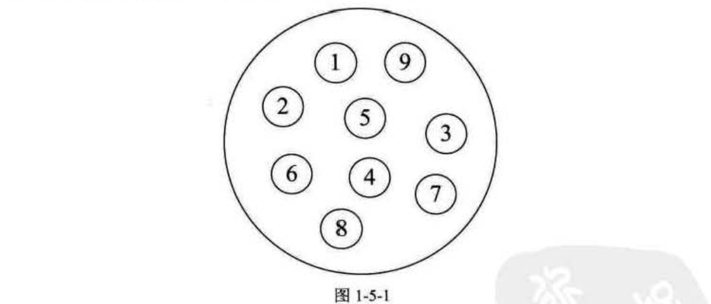
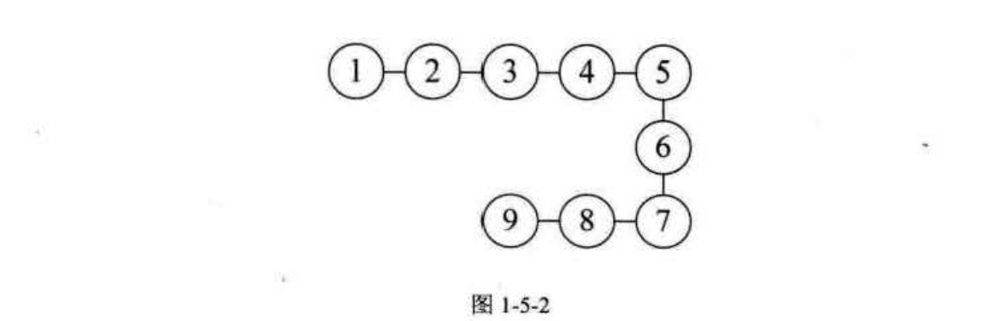
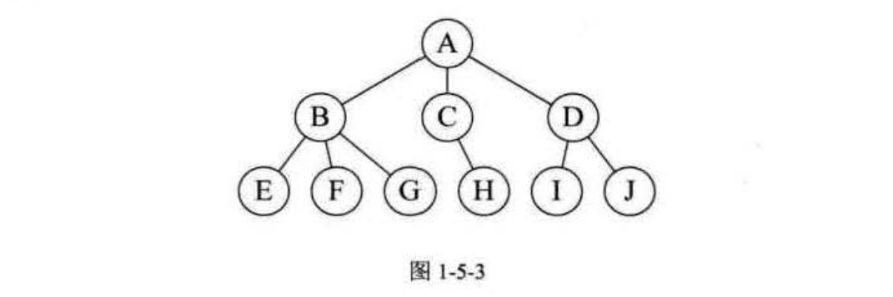
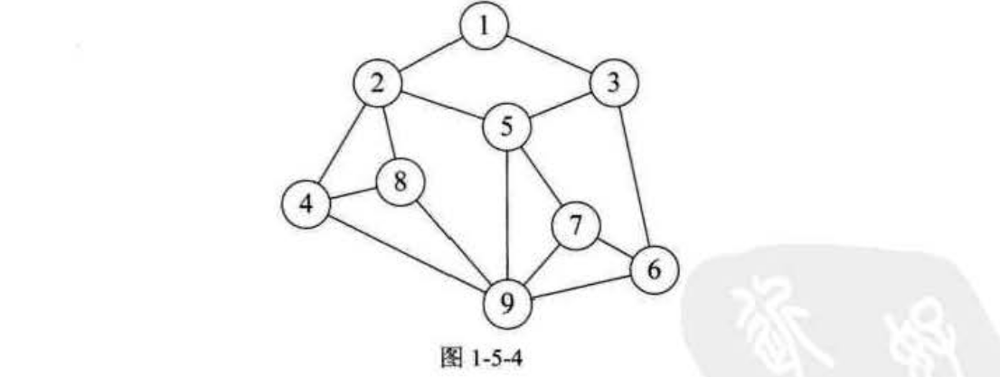
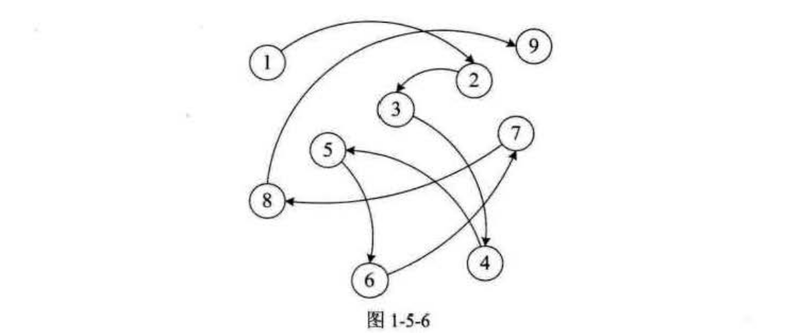

逻辑结构与物理结构
===============================================================
### 逻辑结构
**逻辑结构：是指数据对象中数据元素之间的相互关系**。逻辑结构分为以下四种：

#### 集合结构
**集合结构：集合结构中的数据元素除了同属于一个集合外，它们之间没有其他关系**。各个数据元素是“平等”的，
它们的共同属性是“同属于一个集合”。

#### 线性结构
**线性结构：线性结构中的数据元素之间是一对一的关系。**

#### 树形结构
**树形结构：树形结构中的数据元素之间存在一种一对多的层次关系。**

#### 图形结构
**图形结构：图形结构的数据元素是多对多的关系。**

### 物理结构
说完了逻辑结构，我们再来说说数据的物理结构（或者存储结构）。**物理结构：是指数据的逻辑结构在计算机中的存储形式**。
根据物理结构的定义，实际上就是如何把数据元素存储到计算机的存储器中。

数据元素的存储结构形式有两种：**顺序存储** 和 **链式存储**。

#### 顺序存储结构
**顺序存储结构：是把数据元素存放在地址连续的存储单元里，其数据间的逻辑关系和物理关系是一致的。**

这种存储结构其实很简单，说白了，就是排队占位。大家都按顺序排好，每个人占一小段空间，大家谁也别插谁的队，
**数组就是这样的顺序存储结构**。

#### 链式存储结构
如果就是这么简单和有规律，一切就好办了。可实际上，总会有人插队，也会有人要上厕所，有人会放弃排队。
所以这个队伍当中会添加新成员，也有可能会去掉老元素，整个结构时刻都处于变化中。显然，面对这样时常要
变化的结构，顺序存储是不科学的，那怎么办呢？

现在如银行，医院等地方，设置了排队系统，也就是每个人去了，先领一个号，等着叫号，叫到时去办理业务或看病。
在等待的时候，你爱在哪在哪，可以坐着，站着或者走动。你关注的是前一个号有没有被叫到，叫到了，下一个就轮
到了。

**链式存储结构：是把数据元素存放在任意的存储单元里，这组存储单元可以是连续的，也可以是不连续的。
数据元素的存储关系并不能反映其逻辑关系，因此需要用一个指针存放数据元素的地址，这样通过地址就可以找到
相关联数据元素的位置**。

显然，链式存储就灵活多了，数据存在哪里不重要，只要有一个指针存放了相应的地址就能找到它了。

**逻辑结构是面向问题的，而物理结构就是面向计算机的，其基本的目标就是将数据及其逻辑关系存储到计算机的内存中**。
