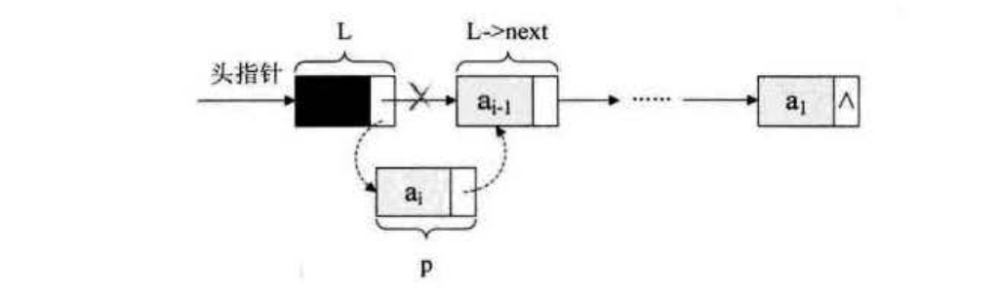

单链表的整表创建
==========================================================
顺序存储结构的创建，其实就是一个数组的初始化，即声明一个类型和大小的数组并赋值的过程。而单链表和顺序存储结构就不一样，
它不像顺序存储结构这么集中，它可以很散，是一种 **动态结构**。对于每个链表来说，**它所占用空间的大小和位置是不需要预先分配划定的，
可以根据系统的情况和实际的需求即时生成。所以创建单链表的过程就是一个动态生成链表的过程。即从"空表"的初始状态起，
依次建立各元素结点，并逐个插入链表**。

单链表整表创建的算法思路：
1. 声明一结点`p`和计数器变量`i`；
2. 初始化一空链表`L`；
3. 让`L`的头结点的指针指向`NULL`，即建立一个带头结点的单链表；
4. 循环：
  + 生成一新结点赋值给`p`；
  + 随机生成一数字赋值给`p`的数据域`p->data`；
  + 将`p`插入到头结点与前一新结点之间；

实现代码算法如下：
```c
//随机产生n个元素的值，建立带表头结点的单链线性表L(头插法)
void CreateListHead(LinkList ＊L, int n)
{
    LinkList p;
    int i;
    srand(time(0));                             //初始化随机数种子
    ＊L = (LinkList) malloc(sizeof(Node));
    (＊L) -> next = NULL;                        //先建立一个带头结点的单链表
    for (i = 0; i < n; i++)
    {
        p = (LinkList) malloc(sizeof(Node));    //生成新结点
        p -> data = rand() % 100 + 1;           //随机生成100以内的数字
        p -> next = (＊L) -> next;
        (＊L) -> next = p;                       //插入到表头
    }
}
```
这段算法代码里，我们其实用的是插队的办法，就是始终让新结点在第一的位置。我也可以把这种算法简称为 **头插法**。



可事实上，我们还是可以不这样干，为什么不把新结点都放到最后呢？这才是排队时的正常思维，所谓的先来后到。
我们把每次新结点都插在终端结点的后面，这种算法称之为 **尾插法**。

实现代码算法如下：
```c
//随机产生n个元素的值，建立带表头结点的单链线性表L（尾插法）
void CreateListTail(LinkList ＊L, int n)
{
    LinkList p,r;
    int i;
    srand(time(0));                                   //初始化随机数种子
    ＊L = (LinkList)malloc(sizeof(Node));             //为整个线性表
    r = ＊L;                                          //＊r为指向尾部的结点
    for (i=0; i<n; i++)
    {
        p = (Node ＊)malloc(sizeof(Node));            //生成新结点
        p -> data = rand() % 100 + 1;                 //随机生成100以内的数字
        r -> next = p;                                //将表尾终端结点的指针指向新结点
        r = p;                                        //将当前的新结点定义为表尾终端结点
    }
    r -> next = NULL;                                 //表示当前链表结束
}
```
