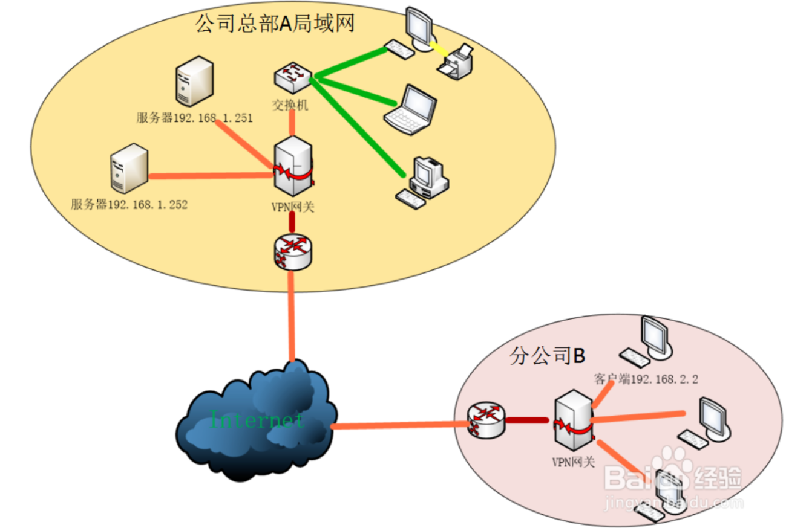
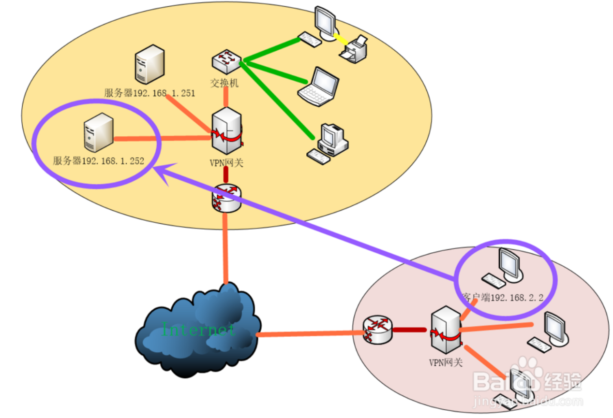
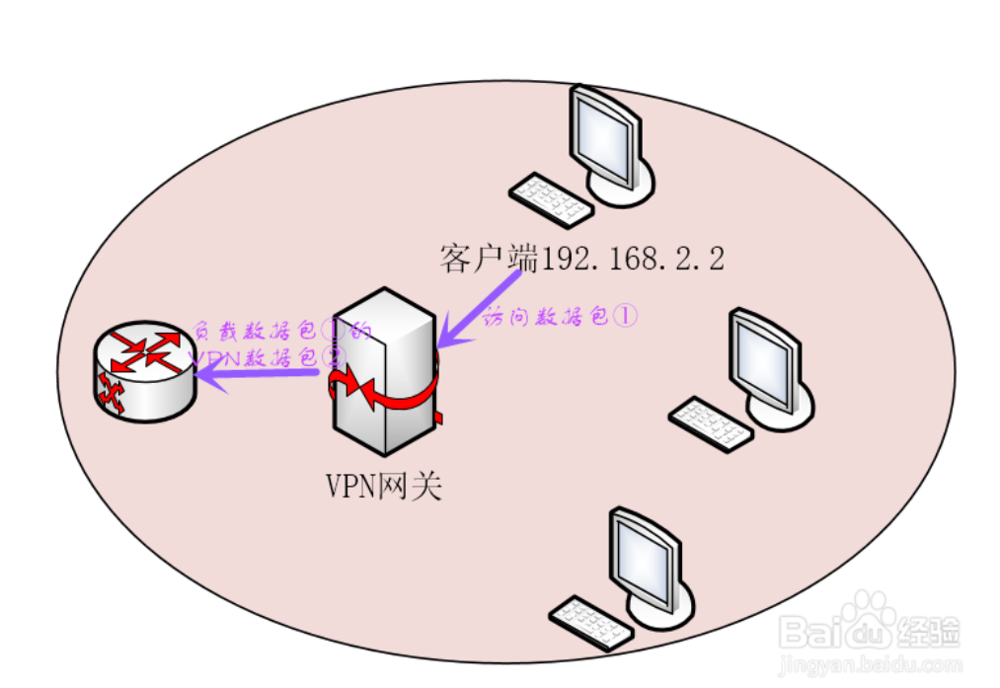
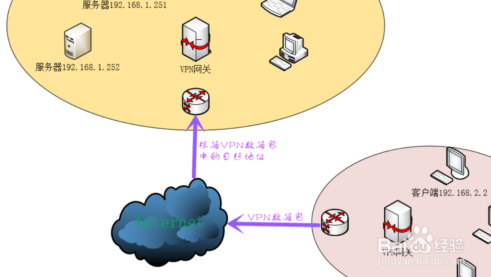
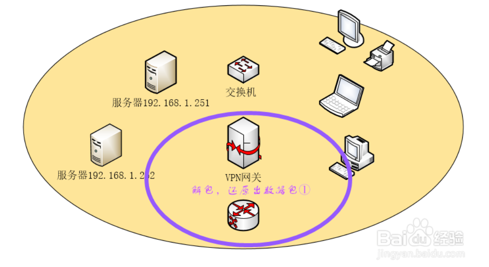
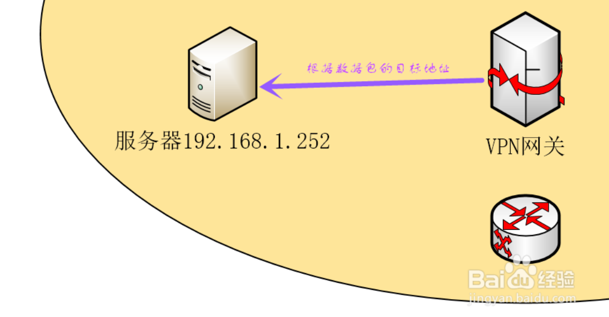

vpn的实现原理
================================================================================
由于公共IP的短缺，我们在组建局域网时，通常使用保留地址作为内部IP，（比如最常用的C类保留地址：
192.168.0.0－192.168.255.255）这些地址是不会被互联网分配的，因此它们在互联网上也无法被路由的，
所以在正常情况下无法直接通过Internet外网访问到在局域网内的主机。为了实现这一目的，需要使用VPN隧
道技术建立一个虚拟专用网络。

比如，一个企业的总部A网络中搭建的ERP系统服务器（假设IP为192.168.1.251），总部的计算机可以通过
内网地址进行直接访问，但在外地的分公司B无法通过Internet外网访问这台服务器的内网地址。那么，分公
司B就只能通过虚拟专用网络接入到总部A的局域网内来访问这台服务器。 

## 实现原理
**1** VPN网关一般会采用 **双网卡结构**，内网卡接入公司总部A的内部局域网络，外网卡使用公共IP接
入Internet。

**2**  比如说分公司B的终端（192.168.2.2）需要访问总部A的服务器（192.168.1.252），其发出的访
问数据包的目标地址为服务器的IP：192.168.1.252。

**3** 分公司B局域网的VPN网关在接收到终端（192.168.2.2）发出的访问数据包①时对其目标地址
（192.168.1.252）进行检查，发现目标地址属于公司总部A网络的地址，于是将该数据包①根据所采用的VPN
技术进行封装，同时VPN网关会构造一个新的VPN数据包②，并将封装后的原数据包①作为VPN数据包②的负载，
VPN数据包的目标地址为公司总部A网络的VPN网关的公共IP地址。

**4** 分公司B局域网的VPN网关将VPN数据包发送到Internet外网中，由于VPN数据包的目标地址是总部A网
络的VPN网关的外部地址，所以该数据包将被Internet中的路由正确地发送到总部A网络的VPN网关。

**5** 总部A网络的VPN网关对接收到的数据包②进行检查，如果发现该数据包是从分公司B网络的VPN网关发
出的，即可判定该数据包为VPN数据包，并对该数据包进行解包。解包的过程主要是将VPN数据包的包头剥离，
将负载通VPN技术反向处理还原成原始的数据包①。

**6** 总部A网络的VPN网关将还原后的原始数据包发送至目标服务器（192.168.1.252）。在服务器
（192.168.1.252）看来，它收到的数据包就跟从终端（192.168.2.2）直接发过来的一样。  

**7** 从服务器（192.168.1.252）返回终端（192.168.2.2）的数据包处理过程与上述过程原理是一样的。
这样就完成了整个通过VPN的访问。
