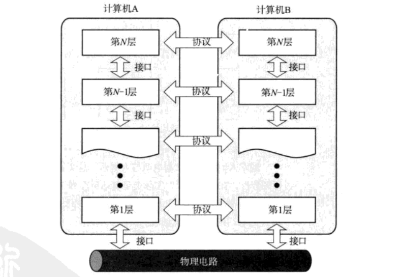
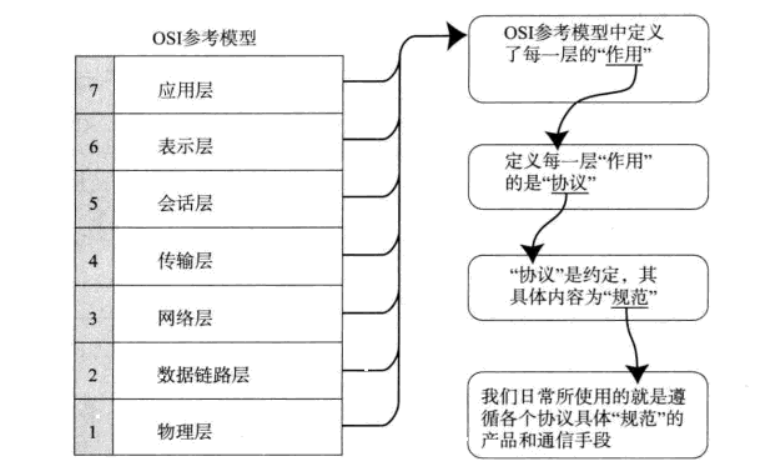
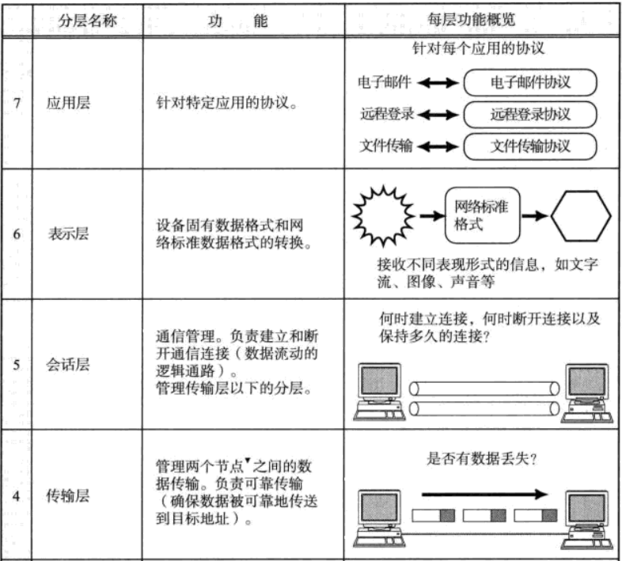
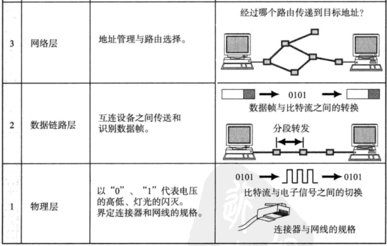

协议分层与OSI参考模型
======================================

### 协议的分层
在这一模型中，每个分层都接收由它下一层所提供的特定服务，并且负责为自己的上一层提供特定的服务。
上下层之间进行交互时所遵循的约定叫 **“接口”**。同一层之间的交互所遵循的约定叫做 **”协议”**。

### OSI参考模型
OSI参考模型将这样一个复杂的协议整理并分为了易于理解的7个分层。

### OSI参考模型中各个分层的作用

+ **应用层：** **为应用程序提供服务** 并规定应用程序中通信相关的细节。包括文件传输，电子邮件，运程登录（虚拟终端）等协议。
+ **表示层：** 将应用处理的信息转换为适合网络传输的格式，或将来自下一层的数据转换为上层能够处理的格式。
因此，它主要负责 **数据格式的转换**。具体来说，就是将设备固有的数据格式转换为网络标准传输格式。不同设备对
同一比特流解释的结果可能会不同。因此，使它们保持一致是这一层的主要作用。
+ **会话层：** **负责建立和断开通信连接**（数据流动的逻辑通路），以及数据的分割等数据传输相关的管理。
+ **传输层：** 起着 **可靠传输** 的作用。只在通信双方节点上进行处理，而无需在路由器上处理。
+ **网络层：** 将数据传输到目标地址。目标地址可以是多个网络通过路由器连接而成的某一个地址。因此这一层
主要 **负责寻址和路由选择**。
+ **数据链路层：** **负责物理层面上互连的节点之间的通信传输**。例如与1个以太网相连的2个节点之间的通信。
+ **物理层：** 负责0，1比特流与电压的高低，光的闪灭之间的互换。
