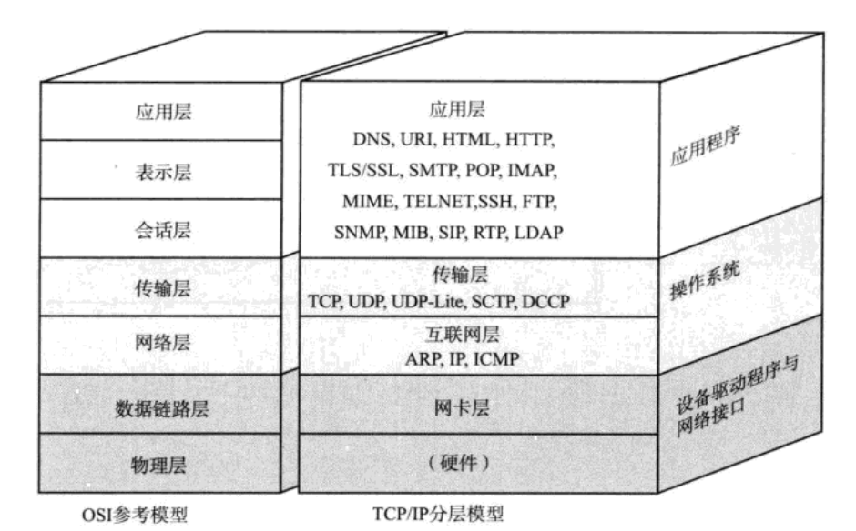

TCP/IP协议分层模型
==============================================================
### TCP/IP与OSI参考模型

### 硬件（物理层）
TCP/IP的最底层是负责数据传输的硬件。这种硬件就 **相当于以太网或电话线路等物理层的设备**。

### 网络接口层（数据链路层）
网络接口层利用以太网中的数据链路层进行通信，因此属于接口层。也就是说，**把它当做让网卡（NIC）起作用的
“驱动程序”也无妨。驱动程序是在操作系统与硬件之间起桥梁作用的软件**。计算机的外围附加设备或扩展卡，
不是直接插到电脑上或电脑的扩展槽上就能马上使用的，还需要有相应驱动程序的支持。例如，换了一个新的NIC网卡，
不仅需要硬件，还需要软件才能真正投入使用。

### 互联网层（网络层）
互联网层IP协议，它相当于OSI模型中的第3层网络层。**IP协议基于IP地址转发分包数据**。

TCP/IP分层中的互联网层与传输层的功能通常由操作系统提供。尤其是路由器，它必须得实现通过互联网层转发分组
数据包的功能。

+ **IP**：IP是跨越网络传送数据包，使整个互联网都能收到数据的协议。IP协议使数据能够发送到地球的另一端，
这期间它使用IP地址作为主机的标识。**虽然IP也是分组交换的一种协议，但是它不具有重发机制**。即使分组数据包
未能到达对端主机也不会重发。因此，**属于非可靠性传输协议**。
+ **ICMP**：**IP数据包在发送途中一旦发生异常导致无法到达对端目标地址时，需要给发送端发送一个发生异常的通知。
ICMP就是为这一功能而制定的**。它有时也被用来诊断网络的健康状况。
+ **ARP**：从分组数据包的 **IP地址中解析出物理地址**（MAC地址）的一种协议。

### 传输层
TCP/IP的传输层有 **两个具有代表性的协议**。该层的功能本身与OSI参考模型中的传输层类似。

**传输层最主要的功能就是能够让应用程序之间实现通信**。计算机内部，通常同一时间运行着多个程序。为此，
必须分清是哪些程序与哪些程序在进行通信。**识别这些应用程序的是端口号**。

+ **TCP**：**TCP是一种面向连接的传输层协议。它可以保证两端通信主机之间的通信可达。TCP能够正确处理在
传输过程中丢包、传输顺序乱掉等异常情况**。此外，TCP还能够有效利用带宽，缓解网络拥堵。然而，**为了建立与断开
连接，有时它需要至少7次的发包收包**，导致网络流量的浪费。此外，为了提高网络的利用率，TCP协议中定义了各种各样
复杂的规范，因此 **不利于视频会议（音频、视频的数据量既定）等场合使用**。
+ **UDP**：UDP有别于TCP，**它是一种面向无连接的传输层协议**。**UDP不会关注对端是否真的收到了传送过去的数据，
如果需要检查对端是否收到分组数据包，或者对端是否连接到网络，则需要在应用程序中实现**。UDP常用于 **分组数据较少
或多播、广播通信以及视频通信等多媒体领域**。

### 应用层（会话层以上的分层）
TCP/IP的分层中，将OSI参考模型中的 **会话层**、**表示层** 和 **应用层** 的功能都集中到了应用程序中实现。
+ **WWW**：WWW可以说是互联网能够如此普及的一个重要原动力。用户在web浏览器上借助鼠标和键盘就可以轻轻松松地
在网上自由地冲浪。浏览器与服务端之间通信所用的协议是HTTP。所传输数据的主要格式是HTML。**WWW中的HTTP属于
OSI应用层的协议，而HTML属于表示层的协议**。
+ **E-Mail**：电子邮件其实就是指在网络上发送信件。有了电子邮件，不管距离多远的人只要连着互联网就可以相互发送
邮件。发送电子邮件时用到的协议叫做 **`SMTP`**。最初，人们只能发送文本格式的电子邮件。然而现在，电子邮件的格式
由 **`MIME`** 协议扩展以后，就可以发送声音、图像等各式各样的信息。**这里提到的`MIME`属于OSI参考模型的第6层
————表示层**。
+ **文件传输协议（FTP）**：文件传输是指将保存在某他计算机硬盘上的文件转移到本地的硬盘上，或者本地硬盘的
文件传送到其他机器硬盘上的意思。该过程使用的协议叫做 **FTP**。FTP很早就已经投入使用，传输过程中可以选择
用 **二进制方式** 还是 **文本方式**。**在FTP中进行文件传输时会建立两个TCP连接，分别是发出传输请求时所要用到的控制连接与
实际传输数据时所要用到的数据连接**。
+ **远程登录（TELNET与SSH）**：远程登录是指登录到远程的计算机上，操作那台计算机。TCP/IP网络中远程登录
常用`TELNET`和`SSH`两种协议。其实还有很多其他可以实现远程登录的协议，这里就不说了。
+ **网络管理（SNMP）**：**在TCP/IP中进行网络管理时，采用`SNMP`协议**。使用SNMP管理的主机、网桥、路由器
等称作 **SNMP代理（Agent）**，而进行管理的那一段叫做 **管理器（Manager）**。SNMP正是这个Manager
与Agent所要用到的协议。在SNMP的代理端，保存着网络接口的信息、通信数据量、异常数据量以及设备温度等信息。
这些信息可以通过 **MIB** 访问。因此，**在TCP/IP的网络管理中，SNMP属于应用协议，MIB属于表示层协议**。
