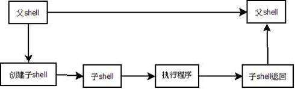

Shell的基本元素
===================================================================================
本节要介绍的是，适用于所有Shell脚本的基本元素。通过以交互的方式使用Shell。

## 1. 命令与参数
**Shell** 最基本的工作就是 **执行命令**。以互动的方式来使用Shell很容易了解这一点，每键入一道命令，
Shell就会执行。像这样：
```shell
$ cd work; ls -l whizprog.c
```
以上的例子展现了UNIX命令行的原理。首先，格式很简单，**以空白（Space键或Tab键）隔开命令行中各个组
成部分**。

其次，**命令名称** 是命令行的第一个项目。通常后面会跟着 **选项**，任何额外的 **参数** 都会放在选项之
后。

第三，**选项的开头是一个破折号（或减号），后面接着一个字母。选项是可有可无的，有可能需要加上参数**
（例如`cc -o whizprog whizprog.c`）。**不需要参数的选项可以合并**：例如，`ls -lt whizprog.c`比
`ls -l -t whizprog.c`更方便（后者当然也可以，只是得多些录入）。

**长选项** 的使用越来越普遍，特别是标准工具的GNU版本，以及在`X Window System`（X11）下使用的程
序。例如：
```shell
$ cd whizprog-1.1 
$ patch --verbose --backup -pl < /tmp/whizprog-1.1-1.2-patch 
```
**长选项的开头是一个破折号还是两个视程序而定**（`< /tmp/whizprog-1.1-1.2-patch`是一个 **`I/O`重定
向）。它会使得patch从`/tmp/whizprog-1.1-1.2-patch`文件而不是从键盘读取输入**。`I/O`重定向也是重要
的基本概念之一，本章稍后会谈到。

**以两个破折号（`--`）来表示选项结尾的用法**，源自`System V`，不过 **已被纳入POSIX标准**。自此之
后命令行上看起来像选项的任何项目，都将一视同仁地当成 **参数** 处理（例如，视为文件名）。

最后要说的是，**分号（`;`）可用来分隔同一行里的多条命令**。Shell会依次执行这些命令。**如果你使用的
是`&`符号而不是分号，则Shell将在后台执行其前面的命令**，这意味着，Shell不用等到该命令完成，就可以
继续执行下一个命令。

Shell识别三种基本命令，**内建命令、Shell函数以及外部命令**：
+ **内建命令** 就是 **由Shell本身所执行的命令**。有些命令是由于其必要性才内建的，例如cd用来改变目录，
read会将来自用户（或文件）的输入数据传给Shell变量。另一种内建命令的存在则是为了效率，其中最典型的就
是test命令，编写脚本时会经常用到它。另外还有I/O命令，例如echo与printf。
+ **Shell函数** 是 **功能健全的一系列程序代码，以Shell语言写成，它们可以像命令那样引用**。稍后会在
6.5节讨论这个部分。此处，我们只需要知道，它们可以引用，就像一般的命令那样。
+ **外部命令** 就是 **由Shell的副本（新的进程）所执行的命令**，基本的过程如下：
    - 建立一个新的进程。此进程即为Shell的一个副本。
    - 在新的进程里，在PATH变量内所列出的目录中，寻找特定的命令。`/bin:/usr/bin:/usr/X11R6/bin:/usr/local/bin`
    为PATH变量典型的默认值。**当命令名称含有斜杠（`/`）符号时，将略过路径查找步骤**。
    - 在新的进程里，以所找到的新程序取代执行中的Shell程序并执行。
    - 程序完成后，最初的Shell会接着从终端读取的下一条命令，或执行脚本里的下一条命令。
    

以上只是基本程序。当然，Shell可以做的事很多，例如变量与通配字符的展开、命令与算术的替换等。

## 2. 变量
变量就是为某个信息片断所起的名字，例如：first_name或driver_lic_no。所有程序语言都会有变量，Shell也
不例外。每个变量都有一个值，这是由你分配给变量的内容或信息。**在Shell的世界里，变量值可以是（而且通
常是）空值。也就是不含任何字符。这是合理的，也是常见的、好用的特性。空值就是null**。

**Shell变量名称的开头是一个字母或下划线符号，后面可以接着任意长度的字母、数字或下划线符号。变量名称
的字符长度并无限制。Shell变量可用来保存字符串值，所能保存的字符数同样没有限制**。例如：
```shell
#分配变量值
$ myvar=this_is_a_long_string_that_does_not_mean_much
#打印变量值
$ echo $myvar
this_is_a_long_string_that_does_not_mean_much
```
**变量赋值的方式为：先写变量名称，紧接着`=`字符，最后是新值，中间完全没有任何空格。当你想取出Shell
变量的值时，需于变量名称前面加上`$`字符。当所赋予的值内含空格时，请加上引号**：
```shell
#单行可进行多次赋值
$ first=isaac middle=bashevis last=singer
#值中包含空格时使用引号
$ fullname="isaac bashevis singer"
#此处不需要引号
$ oldname=$fullname
```
如上例所示，**当变量作为第二个变量的新值时，不需要使用双引号，但是使用双引号也没有关系。不过，当你
将几个变量连接起来时，就需要使用引号**：
```shell
#这里需要双引号
$ fullname="$first $middle $last"
```

## 3. 简单的echo输出
这里要看的是echo命令如何显示myvar变量的值，这是很可能会在命令行里使用到的情况。**echo的任务就是产
生输出，可用来提示用户，或是用来产生数据供进一步处理**。

**原始的echo命令只会将参数打印到标准输出，参数之间以一个空格隔开，并以换行符号（newline）结尾**。
```shell
$ echo Now is the time for all good men
Now is the time for all good men

$ echo to come to the aid of their country.
to come to the aid of their country.
```
不过，随着时间的流逝，有各种版本的echo开发出来。**BSD版本的echo** 看到第一个参数为 **`-n`** 时，
**会省略结尾的换行符号**。例如（下划线符号表示终端画面的光标）：
```shell
$ echo -n "Enter your name: "
```
**System V版本的echo会解释参数里特殊的转义序列**。由于 **很多系统默认以BSD的行为模式来执行echo**，
所以本书只会使用它的最简单形式。比较复杂的输出，我们会使用printf。
```
echo 

语法：
        echo [string ......]
用途：
        产生Shell脚本的输出。
主要选项：
        无
行为模式：
        echo将各个参数打印到标准输出，参数之间以一个空格隔开，并以换行符号结束。它会解释每个字符串里的转义序列。转义序列
        可用来表示特殊字符，以及控制其行为模式。
警告：
        UNIX各版本间互不相同的行为模式使得echo的可移植性变得很困难，不过它仍是最简单的一种输出方式。
        许多版本都支持-n选项。如果有支持，echo的输出会省略最后的换行符号。这适合用来打印提示字符串。不过，目前echo符合
        POSIX标准的版本并未包含此选项。
```

