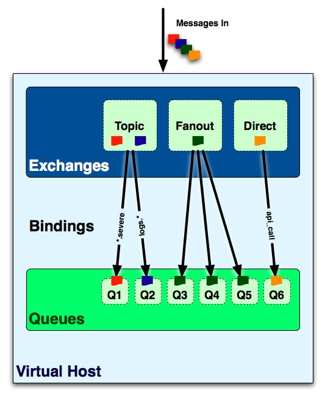

从底部开始构建 ：队列
================================================================================
从概念上来讲：**AMQP消息路由必须有三部分：交换器、队列和绑定。生产者把消息发布到交换器上**；消息最
终到达队列，并被消费者接收；**绑定决定了消息如何从交换器路由到特定的队列**。在研究交换器和绑定之前，
需要先理解队列的概念和工作原理。

消费者通过 **两种方式** 从特定的队列中接收消息：
+ 通过AMQP的 **basic.consume** 命令订阅。这样做 **会将信道置为接收模式**，直到取消对队列的订阅
为止。订阅了消息后，消费者在消费（或者拒绝）最近接收的那条消息后，**就能从队列中（可用的）自动接收下
一条消息**。如果消费者处理队列消息，并且/或者需要 **在消息一到达队列时就自动接收的话，你应该使用
basic.consume**。
+ 某些时候，**你只想从队列获得单条消息而不是持续订阅**。向队列请求单条消息是通过AMQP的 **basic.get**
命令实现的。这样做可以让消费者接收队列中的下一条消息。如果要获得更多消息的话，需要再次发送basic.get
命令。**你不应该将basic.get放在一个循环里来替代basic.consume。因为这样做会影响Rabbit的性能。大致
上讲，basic.get命令会订阅消息，获得单条消息，然后取消订阅。消费者理应始终使用basic.consume来实现高
吞吐量**。

如果至少有一个消费者订阅了队列的话，**消息会立即发送给这些订阅的消费者。但是如果消息到达了无人订阅的
队列呢？在这种情况下，消息会在队列中等待**。一旦有消费者订阅到该队列，那么队列上的消息就会发送给消费
者。

**当有多个消费者订阅到同一队列上时，消息是如何分发的？当Rabbit队列拥有多个消费者时，队列收到的消息将
以循环（round-robin）的方式发送给消费者。每条消息只会发送给一个订阅的消费者**。假设有`seed_bin`队
列，消费者`Farmer Bob`和消费者`Farmer Esmeralda`订阅到`seed_bin`队列。当消息到达`seed_bin`队
列时，消息投递方式如下：
1. 消息`Message_A`到达`seed_bin`队列。
2. `RabbitMQ`把消息`Message_A`发送给`Farmer Bob`。
3. `Farmer Bob`确认接收到了消息`Message_A`。
4. `RabbitMQ`把消息`Message_A`从`seed_bin`中删除。
5. 消息`Message_B`到达`seed_bin`队列。
6. `RabbitMQ`把消息`Message_B`发送给`Farmer Esmeralda`。
7. `Farmer Esmeralda`确认接收到了消息`Message_B`。
8. `RabbitMQ`把消息`Message_B`从`seed_bin`中删除。

**消费者接收到的每一条消息都必须进行确认。消费者必须通过AMQP的basic.ack命令显式地向RabbitMQ发送一
个确认，或者在订阅到队列的时候就将auto_ack参数设置为true。当设置了auto_ack时，一旦消费者接收消息，
RabbitMQ会自动视其确认了消息**。需要记住的是，**消费者对消息的确认和告诉生产者消息已经被接收了这两
件事毫不相关**。因此，**消费者通过确认命令告诉RabbitMQ它已经正确地接收了消息，同时RabbitMQ才能安
全地把消息从队列中删除**。

**如果消费者收到一条消息，然后确认之前从Rabbit断开连接（或者从队列上取消订阅），RabbitMQ会认为这条
消息没有分发，然后重新分发给下一个订阅的消费者**。如果你的应用程序崩溃了，这样做可以确保消息会被发送
给另一个消费者进行处理。

另一方面，**如果应用程序有bug而忘记确认消息的话，Rabbit将不会给该消费者发送更多消息了。这是因为在上
一条消息被确认之前，Rabbit会认为这个消费者并没有准备好接收下一条消息**。你可以好好利用这一点。如果处
理消息内容非常耗时，则你的应用程序可以延迟确认该消息，直到消息处理完成。这样可以防止Rabbit持续不断的
消息涌向你的应用而导致过载。

**在收到消息后，如果你想要明确拒绝而不是确认收到该消息的话，该如何呢？**　举例来说，假设在处理消息的
时候你遇到了不可恢复的错误，但是由于硬件问题，只影响到当前的消费者。**只要消息未确认，则你有以下两个
选择**：
+ **把消费者从RabbitMQ服务器断开连接。这会导致RabbitMQ自动重新把消息入队并发送给另一个消息者**。
这样做的好处是所有的RabbitMQ版本都支持。缺点是，**这样连接/断开连接的方式会额外增加RabbitMQ的负担**。
+ **如果你正使用RabbitMQ2.0.0或者更新的版本，那就使用AMQP的basic.reject命令**。顾名思义：
**basic.reject允许消费者拒绝RabbitMQ发送的消息。如果把reject命令的requeue参数设置成true的话，
RabbitMQ会将消息重新发送给下一个订阅的消费者。如果设置成false的话，RabbitMQ立即会把消息从队列中移
除，而不会把它发送给新的消费者**。你也可以通过对消息确认的方式来简单地忽略该消息（这种忽略消息的方式的
优势在于所有版本的RabbitMQ都支持）。如果你检测到一条格式错误的消息而任何一个消费者都无法处理的时候，
这样做就十分有用。

**注意：当丢弃一条消息时，为什么要使用basic.reject命令，并将requeue参数设置成false来替代确认消息
呢**？在将来的RabbitMQ版本中会支持一个 **特殊的“死信（dead letter）”队列**，用来存放那些被拒绝而
不重入队列的消息。**死信队列让你通过检测拒绝/未送达的消息来发现问题**。如果应用程序想自动从死信队列中
获益的话，需要使用reject命令并将requeue参数设置成false。

**消费者和生产者都能使用AMQP的queue.declare命令来创建队列。但是如果消费者在同一条信道上订阅了另一个
队列的话，就无法再声明队列了。必须首先取消订阅，将信道置为“传输”模式**。

当 **创建** 队列时，你常常想要指定队列名称。消费者 **订阅** 队列时需要队列名称，并在 **创建绑定** 时
也需要指定队列名称。**如果不指定队列名称的话，Rabbit会分配一个随机名称并在queue.declare命令的响应中
返回**。

以下是队列设置中另一些有用的参数：
+ **exclusive**： 如果设置为 **true** 的话，**队列将变成私有的**，此时只有你的应用程序才能够消费队
列消息。**当你想要限制一个队列只有一个消费者的时候很帮助**。
+ **auto-delete**： **当最后一个消费者取消订阅的时候，队列就会自动移除**。如果你需要 **临时队列只为
一个消费者服务** 的话，请结合使用 **auto-delete** 和 **exclusive**。当消费者断开连接时，队列就被
移除了。

**如果尝试声明一个已经存在的队列会发生什么呢？只要声明参数完全匹配现存的队列的话，Rabbit就什么都不做，
并成功返回，就好像这个队列已经创建成功一样（如果参数不匹配的话，队列声明尝试会失败）。如果你只是想检测队
列是否存在，则可以设置queue.declare的passive选项为true。在该设置下，如果队列存在，那么queue.declare
命令会成功返回；如果队列不存在的话，queue.declare命令不会创建队列而会返回一个错误**。

当设计应用程序时，你最有可能会问自己，**是该由生产者还是消费者来创建所需的队列呢？** 看起来最自然的答案
是由消费者来创建队列。毕竟，消费者才需要订阅队列，而且总不能订阅一个不存在的队列，是吧？先别这么快下结论。
**你首先需要想清楚消息的生产者能否承担得起丢失消息。发送出去的消息如果路由到了不存在的队列的话，Rabbit
会忽略它们。因此，如果你不能承担得起消息进入“黑洞”而丢失的话，你的生产者和消费者就都应该尝试去创建队列**。

队列是AMQP消息通信的基础模块：
+ 为消息提供了处所，消息在此等待消费。
+ **对负载均衡来说，队列是绝佳方案。只需附加一堆消费者，并让RabbitMQ以循环的方式均匀地分配发来的消息**。
+ 队列是Rabbit中消息的最后的终点。
