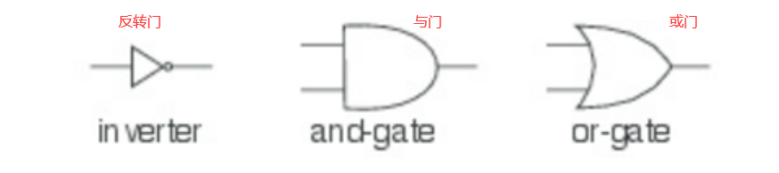

用于描述数字电路的语言
================================================================================
我们从描述数字电路的“小型语言”开始。数字电路由 **线（`wire`）** 和 **功能箱（`function box`）** 
组成。**线负责传递信号，而功能箱对信号进行转换。信号以布尔值表示：true代表信号开启，false代表信
号关闭**。



上图展示了三种基本的功能箱，又称作门（`gate`）：
+ **反转器**（`inverter`），对信号取反。
+ **与门**（`and-gate`），将输出设为输入的逻辑与。
+ **或门**（`or-gate`），将输出设为输入的逻辑或。

这些门已经足以用于构建所有其他功能箱。门有延迟（`delay`），因此门的输出会在其输入变化之后过一段
时间才改变。

我们将用下列 **Scala类和函数** 来描述数字电路的元素。首先，我们有一个 **Wrie类来表示线**。可以
像这样构建线：
```scala
val a = new Wire
val b = new Wire
val c = new Wire 
```
或者这种更简短的写法也能达到同样的目的：
```scala
val a,b,c = new Wire
```

