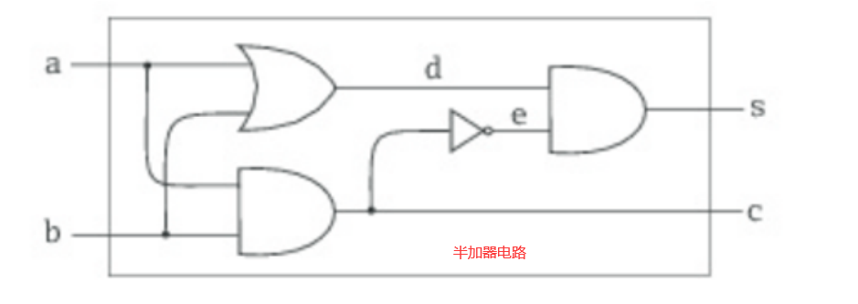
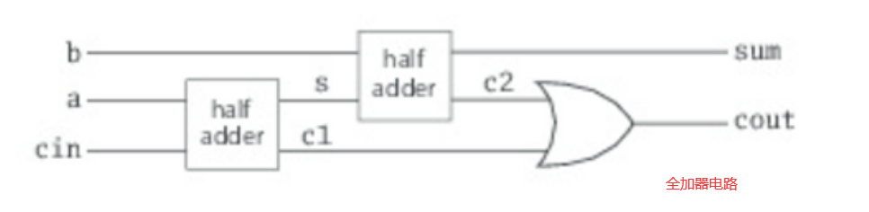

用于描述数字电路的语言
================================================================================
我们从描述数字电路的“小型语言”开始。数字电路由 **线（`wire`）** 和 **功能箱（`function box`）** 
组成。**线负责传递信号，而功能箱对信号进行转换。信号以布尔值表示：true代表信号开启，false代表信
号关闭**。


上图展示了三种基本的功能箱，又称作门（`gate`）：
+ **反转器**（`inverter`），对信号取反。
+ **与门**（`and-gate`），将输出设为输入的逻辑与。
+ **或门**（`or-gate`），将输出设为输入的逻辑或。

这些门已经足以用于构建所有其他功能箱。门有延迟（`delay`），因此门的输出会在其输入变化之后过一段
时间才改变。

我们将用下列 **Scala类和函数** 来描述数字电路的元素。首先，我们有一个 **Wrie类来表示线**。可以
像这样构建线：
```scala
val a = new Wire
val b = new Wire
val c = new Wire 
```
或者这种更简短的写法也能达到同样的目的：
```scala
val a,b,c = new Wire
```
其次，还有一个 **过程（`procedure`）** 可以用来“制作”我们需要的基本的门：
```scala
def inverter(input: Wire, Output: Wire)
def andGate(a1: Wire, a2: Wire, output: Wire)
def orGate(o1: Wire, o2: Wire, Output:Wire)
```
考虑到Scala对于函数式的强调，有个不太寻常的地方是 **这些过程是以副作用的形式构建门**。举例来说，
调用`inverter(a,b)`会在`a`和`b`两条线之间放置一个反转器。我们会发现这种通过副作用进行构建的方
式让我们比较容易逐步构建出复杂的电路。除此之外，尽管方法通常都以动词命名，**这里的方法命名用的是
名词，表示它们构建出来的门，这体现出的是DSL的声明性：它应该描述电路本身，而不是制作线路的行为**。

通过这些基本的门，可以构建出更复杂的功能箱。比如，如下示例：
```scala
def halfAdder(a: Wire, b: Write, s: Write, c: Wire) = {
  val d, e = new Wire
  orGate(a, b, d)
  andGate(a, b, c)
  inverter(c, e)
  andGate(d, e, s)
}
```
这是一个半加器。`halfAdder`方法接收两个输入信号`a`和`b`，产出一个由`s = (a+b) % 2`的和
(`sum`)s，以及一个由`c = (a + b) / 2`定义的进位信号（`carry`）c。



注意，跟那三个构建基本门的方法一样，`halfAdder`也是一个参数化的功能箱。示例：
```scala
def fullAdder(a: Wire, b: Wire, cin: Wire, sum: Wire, cout: Wire) = {
  val s, c1, c2 = new Wire
  halfAdder(a, cin, s, c2)
  halfAdder(b, s, sum, c2)
  orGate(c1, c2, cout)
}
```
该示例定义了一个一字节的全加器。如图：



接收两个输入信号`a`和`b`，以及一个低位进位`cin`，产出一个由`sum = (a + b + cin) % 2`定义的
输出和，以及一个由`cout = (a + b + cin) / 2`定义的高位进位输出信号。

**`Wire`类和`inverter`、`andGate`、`orGate`函数构成了用户来定义数字电路的小型语言。这是内
部（`internal`）DSL的绝佳示例，一个在宿主语言中以类库形式定义的领域特定语言**。


