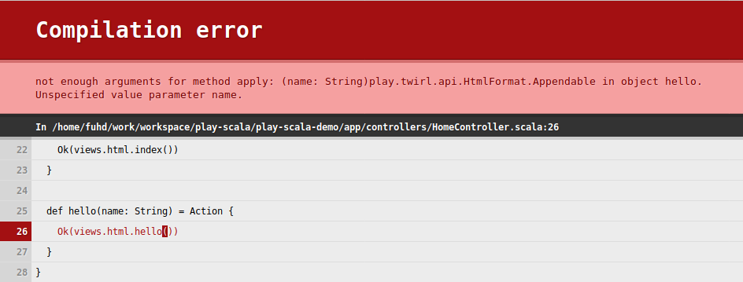

实现Hello World
===================================================================================
## 1.创建Hello World页面
按照以下说明为此项目添加新的Hello World页面。

创建一个名为`hello.scala.html`的文件并将其保存在此项目的`app/views`目录中。将以下内容添加到文件中：
```html
@main("Hello") {
    <section id="top">
        <div class="wrapper">
            <h1>Hello World</h1>
        </div>
    </section>
}
```
此 **Twirl** 和 **HTML** 标记可实现以下功能：
1. 该`@`标志告诉模板引擎解释后面的内容。
2. 在这种情况下，`@main("Hello")`调用主模板`main.scala.html`并传递页面标题"Hello"。
3. 内容部分包含Hello World问候语。主模板会将其插入到页面正文中。

现在我们准备添加一个将呈现新页面的动作方法。

## 2.添加一个操作方法
要为新页面添加操作方法，打开`app/controllers/HomeController..scala`文件。添加以下方法：
```scala
def hello = Action {
  Ok(views.html.hello())
}
```
要让Play在浏览器请求hello页面时调用新的操作方法，我们需要添加一个 **将页面映射到方法的路径**。

## 3.定义路由
要为新的Hello页面定义路由，打开`conf/routes`文件并添加以下行：
```ini
GET     /hello      controllers.HomeController.hello
```
当您向routes文件添加路由时，Play的路由编译器将自动生成一个路由器类，该类使用您的控制器实例来调用该
操作。

您现在可以测试新页面了。如果由于某种原因停止了应用程序，请使用该 **sbt run命令** 重新启动它。输入URL
http://localhost:9000/hello 以查看工作结果。

## 4.自定义问候语
作为本教程的最后一部分，我们将修改hello页面以接受HTTP请求参数。这些步骤包括故意错误，以证明Play如
何提供有用的反馈。要自定义Hello World问候语，请按照以下说明操作。

在`app/controllers/HomeController.scala`文件中，hello使用以下代码修改action方法以接受name参数：
```scala
def hello(name: String) = Action {
  Ok(views.html.hello())
}
```
在`conf/routes`文件中，在hello末尾添加一个参数`(name: String)`：
```ini
GET  /hello        controllers.HomeController.hello(name: String)
```
**在Twirl模板中，必须声明所有变量及其类型**。在`app/views/hello.scala.html`文件中：
1. 在文件顶部插入新行。
2. 在该行上，添加一个 **`@指令`**，该指令声明name参数及其类型：**` @(name: String)`**。
3. 要使用页面上的变量，请将`<h2>`标题中的文本从Hello World更改为`<h2>Hello @name</h2>`。

最终结果将是：
```html
@(name: String)
@main("Hello") {
    <section id="top">
        <div class="wrapper">
            <h1>Hello, @name</h1>
        </div>
    </section>
}
@* #hello-world-page *@
```
在浏览器中，输入以下URL并将任何名称作为查询参数传递给hello方法：http://localhost:9000/hello?name=MyName。
**Play会回应一个有用的编译错误，使您知道返回值中的render方法需要一个类型化的参数**：



要解决编译错误，请修改`hello` action方法，HomeController使其在呈现视图时包括name参数：
```scala
def hello(name: String) = Action {
  Ok(views.html.hello(name))
}
```
保存文件并刷新浏览器。


