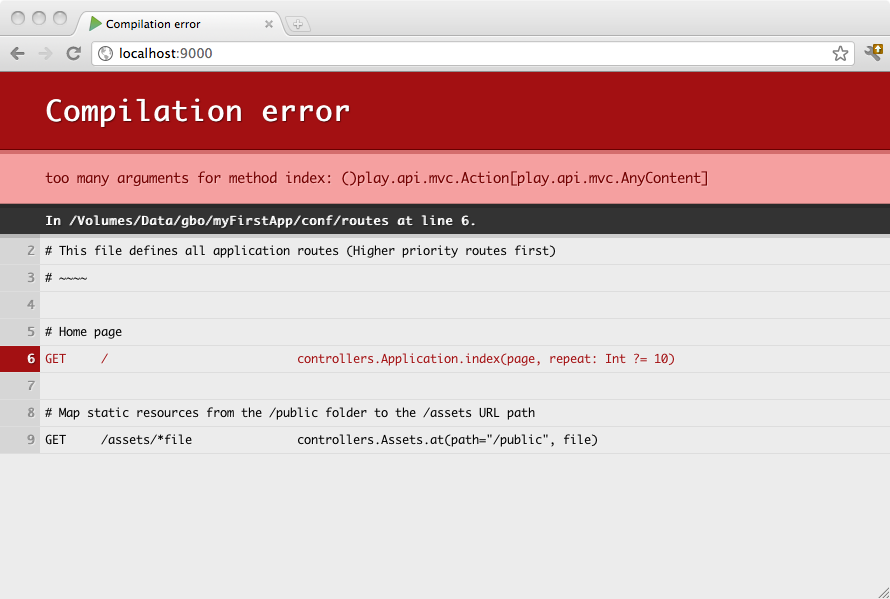

HTTP路由
================================================================================
## 1.内置的HTTP路由器
路由器是负责将每个传入的HTTP请求转换为Action的组件。HTTP请求被MVC框架视为一个事件。本次活动包
含两大信息：
+ 请求路径（例如:`/clients/1542`、`/photos/list`），包括查询字符串。
+ HTTP方法（例如：`GET`、`POST`等）。

路由在编译的`conf/routes`文件中定义。这意味着您将直接在浏览器中看到路由错误：

## 2.依赖注入
Play的默认路由生成器创建了一个路由器类，该类在`@Inject`注释的构造函数中接受控制器实例。 
这意味着该类适用于依赖注入，也可以使用构造函数手动实例化。

**在`Play2.7.0`之前，Play支持静态路由生成器，允许将控制器定义为对象而不是类**。 这不再受支持，
因为Play不再依赖于静态状态。如果您希望使用自己的静态状态，您仍然可以在作为类的控制器中这样做。