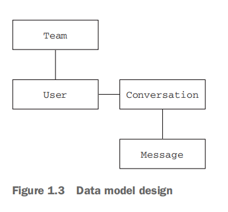
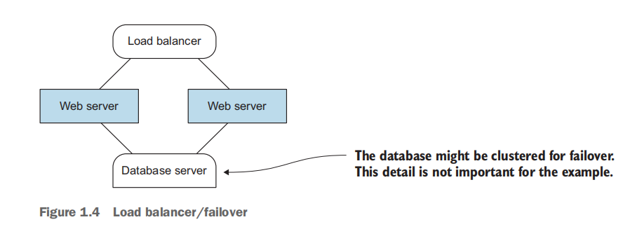

传统扩展
===================================================================================
从单个服务器开始，开发聊天程序的第一个版本，先进行数据模型设计，一开始只是把这些对象保存在内存里。
应用程序只运行在内存中，一旦程序重启，所有数据就会丢失，而且只能运行在一台服务器上。

Team是User的集合，许多User可能是Conversation的一部分，Conversation是消息的集合。

## 1.传统扩展和持久性：一切移入数据库
接下来，我们在应用中引入数据库，并运行两台Web服务器，在Web服务器之前放置负载均衡器。因为不能仅仅
在内存中保存对象了，所以代码将变得更加复杂。如何保证两台服务器上的数据一致性？团队中有的人建议“我
们需要转换成无状态的！”，于是删除了功能丰富的对象，并替换成数据库代码。

对象的状态不再是简单地驻留在Web服务器的内存中了，这也就意味着对象的方法不能直接改变对象的状态，因
此所有逻辑操作都要转换成数据库语句。

这种转换需要把某些对象以数据库访问抽象层代替。在这种情况下，使用DAO感觉有点“复古”。

而很多事情都发生了变化：
+ **不再有以前同样的保证**，例如添加一个Message消息。以前可以保证addMessage方法不会执行失败，因
为它只是对内存中的列表（除非JVM内存不足的特殊情况）进行操作。现在，在任何addMessage方法调用中数
据库都可能返回错误。插入操作可能失败，或者恰好此时数据库服务器宕机，或者由于网络问题导致数据库不可
用。
+ **内存版本中有一种锁，可以保证数据不会被并发用户损坏。而现在使用“数据库X”，必须找到处理这个问题
的方法，以保证不会有重复的记录或不一致的数据**。必须在数据库X的库中找到切实解决这个问题的方法。对任
一对象的简单方法调用，只有这些方法工作协调，才会使每次调用成为一次有效的数据库操作。
+ **内存版本易于测试，且单元测试运行很快**。现在在本地运行数据库X进行测试，需要添加测试工具以隔离
测试。单元测试运行速度慢了很多。

数据库调用本质上就是RPC，几乎所有的标准数据库驱动（如JDBC）使用阻塞式I/O。这正是前面描述的，同时
使用线程和RPC的情况。内存中的线程锁和数据库中保护表记录互斥的锁不是一回事，但必须小心地把它们组合
在一起。这里使用的是一个到两个交织的编程模型。

我们只是第一次重写了这个应用程序，但花费的时间远远超过我们的预期。随着应用程序的扩展，复杂性变得难
以控制，灵活性也很不到保证。

## 2.传统扩展和交互应用：轮询
Web应用服务器使用的资源不多，大部分都用于对请求和响应进行（反）序列化，大部分处理时间都用于数据库，
而Web服务器上的代码大部分时间都在等待数据库驱动的响应。

当有了基本的功能之后，要构建更有交互性的功能。用户已经习惯于Facebook和Twitter，并且希望在团队对话
中提及他们的姓名时能够及时通知他们，以便随时响应。

我们想要构建一个Mention组件来解析所写的每条消息，并将所提到的联系人添加到通知表中，通知表从Web应
用程序中轮询以通知所提及的用户。

把数据库代码直接引入应用程序，又不想因此拖慢会话的速度，因此在程序中添加了消息队列。每条消息异步地
发送到队列中，一个独立的进程从队列接收消息，查找用户并在通知表中写入一条记录。

数据库在这里成了瓶颈，我们发现数据库自动轮询和Mention组件一同工作将导致数据库相关的性能问题。不仅
是复杂性再度增加，而且添加新的交互功能也越来越困难。数据库轮询对于此类应用程序而言并不是一个好办法，
但没有更好的选择，因为所有的逻辑都在DAO中，而数据库X却不会向Web服务器主动“推送”。

## 3.传统扩展和交互应用：Web服务
用户开始反馈，他们喜欢查找联系人时能有智能提示（当用户输入联系人的部分名字时，系统可以给出提示），
并自动接收团队建议和基于最近E-mail会话的内容。我们构建了TeanFinder对象调用外部的Web服务，如Google
的Contacts API和微软的Outlook.com API，并且构建了Web服务客户端。，实现查找联系人操作。

我们发现其中一个服务经常失败，并且在最坏的情况下——经常超时，或者由于网络拥塞每分钟只能接收几个字
节。因为Web服务是一个接一个的访问的，然后等待响应。即使许多有效的建议通过工作正常的服务传递给客户，
但查找时间很长也是失败的。

更糟糕的是，虽然我们把数据库操作封装在DAO中，并把联系人查找封装在TeamFinder对象中，但控制器却像
调用其他对象一样调用它们。这就意味着，有时用户的查找可能在两次数据操作之间执行失败，但却占有数据库
连接，时间超过我们的预期，严重损害了数据库资源的利用率。如果TeanFinder执行失败，则程序中同一流程中
的其他部分也会失败。控制器将抛出异常并无法继续执行。我们怎样才能把TeamFinder从其他代码中安全分离
出来呢？

是时候进行另一次改写了，这看起来不会增加复杂性，事实上，我们正在使用以下4种编程方式：在内存中使用
线程，数据库操作，Mention消息队列，联系人Web服务。

