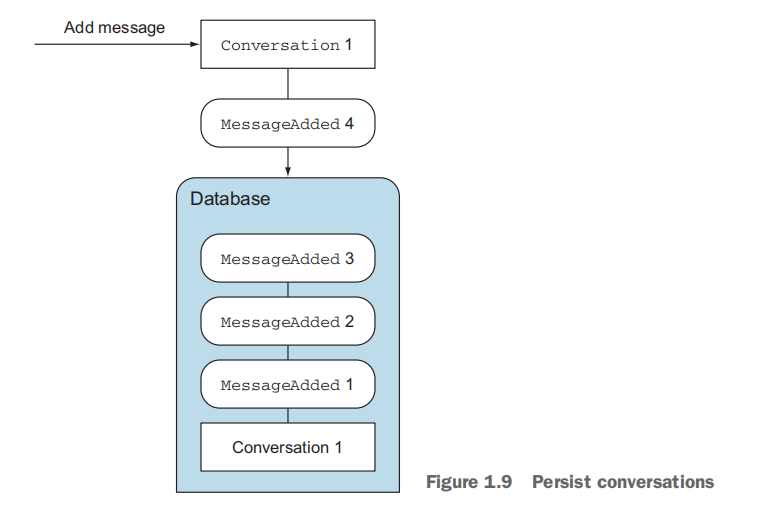
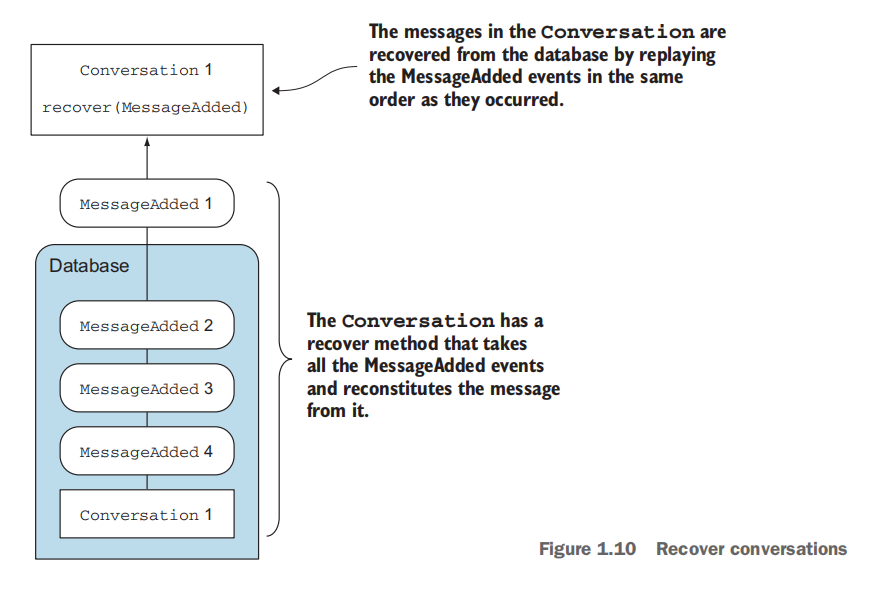

用Akka进行扩展
===================================================================================
下面来看看是否有可能只使用Actor来满足应用程序的扩展需求。我们将轮番使用对象和Actor，并集中说明这种
方法与传统方法的不同。

下表展示了这两种方法的异同：

| 目标 | 传统方法 | Akka方式（Actor）|
|:-------|:-----------|:-------------------------|
| 即使应用重新启动或崩溃，也要保持会话数据的持久性 | 重写代码，把数据库操作封装到DAO中。把数据库作为一个大的共享互斥状态，程序中所有部分都在数据库中执行创建、更新、插入和查找操作 | 继续使用内存中的状态。所有状态的改变作为消息发送到日志。如果应用重新启动，则只需要重新读取日志。 |
| 提供交互功能（Mention）| 对数据库进行轮询。即使数据没有变化，轮询也会使用很多资源 | 把事件推送到相关的组件。只有当发生重大事件时，才会通知相关的组件，从而减小额外开销。|
| 服务解耦，Mention和聊天功能应该互不干涉 | 添加消息队列进行异步处理 | 无须添加消息队列，Actor定义时就是异步的。没有额外的复杂性；而且是熟悉的发送和接收消息的方式。|
| 当关键服务故障或在任何给定时间超出指定性能参数时，防止整个系统出现故障。| 通过预测所有失败的情况，进行异步处理，防止执行错误。| 消息异步发送：一个消息由于某个组件故障没有得到处理，不会影响其他服务的稳定性。 |

**如果只写一次代码，就可以随意扩展，这将是最好的**。我们应该避免大幅度地修改程序的主要对象。如在
1.4.1节用DAO代替内存中的对象。

首先要解决的挑战是安全地保存会话数据。对数据库直接编码，使我们无法使用单一的内存编码方式。本来非常
简单的方法被数据库的RPC命令所替代，使我们陷入复杂的混合编程方式。**需要寻找另一种方式，既可以保证
不丢失会话，又能保持事情的简单性**。

## 1.用Akka扩展和持久化：发送和接收消息
下面解决Conversation持久化的问题。应用程序对象必须以某种方式保存Conversation。如果应用程序重启，
Conversation至少可以恢复。

上图演示了对于每条内存中的消息Conversation是如何把MessageAdded发送到数据库的。

Conversation在服务器（重新）启动时，可以用这些数据库中的对象进行恢复。如下图：

这个过程是如何工作的，稍后讨论。这里只使用数据库恢复会话中的消息，而无须在数据库中解释任何代码。
**Conversation Actor向日志发送消息，并在启动时接收它们**。我们不需要学习任何新东西，只是发送和接
收消息而已。

### 改变保存为事件序列
