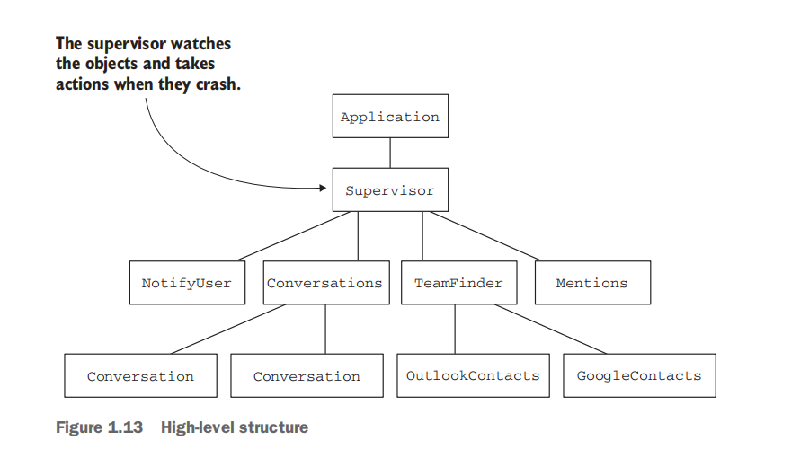

用Akka进行扩展
===================================================================================
下面来看看是否有可能只使用Actor来满足应用程序的扩展需求。我们将轮番使用对象和Actor，并集中说明这种
方法与传统方法的不同。

下表展示了这两种方法的异同：

| 目标 | 传统方法 | Akka方式（Actor）|
|:-------|:-----------|:-------------------------|
| 即使应用重新启动或崩溃，也要保持会话数据的持久性 | 重写代码，把数据库操作封装到DAO中。把数据库作为一个大的共享互斥状态，程序中所有部分都在数据库中执行创建、更新、插入和查找操作 | 继续使用内存中的状态。所有状态的改变作为消息发送到日志。如果应用重新启动，则只需要重新读取日志。 |
| 提供交互功能（Mention）| 对数据库进行轮询。即使数据没有变化，轮询也会使用很多资源 | 把事件推送到相关的组件。只有当发生重大事件时，才会通知相关的组件，从而减小额外开销。|
| 服务解耦，Mention和聊天功能应该互不干涉 | 添加消息队列进行异步处理 | 无须添加消息队列，Actor定义时就是异步的。没有额外的复杂性；而且是熟悉的发送和接收消息的方式。|
| 当关键服务故障或在任何给定时间超出指定性能参数时，防止整个系统出现故障。| 通过预测所有失败的情况，进行异步处理，防止执行错误。| 消息异步发送：一个消息由于某个组件故障没有得到处理，不会影响其他服务的稳定性。 |

**如果只写一次代码，就可以随意扩展，这将是最好的**。我们应该避免大幅度地修改程序的主要对象。如在
1.4.1节用DAO代替内存中的对象。

首先要解决的挑战是安全地保存会话数据。对数据库直接编码，使我们无法使用单一的内存编码方式。本来非常
简单的方法被数据库的RPC命令所替代，使我们陷入复杂的混合编程方式。**需要寻找另一种方式，既可以保证
不丢失会话，又能保持事情的简单性**。

## 1.用Akka扩展和持久化：发送和接收消息
下面解决Conversation持久化的问题。应用程序对象必须以某种方式保存Conversation。如果应用程序重启，
Conversation至少可以恢复。

上图演示了对于每条内存中的消息Conversation是如何把MessageAdded发送到数据库的。

Conversation在服务器（重新）启动时，可以用这些数据库中的对象进行恢复。如下图：

这个过程是如何工作的，稍后讨论。这里只使用数据库恢复会话中的消息，而无须在数据库中解释任何代码。
**Conversation Actor向日志发送消息，并在启动时接收它们**。我们不需要学习任何新东西，只是发送和接
收消息而已。

### 改变保存为事件序列
**所有更改都保存为事件序列，在本例中是MessageAdded事件。Conversation的当前状态可以回放内存中
Conversation发生的事件进行重建，因此它可以在中断的地方继续。这种类型的数据库通常称为日志（journal）,
这种技术常称为事件源（event sourcing）。事件源技术内涵更丰富，现在这种定义就足够了**。

这里需要注意的是，**日志成为统一的服务。它所需要做的就是把所有事件按顺序保存，并且可以按保存的顺序
从日志中取出**。

### 数据扩展：会话分割
下一个问题是把所有东西都保存在一台服务器上。服务器启动，读取所有会话到内存，然后继续操作。传统方法
修改为无状态的主要原因是，很难在多台服务器上保持会话的一致。如果一台服务器上会话太多，会不会也发生
这样的情况呢？

这个问题的解决方案是，**事先预测的方式把会话划分到不同的服务器上，或者跟踪每个会话的原始情况，这称
为分片（sharding）或分区（partitioning）**。下图展示了会话在两台服务器上的划分情况：

**如果有一个通用的事件源日志和表明Conversation如何划分的方式，就可以继续使用简单的内存会话模型**。

## 2.用Akka扩展和交互应用：消息推送
 可以寻找一种方式，**通过向用户的Web浏览器发送消息的方式通知用户发生了重要的改变（事件），而不是为
 每个用户轮询数据库**。

 **应用程序内部也可以发送事件消息作为执行特定任务的信号。当关注的事情发生时，应用程序的每个对象将发送
 一个事件，其他对象决定是否与自己相关并采取相应的行动**，如下图：

 

 事件（以橢圆表示）降低了系统组件之间不希望的耦合。Conversation（会话）只是发布一条添加Message（消
 息）的消息，然后继续工作。**事件通过发布-订阅机制发送，而不是组件之间直接通信**。事件最终到达订阅者，
 这里（指的是Conversation发布添加消息）是Mention组件。再次重申，可以通过简单地发送和接收消息的方式
 对这个问题进行建模。

 ## 用Akka扩展和容错：异步解耦
 即使Mention组件崩溃，用户仍然可以进行会话，这是再好不过了。TeamFinder组件也面临相似的情况：进行的
 会话仍然可以继续。当订阅者，如Mention组件和TeamFinder对象崩溃或重启时，Conversation仍然可以继续
 发布事件。

 NotifyUser组件跟踪连接的Web浏览器，当UserMentioned消息发生时直接发送给浏览器，把应用程序从轮询中
 解脱出来。

 这种事件驱动方法有以下几个优点：
 + 使组件间的相互依赖最小化。会话（Conversation）不知道Mention对象的存在，并且不关心发生了什么事件。
 会话对象在Mention对象崩溃时仍然可以继续工作。
 + 应用程序的组件在时间上是松耦合的。Mention对象接收事件稍晚一些没有关系，只要最终接收到该事件即可。
 + 组件可以在地理位置上解耦。Conversation和Mention对象可以驻留在不同的服务器上，事件只是可以网上传
 播的消息。

 **事件驱动机制解决了Mention对象的轮询问题和TeamFinder的直接耦合问题**。

 ## Akka方式：发送和接收消息
 下面重温一下到现在为止所做的改变：**Conversation现在是内存中有姿态的对象（Actor），保存其内部的状
 态，从事件进行恢复，跨服务器进行划分，发送和接收消息。

 通过消息进行对象间的交互，而不是直接调用对象的方法，这是一种好的设计策略。

 核心需求是消息按顺序发送和接收，每个Actor一次只能接收一条消息。如果一个事件与下一事件有关，则会导
 致不可预料的后果。这就要求Conversation对其他任何组件保持自己消息的私密性。如果其他组件可以与消息进
 行交互，则无法保证消息的顺序。

 我们是在一台服务器上局部发送消息还是向远程其他服务器发送消息都没有关系。如果有必要，需要一些服务负
 责向其他服务器的Actor发送消息。它需要跟踪Actor的位置并可以提供Actor的引用，以便于其他的服务器与Actor
 交互。

 Conversation不需要关心Mention组件发生了什么，但在应用程序的层面上需要知道Mention组件何时工作不正
 常，并向用户报告它暂时离线，其他事情也是这样。因此需要Actor的监视器，并在必要时重启Actor。这种监视
 跨服务器工作与局部工作应该是一样的，因此它也需要发送和接收消息**。应用程序的这种更高层次的结构如下
 图：

 

监视器（supervisor）监视这些组件并在它们崩溃时采取措施。例如，它可决定当Mention组件或TeamFinder不
能工作时是否继续。如果Conversation和NotifyUser完全停止工作，则监视器决定是重新启动还是停止应用程序，
因为这时已经没有继续运行的必要。当组件工作失败时会向监视器发送消息，监视器也可以发送消息给组件使其
停止或尝试重新启动，这是Akka提供的错误恢复策略。

