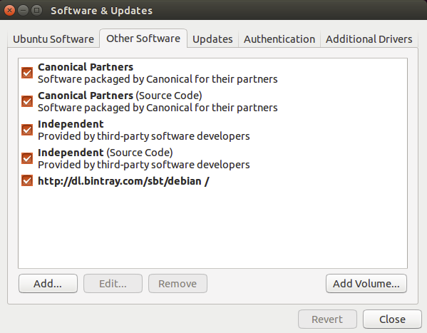

在Ubuntu上安装sbt
===================================================================================
Ubuntu和其他基于Debian的发行版使用DEB格式，但通常你不从本地的DEB文件安装软件。相反，他们由程序
包管理器安装，通过命令行（如`apt-get`，`aptitude`）或图形用户界面 （如Synaptic）。从终端运行下面的
命令安装sbt（**你需要超级用户权限，因此需要`sudo`**）。
```shell
echo "deb https://dl.bintray.com/sbt/debian /" | sudo tee -a /etc/apt/sources.list.d/sbt.list
curl -sL "https://keyserver.ubuntu.com/pks/lookup?op=get&search=0x2EE0EA64E40A89B84B2DF73499E82A75642AC823" | sudo apt-key add
sudo apt-get update
sudo apt-get install sbt
```
> 当前版本sbt 1.3.8 

软件包管理器将检查若干个提供安装软件包的配置存储库。sbt二进制文件发布到`Bintray`，而`Bintray`方便
地提供了APT资源库。你只需要将存储库添加到你的软件包管理器将检查的地方。 一旦安装了sbt，你会能够在
aptitude或Synaptic的包缓存更新后管理了。你也应该能够看到添加的存储库，在底部的
`System Settings -> Software & Updates -> Other Software`：



