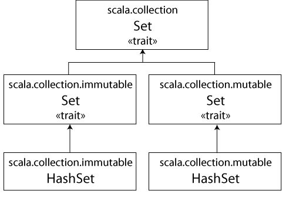
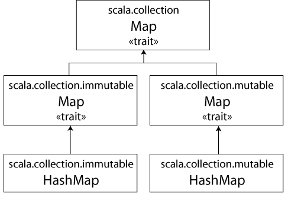

第10步：使用集和映射
================================================================================
由于Scala想让你同时享有 **函数式** 和 **指令式** 编程风格优势，**其集合类库特意对可变和不可变
的集合进行了区分**。举例来说， **数组** 永远是 **可变** 的，**列表** 永远是 **不可变** 的。
Scala同时还提供了 **集（set）** 和 **映射（map）** 的 **可变** 和 **不可变** 的不同选择，
但使用同样的简单名字。**对于集和映射而言，Scala通过不同的类继承关系来区分可变和不可变版本**。

例如，Scala的API包含了一个基础的 **特质（`trait`）** 来表示集，这里的 **特质跟Java的接口定
义类似**（将在第12章了解到更多关于特质的内容）。**在此基础上，Scala提供了两个子特质（subtrait），
一个用于表示可变集，另一个用于表示不可变集**。



从上图中可以看到，这 **三个特质都叫作Set**。不过它们的 **完整名称并不相同**，因为它们分别位于
不同的包。Scala API中具体用于表示集的类，**上图中的HashSet类，分别扩展自可变或不可变的特质
Set**。（在Java中“实现”某个接口，而在Scala中“**扩展**”或者“**混入**”特质）。因此，如果想要
使用一个HashSet，可以根据需要选择可变或不可变的版本。**创建集的默认方式** 如下示例：
```scala
var jetSet = Set("Boeing", "Airbus")
jetSet += "Lear"
println(jetSet.contains("Cessna"))
```
示例中的第一行，定义了一个新的名为jetSet的 **var**，将其初始化成一个包含两个字符串的 **不可变
集**。如这段代码所示，在Scala中可以像创建列表和数组那样创建集：**通过调用Set伴生对象的名为apply
的工厂方法**。示例中，实际上调用了 **scala.collection.immutable.Set** 的 **伴生对象** 的
apply方法，返回一个默认的、不可变的Set的对象。Scala编译器推断出jetSet的类型为不可变的Set[String]。

**要向集添加新元素，可以对集调用+方法**，传入这个新元素。**不论是可变的还是不可变的集，+方法都
会创建并返回一个新的包含了新元素的集。可变集提供了一个实际的+=方法，不可变集并不直接提供这个方法**。

本例第二行，“jetSet += "Lear"”，本质上是如下代码的简写：
```scala
jetset = jetSet + "Lear"
```
因此，在示例的第二行，**实际上是将jetSet这个var重新赋值** 成了一个包含“Boeing”，“Aribus”和
“Lear”的 **新集**。最后一行打印出这个集是否包含“Cessna”。（正如你预期的那样，它将打印false）。

如果你想要的是一个 **可变集**，需要做一次 **引入（import）**，如下示例：
```scala
import scala.collection.mutable
val movieSet = mutable.Set("Hitch", "Poltergeist")
movieSet += "Shrek"
println(movieSet)
```
上面示例的第一行，**引入了可变的Set**。跟Java类似，**import语句让你在代码中使用简单名字，比如
Set**，而不是更长的完整名。这样一来，当你在第二行用到Set的时候，编译器知道你指的是scala.collection.mutable.Set。
在这一行，将movieSet初始化成一个新的包含字符串“Hitch”和“Poltergeist”的新的可变集。接下来的
一行通过调用集的 **+=方法** 将“Shrek”添加到 **可变集** 里。前面我们提到过，**+=实际上是一个
定义在可变集上的方法**。只要你想，也完全可以不用 **movieSet += "Shrek"** 这样的写法，而是写
成 **movieSet.+=(“Shrek”)**。
```
说明：

由于上例中的集是可变的，我们并不需要对movieSet重新赋值，这就是为什么它可以是val。与此相对应的是，上上例中对不可变集使用
+=就需要对jetSet重新赋值，因此它必须是var。
```
尽管由 **可变** 和 **不可变** Set的工厂方法生产出来的 **默认集** 的实现对于大多数情况来说都够
用了，偶尔可能也需要一类 **特定的集**。幸运的是，语法上面并没有大的不同。只需要简单地 **引入你
需要的类**，然后使用其 **伴生对象上的工厂方法** 即可。例如，如果需要一个不可变的HashSet，可以：
```scala
import scala.collection.immutable.HashSet
val hashSet = HashSet("Tomatoes", "Chilies")
println(hashSet + "Coriander")
```

Scala的另一个有用的集合类是 **Map**。跟集类似，Scala也提供了Map的 **可变** 和 **不可变** 的
版本，用类继承关系来区分。



上图所示，**映射（map）的类继承关系跟集的类继承关系很像**。在scala.collection包里有一个基础
的Map特质，还有两个子特质，都叫Map，可变的那个位于scala.collection.mutable，而不可变的那个
位于scala.collection.immutable。

Map的实现，比如上图中的 **HashMap**，扩展自 **可变** 或 **不可变** 的特质。跟数组、列表和集
类似，可以使用 **工厂方法** 来创建和初始化映射。
```scala
import scala.collection.mutable
val treasureMap = mutable.Map[Int, String]()
treasureMap += (1 -> "Go to island.")
treasureMap += (2 -> "Find big X on ground.")
treasureMap += (3 -> "Dig.")
println(treasureMap(2))
```
示例中展示了一个 **可变映射** 的具体例子。在示例的第一行，引入了可变的Map特质。接下来定义了一个
名为treasureMap的 **val**，并初始化成一个 **空** 的，包含整数键和字符串值的可变Map。这个映
射之所以是空的，是 **因为没有向工厂方法传入任何内容**（在代码“Map[Int, String]()”中 **圆括
号是空的**）。在接下来的几行，通过 **->** 和 **+=** 方法向映射添加 **键值对**（key/value pair）。
正如我们前面演示过的，**Scala编译器会将二元的操作，比如`1 -> "Go to island."`，转换成标准的
方法调用，即`(1).->("Go to island.")`**。因此，当你写`1 -> "Go to island."`时，实际上是
对这个值为1的整数调用`->`方法，传入字符串“Go to island.”。**可以在scala的任何对象上调用这个
`->`方法，它将返回包含键和值两个元素的元组**。然后将这个 **元组** 传给treasureMap指向的那个
映射对象的`+=`方法。最后一行将打印出treasureMap中键2对应的值。

运行这段代码，它将打印：
```
Find big X on ground.
```
```
注：

Scala允许对任何对象调用->方法的机制，即隐式转换（impllict conversion），将在21章中介绍。
```
**如果你更倾向于使用不可变的映射，则不需要任何引入，因为默认的映射就是不可变的**，如下示例：
```scala
val romanNumeral = Map(1 -> "I", 2 -> "II", 3 -> "III", 4 -> "IV", 5 -> "V")
println(romanNumeral(4))
```
由于 **没有显式引入**，当你在示例中的第一行提到Map时，得到的是 **默认的那个scala.collection.
immutable.Map**。接下来将五组 **键值元组** 传给映射的工厂方法，返回一个包含了传入的键值对的不
可变Map。如果运行示例将打印出“IV”。
```
说明：

在上上例中，那段显式的类型参数声明“[int,String]”是必需的，因为在没有在工厂方法传入任何值的情况下，编译器无法推断出映射
的类型。与此相反，在上例中，编译器能够根据传入工厂方法的值推断出类型参数，因此并不需要显式地给出类型参数。
```
