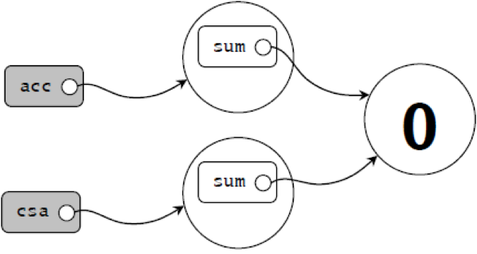
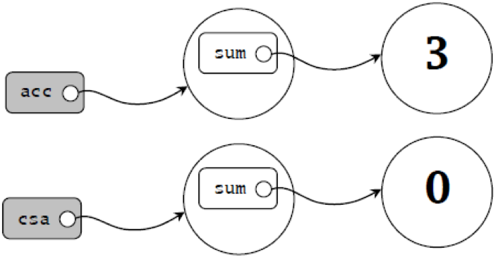

类、字段和方法
================================================================================
**类是对象的蓝本**。一旦你定义好一个类，就可以用 **new关键字** 从这个类蓝本创建对象。例如，有了
下面这个类定义：
```scala
class ChecksumAccumulator {
    //这里是类定义
}
```
就可以用如下代码创建ChecksumAccumulator的对象：
```scala
new ChecksumAccumulator
```
在类定义中，你会填入 **字段（field）** 和 **方法（method）**，这些被统称为 **成员（member）**。
通过 **val** 或 **var** 定义的 **字段** 是指向对象的 **变量**，通过 **def** 定义的 **方法**
则包含了可执行的代码。

例如，如果你定义了一个ChecksumAccumulator类并给它一个名为sum的var字段：
```scala
class ChecksumAccumulator {
    var sum = 0
}
```
然后用如下代码实例化两次：
```scala
val acc = new ChecksumAccumulator
val csa = new ChecksumAccumulator
```
那么内存中这两个对象看上去可能是这个样子的：



由于sum这个定义在ChecksumAccumulator类中的字段是 **var**，而不是val，可以在后续代码中对其重
新赋予不同的Int值。如：
```scala
acc.sum = 3
```
如此一来内存中的对象看上去就如同：



关于这张图需要注意的一点是总共有两个sum变量，一个位于acc指向的对象里，而另一个位于csa指向的对象
里。字段又叫作 **实例变量**（instance variable），**因为每个实例都有自己的变量**。这些实例变
量合在一起，构成了对象在内存中的映像，另一个并不会受到影响。

本例中另一个值得注意的昌 **可以修改acc指向的对象**。尽管acc本身是val，由于acc和csa都是val而不
是var，**你不能做的是将它们重新赋值指向别的对象**。例如，如下代码会报错：
```scala
//不能编译，因为acc是一个val
acc = new ChecksumAccumulator
```
因此，你能够确信的是，**acc永远指向那个你在初始化的时候用的ChecksumAccumulator对象**，但随着
时间推移 **这个对象中包含的字段是有可能改变的**。

追求健壮性的一个重要手段是确保对象的状态（它的实例变量的值）在其整个生命周期都是有效的。**首先是通
过将字段标记为私有（private）来防止外部直接访问字段**。因为私有字段只能被定义在同一个类中的方法访
问，所有对状态的更新操作的代码，都在类的内部。**要将某个字段声明为私有，可以在字段前加上private这
个访问修饰符**，如：
```scala
class ChecksumAccumulator {
    private var sum = 0
}
```
有了ChecksumAccumulator的定义，任何试图通过外部访问sum的操作都会失败：
```scala
val acc = new ChecksumAccumulator
acc.sum = 5   //不能编译，因为sum是私有的
```
```
注意：

在Scala中，使得成员允许公共访问（public）的方式是不在成员前面显式地给出任何访问修饰符。换句话说，对于那些在Java中可能会
用“public”的地方，到了Scala中，什么都不用就对了。公共访问是Scala的默认访问级别。
```
由于sum是私有的，唯一能访问sum的代码都定义在类自己里面。因此，ChecksumAccumulator对于别人来说
没什么用处，除非给它定义一些方法：
```scala
class ChecksumAccumulator {
    private var sum = 0
    def add(b: Byte): Unit = {
        sum += b
    }
    def checksum(): Unit = {
        return ~(sum & 0xFF) + 1
    }
}
```

传递给方法的任何参数都能在方法内部使用。**Scala方法参数的一个重要特征是它们都是val而不是var**。
因此，如果你试图在Scala的方法中对入参重新赋值，编译会报错：
```scala
def add(b: Byte): Unit = {
    b = 1   //不能编译，因为b是val
    sum += b
}
```
虽然当前版本的ChecksumAccumulator中，add和checksum正确地实现了预期的功能，**还可以用更精简
的风格来表达**。首先，checksum方法最后的 **return是多余的**，可以去掉。**在没有任何显式的
return语句时，Scala方法返回的是该方法计算出的最后一个（表达式的）值**。

事实上我们 **推荐的方法风格是避免使用任何显式的return语句**，尤其是多个return语句。与此相反，
**尽量将每个方法当作是一个最终交出某个值的表达式。这样的哲学鼓励你编写短小的方法，将大的方法拆成
小的**。

另一种方法简写的方式是，**当一个方法只会计算一个返回结果的表达式时，可以不写花括号。如果这个表达
式很短，它甚至可以被放置在def的同一行。为了极致精简，还可以省略掉结果类型，Scala会帮你推断出来**。
做出这些修改之后，ChecksumAccumulator类看上去是这个样子的：
```scala
class ChecksumAccumulator {
    private var sum = 0
    def add(b: Byte) = sum += b
    def checksum() = ~(sum & 0xFF) + 1
}
```
虽然Scala能够正确地推断出add和checksum这两个方法的结果类型，**但通常更好的做法是对类中声明为公
有的方法显式地给出结果类型，哪怕编译器可以帮你推断出来**。示例：
```scala
//位于ChecksumAccumulator.scala文件中
class ChecksumAccumulator {
    private var sum = 0
    def add(b: Byte): Unit = sum += b
    def checksum(): Int = ~(sum & 0xFF) + 1
}
```
