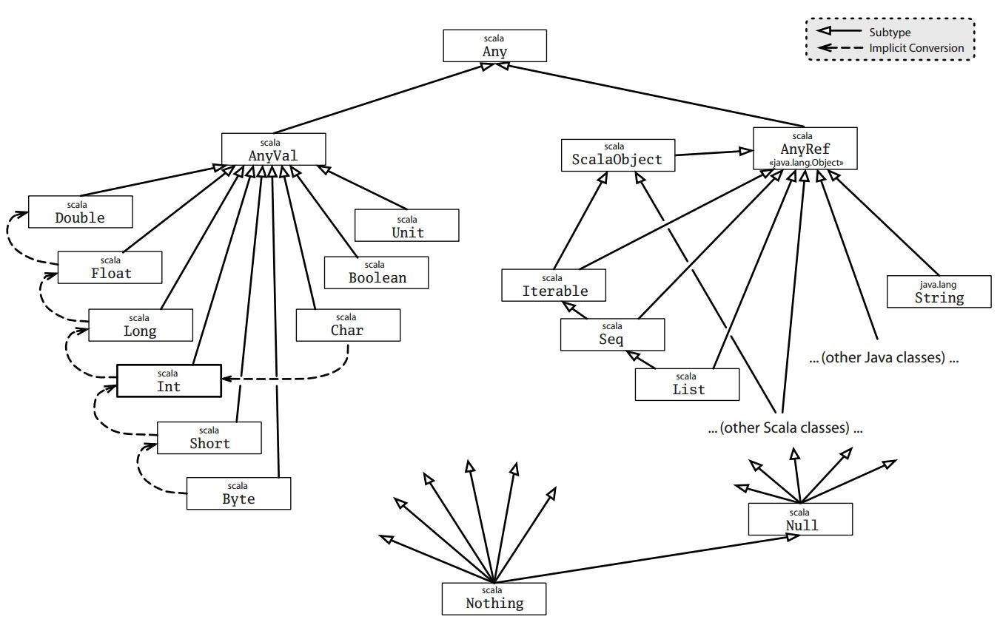

Scala的类继承关系
===================================================================================
在Scala中，每个类都继承自同一个名为 **Any** 的超类。由于每个类都是Any的子类，在Any中定义的方法是
“**全类型的**”（universal）：它们可以在任何对象上被调用。Scala还在 **继承关系的底部** 定义了一些有
趣的类，**Null和Nothing，它们本质上是作为通用的子类存在的。例如，就像Any是每一个其他类的超类那样，
Nothing是每一个其他类的子类**。



上图展示了Scala类继承关系的轮廓。在继承关系的项部是Any类，定义了如下方法：
```scala
final def ==(that: Any): Boolean 
final def !=(that: Any): Boolean 
final equals(that: Any): Boolean 
final ##: Int 
def hashCode: Int 
def toString: String 
```
由于每个类都继承自Any，Scala程序中的每个对象都可以  **用`==`、`!=`或`equals`来进行比较，用`##`或
`hashCode`做哈希，以及用`toString`做格式化**。相等和不等方法（`==`和`!=`）在Any类中声明为final，
所以它们不能被子类重写。

**`==`方法从本质上讲等同于`equals`，而`!=`一定是`equals`的反义。这样一来，子类可以通过重写`equals`
方法来定制`==`或`!=`的含义**。
```
说明：

唯一一个==不直接调用equals的场景是Java的数值类，比Integer或Long。在Java中，new Integer(1)并不等于（equals）new Long(1)，尽管
对于基本类型而言，1 == 1L。由于Scala跟Java相比是个更规则的语言，我们在实现时有必要将这些类的 == 做特殊处理，来解决这个差异。
同理，##方法提供了Scala版本的哈希算法，跟Java的hashCode一样，除了一点：对包装的数值类型而言，它的行为跟==是一致的。例如，
new Integer(1)和new Long(1)通过##能取到相同的哈希值，尽管它们的Java版hashCode是不同的。
```

根类Any有两个子类：**AnyVal** 和 **AnyRef**。**AnyVal是Scala中所有值类（value class）的父类**。虽
然你可以定义自己的值类，**Scala提供了九个内建的值类：Byte、Short、Char、Int、Long、Float、Double、
Boolean和Unit**。前八个对应Java的基本类型，它们的值在运行时是用Java的基本类型的值来表示的。**这些
类的实例在Scala中统统写作字面量。不能用new来创建这些类的实例。这一点是通过将值类定义为抽象的同时是
final的这个“小技巧”来完成的**。

所以如果你尝试编写这样的代码：
```scala
scala> new Int
```
你将得到：
```
<console>:12: error: class Int is abstract; cannot be instantiated
       new Int
       ^
```
**另外的那个值类Unit粗略地对应到Java的void类型；它用来作为那些不返回有趣的结果的方法的结果类型。
Unit有且只有一个实例值，写作：()**。


