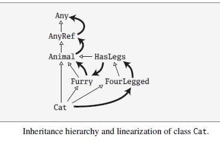

为什么不用多重继承？
===================================================================================
**特质跟许多其他语言中的多重继承有着重大的区别**。其中一个区别尤为重要：**对super的解读。在多重继
承中，super调用的方法在调用发生的地方就已经确定了。而特质中的super调用的方法取决于类和混入该类的特
质的线性化**。正是这个差别让前一节介绍的 **可叠加修改变为可能**。

考虑一下传统多重继承的语言中要如何实现可叠加的修改。其实，多重继承对这类问题并没有好的解决方案。相
比较而言，用Scala特质的解决方案是很直截了当的，只需要简单地混入Incrementing和Doubling，Scala对特质
中super的特殊处理完全达到了预期的效果。这种方案跟传统的多重继承相比，很显然有某种不一样，但是这个区
别究竟是什么呢？

前面我们提示过了，答案是 **线性化**。当你new实例化一个类的时候，**Scala会将类及它所有继承的类和特质
都拿出来，将它们线性地排列在一起。然后，当你在某一个类中调用super时，被调用的方法是这个链条中向上最
近的那一个。如果除了最后一个方法外，所有的方法都调用super，那么最终的结果就是叠加在一起的行为**。

线性化的确切顺序在语言规格说明书里有描述。这个描述有点复杂，不过你需要知道的要点是，**在任何线性化
中，类总是位于所有它的超类和混入的特质之前**。因此，当你写下调用super的方法时，那个方法绝对是在修
改超类和混入特质的行为，而不是反过来。

Scala线性化的主要性质可以用下面的例子来说明：假定你有一个Cat类，这个类继承自超类Animal和两个超特质
Furry和FourLegged，而FourLegged又扩展自另一个特质HasLegs：
```scala
class Animal
trait Furry extends Animal
trait HasLegs extends Animal
trait FourLegged extends HasLegs 
class Cat extends Animal with Furry with FourLegged
```
Cat类的继承关系和线性化如下图：



继承是用传统的UML表示法票房的：**白色的三角箭头表示继承，其中箭头指向的是超类型。黑化的非三角的箭
头表示线性化，其中箭头指向的是super调用的解析方向**。

