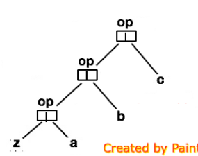
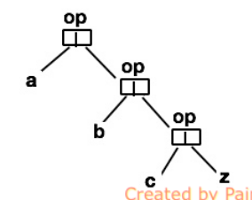

List类的高阶方法
===================================================================================
许多对列表的操作都有相似的结构，有一些模式反复出现。例如：以某种方式对列表中的每个元素做转换，验证
列表中所有元素是否都满足某种性质，从列表元素中提取满足某个指定条件的元素，或用某种操作符来组合列表
中的元素。在Java中，这些模式通常要通过固定写法的for循环或while循环来组装。**而Scala允许我们使用高阶
操作符来更精简、更直接地表达，这些高阶操作是通过List类的方法实现的**。
```
这里所说的高阶操作符指的是用在操作符表示法中的高阶函数。
```

## 1. 对列表作映射：map、flatMap和foreach
**`xs map f`这个操作将类型为`List[T]`的列表xs和类型为`T => U`的函数f作为操作元。它返回一个通过应用f
到xs的每个元素后得到的列表**。例如：
```scala
scala> List(1, 2, 3) map (_ + 1)
res0: List[Int] = List(2, 3, 4)

scala> val wordLi = List("the", "quick", "brown", "fox")
wordLi: List[String] = List(the, quick, brown, fox)

scala> wordLi map (_.length)
res1: List[Int] = List(3, 5, 5, 3)

scala> wordLi map (_.toList.reverse.mkString)
res2: List[String] = List(eht, kciuq, nworb, xof)
```
**flatMap操作符跟map类似，不过它要求右侧的操作元是一个返回元素列表的函数。它将这个函数应用到列表的
每个元素，然后将所有结果拼接起来返回**。下面的例子展示了map和flatMap的区别：
```scala
scala> wordLi map (_.toList)
res3: List[List[Char]] = List(List(t, h, e), List(q, u, i, c, k), List(b, r, o, w, n), List(f, o, x))

scala> wordLi flatMap (_.toList)
res4: List[Char] = List(t, h, e, q, u, i, c, k, b, r, o, w, n, f, o, x)
```
我们可以看到，**map返回的是列表的列表，而flatMap返回的是所有元素拼接起来的单个列表**。

下面这个表达式也体现了map和flatMap的区别与联系，这个表达式构建的是一个满足`1 <= j < i < 5`的所有对偶
`（i, j）`：
```scala
scala> List.range(1, 5) flatMap (i ⇒ List.range(1, i) map (j ⇒ (i, j)))
res5: List[(Int, Int)] = List((2,1), (3,1), (3,2), (4,1), (4,2), (4,3))
```
**`List.range`是一个用来创建某个区间内所有整数的列表的工具方法**。在本例中，我们用到了两次：一次是
生成 **从1（含）到5（不含）的整数列表**，另一次是生成从1到i的整数列表，其中i是来自第一个列表的每个元
素。表达式中的map生成的是一个由元素`(i, j)`组成的列表，其中`j < i`。外围的flatMap对1到5之间的每个i生
成一个列表，并将结果拼接起来。**也可以用for表达式来构建同样的列表**：
```scala
scala> for (i ← List.range(1, 5); j ← List.range(1, i)) yield (i, j)
res6: List[(Int, Int)] = List((2,1), (3,1), (3,2), (4,1), (4,2), (4,3))
```
你将在第23章了解到更多关于for表达式和列表操作的内容。

**第三个映射类的操作是foreach**。不同于map和flatMap，**foreach要求右操作元是一个过程（结果类型为
Unit的函数）。它只是简单地将过程应用到列表中的每个元素。整个操作本身的结果类型也是Unit，并没有列表
类型的结果被组装出来**。参考下面这个精简的将列表中所有数值加和的例子：
```scala
scala> var sum = 0
sum: Int = 0

scala> List(1, 2, 3, 4, 5) foreach (sum += _)
scala> sum 
res8: Int = 15
```

## 2. 过滤列表：filter、partition、find、takeWhile、dropWhile和span
**`xs filter p`这个操作的两个操作元分别是类型为`List[T]`的xs和类型为`T => Boolean`的前提条件函数p。这
个操作将交出xs中所有`p(x)`为true的元素x**。例如：
```scala
scala> List(1, 2, 3, 4, 5) filter (_ % 2 == 0)
res0: List[Int] = List(2, 4)

scala> val wordLi2 = List("the", "quick", "brown", "fox")
wordLi2: List[String] = List(the, quick, brown, fox)

scala> wordLi2 filter (_.length == 3)
res1: List[String] = List(the, fox)
```
**partition方法跟filter很像，不过返回的是一对列表。其中一个包含所有前提条件为true的元素，另一个包含所
有前提条件为false的元素**。参考下面的例子：
```scala
scala> List(1,2,3,4,5) partition (_ % 2 == 0)
res2: (List[Int], List[Int]) = (List(2, 4),List(1, 3, 5))
```
**find方法跟filter也很像，不过它返回满足给定前提条件的第一个元素，而不是所有元素。`xs find p`这个操作
接收列表xs和前提条件函数p两个操作元，返回一个可选值。如果xs中存在一个元素x满足`p(x)`为true，那么就
返回`Some(x)`。而如果对于所有元素而言p都为false，那么则返回None**。来看一些例子：
```scala
scala> List(1, 2, 3, 4, 5) find (_ % 2 == 0)
res3: Option[Int] = Some(2)

scala> List(1, 2, 3, 4, 5) find (_ < 0)
res4: Option[Int] = None
```
**takeWhile和dropWhile操作符也将一个前提条件作为右操作元。`xs takeWhile p`操作返回列表xs中连续满足
p的最长前缀。同理，`xs dropWhile p`操作将去除列表xs中连续满足p的最长前缀**。来看一些例子：
```scala
scala> List(1, 2, 3, -4, 5) takeWhile (_ > 0)
res5: List[Int] = List(1, 2, 3)

scala> wordLi2 dropWhile (_ startsWith "t")
res6: List[String] = List(quick, brown, fox)
```
**span方法将takeWhile和dropWhile两个操作合二为一，就像splitAt将take和drop合二为一一样**。它返回
一堆列表，满足如下等式：
```
xs span p   等于  (xs takeWhile p, xs dropWhile p)
```
跟splitAt一样，**span同样不会重复遍历xs**：
```scala
scala> List(1, 2, 3, -4, 5) span (_ > 0)
res7: (List[Int], List[Int]) = (List(1, 2, 3),List(-4, 5))
```

## 3. 对列表的前提条件检查：forall和exists
**`xs forall p`这个操作接收一个列表xs和一个前提条件p作为入参。如果列表中所有元素都满足p就返回true**。
与此相反，**`xs exists p`操作返回true的要求是xs中存在一个元素满足前提条件p**。例如，要搞清楚一个以
列表的列表表示的矩阵里是否存在一行的元素全为0：
```scala
# 
scala>  def hasZoreRow(m: List[List[Int]]) = m exists (_ forall (_ == 0))
hasZoreRow: (m: List[List[Int]])Boolean

scala> hasZoreRow(List(List(1, 2, 3), List(1, 0, 4), List(0, 0, 0, 0))) 
res0: Boolean = true
```

## 4. 折叠列表：/: 和 :\
```
说明

 /:和:\在新版本中已经废弃，现在用foldLeft与foldRight方法代替。
```
对列表的另一种常见操作是 **用某种操作符合并元素**。例如：
```
sum(List(a, b, c))      等于  0 + a + b + c
```
下面是一个 **折叠操作的特例**：
```scala
scala> def sum1(xs: List[Int]) = (0 /: xs) (_ + _)
sum1: (xs: List[Int])Int

scala> def sum2(xs: List[Int]) = xs.foldLeft(0)(_ + _)
(xs: List[Int])Int
```
同理：
```
product(List(a, b, c))      等于   1 * a * b * c 
```
这也是 **折叠操作的一个特例**：
```scala
scala> def product1(xs: List[Int]) = (1 /: xs) (_ * _)
product1: (xs: List[Int])Int

scala> def product2(xs: List[Int]) = xs.foldLeft(1)(_ * _)
product2: (xs: List[Int])Int
```
**左折叠（`fold left`）操作`(z /: xs)(op)`涉及一个对象：起始值z，列表xs和二元操作op。折叠的结果是以z为
前缀，对列表的元素依次连续应用op**。例如：
```
(z /: List(a, b, c))(op)        等于    op(op(op(z, a), b), c)
```
或者用图形化表示就是：



还有个例子可以说明`/:`的用处。**为了把列表中的字符串表示的单词拼接起来，在当中和最前面加上空格**。
可以：
```scala
scala> strings: List[String] = List(a, b, c)
strings: List[String] = List(a, b, c)

scala> ("" /: strings) (_ + " " + _)
res5: String = " a b c"

scala> strings.foldLeft("")(_ + " " + _)
res6: String = " a b c"
```
这里会在最开始多出一个空格，**要去除这个空格**，可以像下面这样简单改写：
```scala
scala> (strings.head /: strings.tail) (_ + " " + _)
res7: String = a b c

scala> strings.tail.foldLeft(strings.head)(_ + " " + _)
res8: String = a b c
```
**`/:`操作符产生一棵往左靠的操作树（之所以用斜杠`/`也是为了体现这一点）。同理，`:\`这个操作产生一棵
往右靠的操作树**。例如：
```
(List(a, b, c) :\ z)(op)    等于  op(a, op(b, op(c, z)))
```
或者用图形化表示就是：



**`:\`操作符读作右折叠（`fold right`）。它涉及跟左折叠一样的一个操作元，不过前两个出现的顺序是颠倒的：
第一个操作元是要折叠的列表，而第二个操作元是起始值**。

**对结合性的操作而言，左折叠和右折叠是等效的，不过可能存在执行效率的差异**。可以设想一下flatten方法
对应的操作，这个操作是将一个列表的列表中的所有元素拼接起来。可以用 **左折叠** 也可以用 **右折叠** 来
完成：
```scala
//左折叠
scala> def flattenLeft1[T](xss: List[List[T]]) = (List[T]() /: xss) (_ ::: _)
scala> def flattenLeft2[T](xss: List[List[T]]) = xss.foldLeft(List[T]())(_ ::: _)

scala> def flattenRight1[T](xss: List[List[T]]) = (xss :\ List[T]()) (_ ::: _)
scala> def flattenRight2[T](xss: List[List[T]]) = xss.foldRight(List[T]())(_ ::: _)
```
**由于列表拼接`xs ::: ys`的执行时间跟首个入参xs的长度成正比，用右折叠的flattenRight比用左折叠的flattenLeft
更高效。左折叠在这里的问题是`flattenLeft(xss)`需要复制首个元素列表`xss.head` n-1次，其中n 为列表xss的
长度**。

**注意上述两个flatten版本都需要对表示折叠起始值的空列表做类型注解。这是由于Scala类型推断程序的一个局
限，不能自动推断出正确的列表类型**。如果漏掉了类型注解，会得到如下结果：
```scala
scala> def flattenRight3[T](xss: List[List[T]]) = (xss :\ List()) (_ ::: _)

error: type mismatch;
found   : List[T]
required: List[Nothing]
```
要搞清楚为什么类型推断程序出了问题，需要了解折叠方法的类型，以及它们是如何实现的。这个留到16.10节再
探讨。

最后，**虽然`/:`和`:\`操作符的一个优势是斜杠的方向形象地表示出往左或往右靠的树形结构**，同时冒号的
结合性也将起始值放在了表达式中跟树中一样的位置，可能有的人会觉得这并不直观。只要你想，**你也可以用
foldLeft和foldRight这样的方法名，这两个也是定义在List类的方法**。

## 5. 用fold反转列表
在本章前面部分，我们看到了 **reverse方法的实现**，名为rev，**其运行时间是待反转列表长度的平方级**。
现在来看 **一个reverse的不同实现，运行开销是线性的**。原理是基于下面的机制来做 **左折叠**：
```
def reverseLeft[T](xs: List[T]) = (startvalue /: xs)(operation)
```
剩下需要补全的就是 **startvalue（起始值）和operation（操作）** 的部分了。事实上，可以用更简单的例子
来推导出来。为了 **推导** 出startvalue正确的取值，可以用最简单的列表`List()`开始：
```
List()
    等同于（根据reverseLeft的性质）：
reverseLeft(List())
    等同于（根据reverseLeft的模板）：
(起始值 /: List()) (操作)
    等同于（根据 /: 的定义）：
起始值
```
**因此，startvalue必须是`List()`**。要推导出第二个操作元，可以拿 **仅次于`List()`的最小列表作为样例**。
我们已经知道startvalue是`List()`，可以做如下的演算：
```

```


## 6. 列表排序：sortWith


