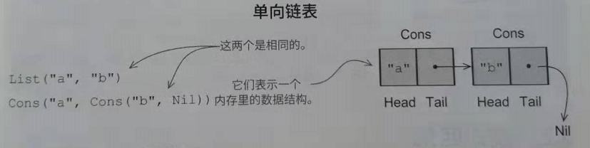

定义函数式数据结构
===================================================================================
**函数式数据结构，只能被纯函数操作**。记住，纯函数一定不能修改原始数据或产生副作用。因此，**函数式
数据结构定义为不可变的**。比如，空列表（在Scala中写为`List()`或`Nil`）如果整数3或4一样是永恒不变的。
执行`3+4`会产生一个新的数值7而不会修改3或4，连接两个list（对a和b两个list可以写为`a ++ b`）产生一个新
的list，对输入的两个list不做改变。

**这是否意味着我们要对数据做很多额外的复制？** 或许会让你吃惊，**答案是否定的**。我们后面再谈为什么
会这样，但首先让我们先检验一下或许是最普遍存在的函数式数据结构：**单向链表**。这里定义在本质上与
Scala标准库中的List数据类型相同，这段代码所引入的新语法和概念我们会通过细节来讨论：
```scala
package fpinscala.datastructures

//List是一个泛型的数据类型，类型参数用A表示
sealed trait List[+A]

//用于表现空List的List数据构造器
case object Nil extends List[Nothing]

//另一个数据构造器,呈现非空List。注意尾部是另一个List[A]，当然这个尾部也可能为Nil或另一个Cons
case class Cons[+A](head: A, tail: List[A]) extends List[A]

//List伴生对象。包含创建List和对List操作的一些函数。
object List {
  //利用模式匹配对一个整数型List进行合计
  def sum(ints: List[Int]): Int = ints match {
    //空列表的累加值为0
    case Nil ⇒ 0
    //对一个头部是x的列表进行累加，这个过程是用x加上该列表剩余部分的累加值
    case Cons(x, xs) ⇒ x + sum(xs)
  }

  def product(ds: List[Double]): Double = ds match {
    case Nil ⇒ 1.0
    case Cons(0.0, _) ⇒ 0.0
    case Cons(x, xs) ⇒ x * product(xs)
  }

  //可变参数（译注：可以是一个或多个该类型的参数）函数语法
  def apply[A](as: A*): List[A] =
    if (as.isEmpty) Nil else Cons(as.head, apply(as.tail: _*))
}
```
先看一下数据类型的定义，以`sealed trait`关键字开头。**通常我们使用trait关键字引入一种数据类型，trait是
一种可以包含一些具体方法（可选）的抽象接口**。这里我们定义了一个没有任何方法的List特质，**前边的sealed
关键字意味着这个特质的所有实现都必须定义在这个文件里**。

**List有两种实现，或者说构造器（每种都由case关键字引入），表示List有两种可能的形式。List如果为空，使
用数据构造器Nil表示，如果非空，使用数据构造器Cons（`Construct`的缩写）表示**。一个非空List由初始元
素head和后续紧跟的也是List结构（可能为空）的tail组成。
```scala
case object Nil extends List[Nothing]
case class Cons[+A](head: A, tail: List[A]) extends List[A]
```



**正如函数可以是多态的，数据类型也可以**。通过在`sealed trait List`之后添加类型参数`[+A]`，然后在Cons
数据构造器内部使用A，我们定义List数据类型所包含的元素类型是多态的，也就意味着对于Int元素（用`List[Int]`
表示）、Double元素（用`List[Double]`表示）、String元素（用`List[String]`表示）等，可以用同样的定义（
**类型参数A前面的`+`表示A是发生协变的**）。

一个数据构造器声明，给我们一个函数来构造那种形式的数据类型。下面是一个例子：
```scala
val ex1: List[Double] = Nil
val ex2: List[Int] = Cons(1, Nil)
val ex3: List[String] = Cons("a", Cons("b", Nil))
```
`case object Nil`让我们用Nil来构造一个空List，`case class Cons`让我们用`Cons(1, Nil)`、
`Cons("a", Cons("b", Nil))`等方式来构造任意长度的单向链表。

```
注释：

Scala对任何case class 或 case object生成默认的def toString: String方法。这以debug很方便。你可以看默认的toString实现。如果你尝试在REPL下用List值使用toString渲染每一个表达式的结果，例如，Cons(1, Nil)将打印字符串"Cons(1, Nil)"，但注意生成的toString方法原生是递归的，如果要打印的List很长，可能会造成栈溢出。所以你可能想提供一个不同的实现。
```

