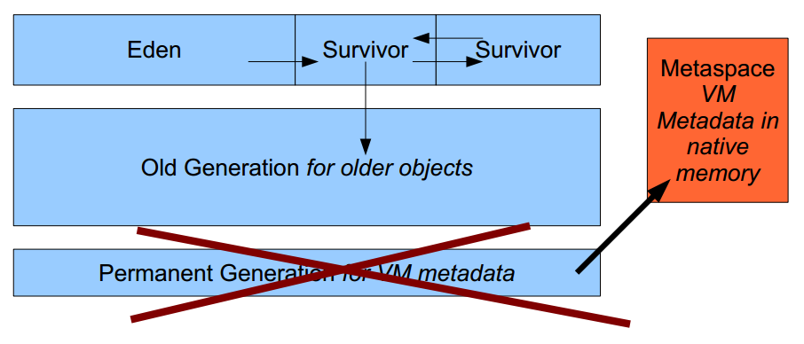

Java8跟OOM：Permgen说再见
========================================================
很多开发者都在其系统中见过“java.lang.OutOfMemoryError: PermGen space”这一问题。
这往往是由类加载器相关的内存泄漏以及新类加载器的创建导致的，**通常出现于代码热部署时**。相对于正式产品，
该问题在开发机上出现的频率更高，在产品中最常见的“问题”是默认值太低了。常用的解决方法是将其设置为256MB或更高。

### PermGen space简单介绍
PermGen space的全称是Permanent Generation space，是指内存的永久保存区域（也就是 **方法区** 或 **永久代**），
说说为什么会内存益出：这一部分用于存放 **Class和Meta的信息**，Class在被Load的时候被放入PermGen space区域，
它和和存放Instance的Heap区域不同，所以如果你的APP会LOAD很多CLASS的话，就很可能出现PermGen space错误。
这种错误常见在web服务器对JSP进行pre compile的时候。

JVM种类有很多，比如Oralce-Sun Hotspot，Oralce JRockit，IBM J9，Taobao JVM（淘宝好样的！）等等。
当然武林盟主是Hotspot了，这个毫无争议。需要注意的是，**PermGen space是Oracle-Sun Hotspot才有**，
JRockit以及J9是没有这个区域。

### 元空间（MetaSpace）：一种新的内存空间诞生
**JDK8 HotSpot JVM移除方法区了**，使用 **本地内存** 来存储 **类元数据信息** 并称之为：**元空间（Metaspace）**；
这与Oracle JRockit和IBM JVM’s很相似，如下图所示：

这意味着不会再有java.lang.OutOfMemoryError: PermGen问题。接下来我们的展示将使你知道仍然要 **关注类元数据内存的占用**。
请一定要牢记，这个 **新特性也不能神奇地消除类和类加载器导致的内存泄漏**。

### PermGen空间的状况
这部分内存空间将全部移除。JVM的参数：**PermSize** 和 **MaxPermSize** 会 **被忽略并给出警告**
（如果在启用时设置了这两个参数）。

### Metaspace内存分配模型
大部分类元数据都在本地内存中分配。用于描述类元数据的“klasses”已经被移除。

### Metaspace容量
**默认情况下，类元数据只受可用的本地内存限制（容量取决于是32位或是64位操作系统的可用虚拟内存大小）。
新参数（MaxMetaspaceSize）用于限制本地内存分配给类元数据的大小**。如果没有指定这个参数，元空间会在运行时根据需要动态调整。

### Metaspace垃圾回收
对于僵死的类及类加载器的垃圾回收将在元数据使用达到“MaxMetaspaceSize”参数的设定值时进行。**适时地监控和调整元空间
对于减小垃圾回收频率和减少延时是很有必要的**。持续的元空间垃圾回收说明，可能存在类、类加载器导致的内存泄漏或是大小设置不合适。

### Java堆内存的影响
一些杂项数据已经移到Java堆空间中。升级到JDK8之后，会发现Java堆空间有所增长。

### Metaspace监控
元空间的使用情况可以从HotSpot1.8的详细GC日志输出中得到。
