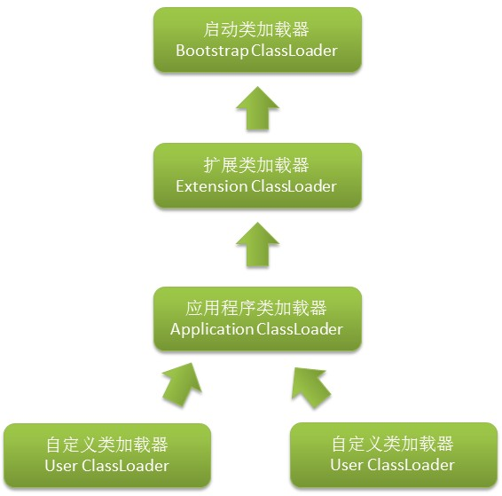

双亲委派模型
================================================================================
**站在Java虚拟机的角度讲**，只存在 **两种不同的类加载器**：一种是 **启动类加载器（`Bootstrap ClassLoader`）**
，这个类加载器使用 **`C++`语言实现** （这只限于`HotSport`），是 **虚拟机自身的一部分**；
另外一种就是 **所有其他的类加载器**，这些类加载器都由 **Java语言实现，独立于虚拟机外部**，并且全都继承
自抽象类 **`java.lang.ClassLoader`**。

**从Java开发人员的角度来看**，类加载器就还可以划分得更细致一些，绝大部分Java程序都会使用到以下 **三种系统
提供的类加载器**：
+ **启动类加载器（`Bootstrap ClassLoader`）**：前面介绍过，这个类加载器负责将存入在 **`<JAVA_HOME>\lib`
目录** 中的，或者被 **`-Xbootclasspath`参数** 所指定的路径中的，**并且是虚拟机识别的** （仅按照文件名识别
，如`rt.jar`，名字不符合的类库即使放在`lib`目录中也不会被加载）类库加载到虚拟机内存中。**启动类加载器无法被
Java程序直接引用**。
+ **扩展类加载器（`Extension ClassLoader`）**：这个加载器由`sun.misc.Launcher$ExtClassLoader`实现，
它负责加载 **`<JAVA_HOME>\lib\ext`目录** 中的，或者被 **`java.ext.dirs`系统变量** 所指定的路径中的所有类库，
**开发者可以直接使用扩展类加载器**。
+ **应用程序类加载器（`Application ClassLoader`）**：这个类加载器由`sun.misc.Launcher$AppClassLoader`
来实现。由于这个类加载器是 **`ClassLoader`中的`getSystemClassLoader()`** 方法的返回值，所以一般也称它为 **系统类加载器**。
**它负责加载用户类路径（`ClassPath`）上所指定的类库，开发者可以直接使用这个类加载器，如果应用程序中没有自定义
过自己的类加载器，一般情况下这个就是程序中默认的类加载器**。

我们的应用程序都是由这三种类加载器互相配合进行加载的，**如果有必要，还可以加入自己定义的类加载器**。
这些类加载器之间的关系一般会如下图：

上图中展示了类加载器之间的层次关系，这种关系称为类加载器的 **双亲委派模型（`Parents Delegation Model`）**。
**双亲委派模型要求除了顶层的启动类加载器外，其余的类加载器都应当有自己的父类加载器。这里类加载器之间的父子关系一般
不会以继承（`Inheritance`）的关系来实现，而是都使用组合（`Composition`）关系来复用父加载器的代码**。

**类加载器的双亲委派模型** 在JDK1.2期间被引入并被广泛应用于之后几乎所有的Java程序中，**但它并不是一个强制性的约束模型，
而是Java设计者们推荐给开发者们的一种类加载器实现方式**。

双亲委派模型的工作过程是：**如果一个类加载器收到了类加载的请求，它首先不会自己去尝试加载这个类，而是把这个请求
委派给父类加载器去完成，每一个层次的类加载器都是如此，因此所有的加载请求最终都应该传送到顶层的启动类加载器中。
只有当父加载器反馈自己无法完成这个加载请求（它的搜索范围中没有找到所需的类）时，子加载器才会尝试自己去加载**。

使用双亲委派模型来组织类加载器之间的关系，有一个显而易见的好处就是Java类随着它的类加载器一起具备了一种带有优先级
的层次关系。**例如类`java.lang.Object`，它存放在`rt.jar`之中，无论哪一个类加载器要加载这个类，最终都是委派给
启动类加载器进行加载，因此`Object`类在程序的各种加载器环境中都是同一个类。相反，如果没有使用双亲委派模型，
由各个类加载器自行去加载的话，如果用户自己写了一个名为`java.lang.Object`的类，并放在程序的`ClassPath`中，
那系统中将会出现多个不同的Object类，Java类型体系中最基础的行为也就无从保证，应用程序也将会变得一片混乱**。

