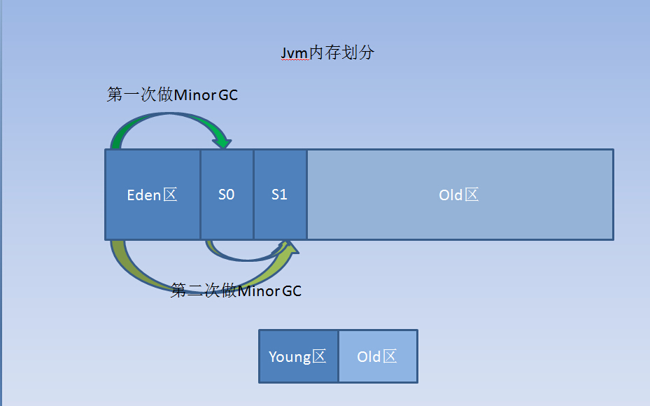

聊聊JVM的年轻代
========================================================
在JVM里的内存空间，从大的层面划分，主要有 **新生代空间（Young）** 和 **老年代空间（Old）**，其中Young空间，
又被分为2个部分和3个板块，分别是 **1个Egen区**，和 **2个Survivor区**，看下图：

下面来具体看下，每部分都是干啥的：
+ **Eden区域** 是用来存放使用new或者newInstance等方式创建的对象，默认都是存放在Eden区，除非这个对象太大，
或者超过了设定的阈值 **-XX:PretenureSizeThresold**，这样的对象会被直接分配到 **Old区域**。
+ 2个 **Survivor（幸存）区**，一般称 **S0**，**S1**，理论上他们是一样大的。解释一下，他们是如何工作的：
在不断创建对象的过程中，Eden区会满，这时候会开始做 **Young GC** 也叫 **Minor GC**。而Young空间的第一次GC就是找出Eden区中
幸存活着的对象，然后将这些对象放到S0或S1区中的其中一个，假设第一次选择了S0。它会逐步将活着的对象拷贝到S0区域，
但是如果S0区域满了，剩下活着的对象只能放old区域了。接下来要做的是将Eden区域清空，此时时候S1区域也是空的。
当第二次Eden区域满的时候，就将Eden区域中活着的对象加上S0区域中活着的对象迁移到S1中。如果S1放不下，就会将剩下的部分，
放到Old区域中，只是这次对象来源区域增加了S0，最后会将Eden区加上S0区域清空。第三次和第四次依次类推，
始终保证S0和S1有一个是空的，用来存储临时对象，用于交换空间的目的。反反复复多次没有被淘汰的对象将会放入old区域中，
默认是15次。具体的交换过程就和上图中的信息相似。

### 对象进入Old区域有什么坏处？
old区域一般称为老年代，老年代与新生代不一样。新生代，我们可以认为存活下来的对象很少，而老年代则相反，
存活下来的对象很多。因为这里面活着的对象非常多，所以发生一次FULL GC来找出所有存活的对象是非常耗时的。
因此，**我们应该尽量避免FULL GC的发生**。

### 一个对象每次Minor Gc时，活着的对象都会在s0和s1区域转移，经过经过Minor GC多少次后，会进入Old区域呢？
**默认是15次**，参数设置 **-XX:MaxTenuringThreshold=15**，计数器会在对象的头部记录它交换的次数！

### 为什么发生FULL GC会带来很大的危害？
在发生FULL GC的时候，意味着JVM会安全的暂停所有正在执行的线程（Stop The World），来回收内存空间。
在这个时间段内，所有除了回收垃圾的线程外，其他有关JAVA的程序，代码都会静止，反映到系统上，就会出现系统响应大幅度变慢，
卡机等状态。
