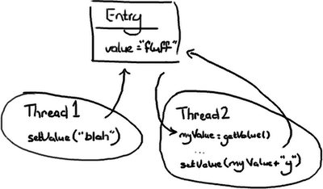
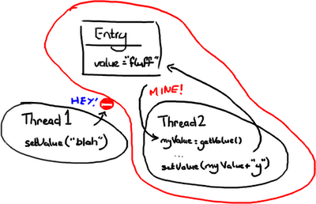
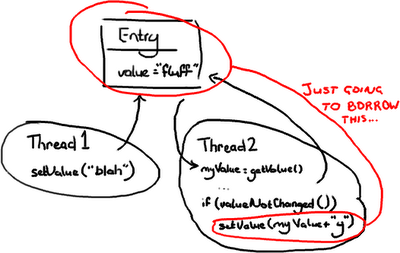
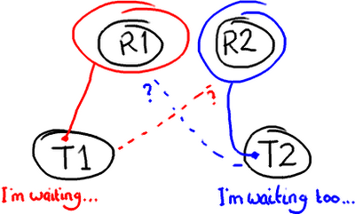
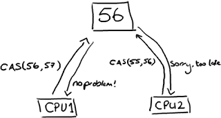
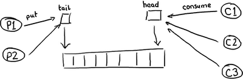
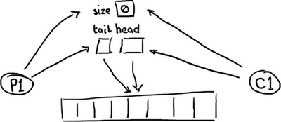
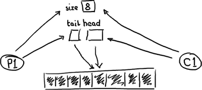

锁的缺点
================================================================================
**Disruptor究竟是什么？**，目前我正准备回答这个问题，但首先回答＂**为什么它会这么快?**＂这些问
题持续出现，但是我不能没有说它是干什么的就说它为什么会这么快，不能没有说它为什么这样做就说它是什么
东西。所以我陷入了一个僵局，一个如何写博客的僵局。要打破这个僵局，我准备以最简单方式回答第一个问题，
如果幸运的话，在以后博文里，如果需要解释的话我会重新提回：**Disruptor提供了一种线程之间信息交换
的方式**。作为一个开发者,因为 **线程** 一词的出现，我的警钟已经敲响，它意味着 **并发**，而并发是
困难的。

## 并发



**想象有两个线程尝试修改同一个变量value**：
+ 情况一：线程1先到达
  1. 变量value的值变为”blah”。
  2. 然后当线程2到达时，变量value的值变为”blahy”。
+ 情况二：线程2先到达
  1. 变量value的值变为”fluffy”。
  2. 然后当线程１到达时，值变为”blah”。
+ 情况三：线程1与线程2交互
  1. 线程2得到值＂fluff＂然后赋给本地变量myValue。
  2. 线程1改变value的值为”blah”。
  3. 然后线程2醒来并把变量value的值改为”fluffy”

**情况三显然是唯一一个是错误的**。其他两种情况主要是看你的意图和想要达到的效果。线程2可能不会关心变
量value的值是什么，主要的意图就是在后面加上字符 ‘y＇而不管它原来的值是什么，**在这种前提下，情况一
和情况二都是正确的**。

但是如果线程2只是想把＂fluff＂改为”fluffy”，**那么情况二和三都不正确**。假定线程2想把值设为”fluffy”,
有几种办法可以解决这个问题：

## 办法一：悲观锁



悲观锁和乐观锁这两个词通常在我们谈论数据库读写时经常会用到，但原理可以应用到在获得一个对象的锁的情况。
只要线程2一获得Entry的互斥锁，它就会阻击其它线程去改变它，然后它就可以随意做它要做的事情，设置值，
然后做其它事情。你可以想象这里非常耗性能的，因为其它线程在系统各处徘徊着准备要获得锁然后又阻塞。线程
越多，系统的响应性就会越慢。

## 办法二：乐观锁



在这种情况，当线程2需要去写Entry时才会去锁定它。它需要检查Entry自从上次读过后是否已经被改过了。如果
线程1在线程2读完后到达并把值改为”blah”，线程2读到了这个新值，线程2不会把＂fluffy＂写到Entry里并把
线程1所写的数据覆盖。线程2会重试（重新读新的值，与旧值比较，如果相等则在变量的值后面附上’y’）,这里在
线程2不会关心新的值是什么的情况。或者线程2会抛出一个异常，或者会返回一个某些字段已更新的标志，这是在期
望把”fluff”改为”fluffy”的情况。举一个第二种情况的例子，如果你和另外一个用户同时更新一个Ｗiki的页面，
你会告诉另外一个用户的线程`Thread2`，它们需要重新加载从`Thread1`来新的变化，然后再提交它们的内容。

## 潜在的问题：死锁
锁定会带来各种各样的问题，比如死锁，想象有２个线程需要访问两个资源：



如果你滥用锁技术，两个锁都在获得锁的情况下尝试去获得另外一个锁，那就是你应该重启你的电脑的时候了。

## 很明确的一个问题：锁技术是慢的
关于锁就是它们需要操作系统去做裁定。线程就像两姐妹在为一个玩具在争吵，然后操作系统就是能决定他们谁能拿
到玩具的父母，就像当你跑向你父亲告诉他你的姐姐在你玩着的时候抢走了你的变形金刚－他还有比你们争吵更大的
事情去担心，他或许在解决你们争吵之前要启动洗碗机并把它摆在洗衣房里。如果你把你的注意力放在锁上，不仅要
花时间来让操作系统来裁定。**Disruptor论文中讲述了我们所做的一个实验。这个测试程序调用了一个函数，该
函数会对一个64位的计数器循环自增5亿次。当单线程无锁时，程序耗时300ms。如果增加一个锁（仍是单线程、没有
竞争、仅仅增加锁），程序需要耗时10000ms，慢了两个数量级。更令人吃惊的是，如果增加一个线程（简单从逻辑
上想，应该比单线程加锁快一倍），耗时224000ms。使用两个线程对计数器自增5亿次比使用无锁单线程慢1000倍。
并发很难而锁的性能糟糕**。我仅仅是揭示了问题的表面，而且，这个例子很简单。但重点是，如果代码在多线程环
境中执行，作为开发者将会遇到更多的困难：
+ 代码没有按设想的顺序执行。上面的场景3表明，如果没有注意到多线程访问和写入相同的数据，事情可能会很糟糕。
+ 减慢系统的速度。场景3中，使用锁保护代码可能导致诸如死锁或者效率问题。

## Disruptor如何解决这些问题
首先，**Disruptor根本就不用锁**。

取而代之的是，在需要 **确保操作是线程安全的**（特别是，在多生产者的环境下，更新下一个可用的序列号）地方，
我们使用 **CAS（Compare And Swap/Set）** 操作。这是一个 **CPU级别的指令**，在我的意识中，它的工作
方式 **有点像乐观锁——CPU去更新一个值，但如果想改的值不再是原来的值，操作就失败，因为很明显，有其它操作
先改变了这个值**。



注意，**这可以是CPU的两个不同的核心，但不会是两个独立的CPU**。

**CAS操作比锁消耗资源少的多，因为它们不牵涉操作系统，它们直接在CPU上操作**。但它们并非没有代价——在上面
的 **试验中，单线程无锁耗时300ms，单线程有锁耗时10000ms，单线程使用CAS耗时5700ms。所以它比使用锁耗时
少，但比不需要考虑竞争的单线程耗时多**。

回到Disruptor，在我讲生产者时讲过ClaimStrategy。在这些代码中，你可以看见两个策略，一个是
**SingleThreadedStrategy（单线程策略）** 另一个是 **MultiThreadedStrategy（多线程策略）**。你
可能会有疑问，**为什么在只有单个生产者时不用多线程的那个策略**？它是否能够处理这种场景？当然可以。但多线
程的那个使用了AtomicLong（Java提供的CAS操作），而单线程的使用long，没有锁也没有CAS。这意味着单线程版
本会非常快，因为它只有一个生产者，不会产生序号上的冲突。

我知道，你可能在想：把一个数字转成AtomicLong不可能是Disruptor速度快的唯一秘密。当然，它不是，否则它不
可能称为“为什么这么快（第一部分）”。

但这是非常重要的一点——**在整个复杂的框架中，只有这一个地方出现多线程竞争修改同一个变量值**。这就是秘密。
还记得所有的访问对象都拥有序号吗？**如果只有一个生产者，那么系统中的每一个序列号只会由一个线程写入。这意
味着没有竞争、不需要锁、甚至不需要CAS。在ClaimStrategy中，如果存在多个生产者，唯一会被多线程竞争写入
的序号就是ClaimStrategy对象里的那个**。

## 回到为什么队列不能胜任这个工作
因此你可能会有疑问，为什么队列底层用 **RingBuffer** 来实现，**仍然在性能上无法与Disruptor相比**。
队列和最简单的ring buffer只有两个指针——一个指向队列的头，一个指向队尾：



**如果有超过一个生产者想要往队列里放东西，尾指针就将成为一个冲突点，因为有多个线程要更新它。如果有多个消
费者，那么头指针就会产生竞争，因为元素被消费之后，需要更新指针，所以不仅有读操作还有写操作了**。

队列的目的就是为生产者和消费者提供一个地方存放要交互的数据，帮助缓冲它们之间传递的消息。这意味着 **缓冲
常常是满的（生产者比消费者快）或者空的（消费者比生产者快）。生产者和消费者能够步调一致的情况非常少见**。

所以，这就是事情的真面目。

**一个空的队列**：



一个满的队列：



```
(校对注：这应该是一个双向队列)
```
队列需要保存一个 **关于大小的变量**，以便区分队列是空还是满。否则，它需要根据队列中的元素的内容来判断，
这样的话，消费一个节点（Entry）后需要 **做一次写入来清除标记，或者标记节点已经被消费过了**。无论采用
何种方式实现，**在头、尾和大小变量上总是会有很多竞争**，或者如果消费操作移除元素时需要使用一个写操作，
那元素本身也包含竞争。基于此，**不仅要担心生产者和消费者同时写size变量（或者元素），还要注意由于头指针
尾指针在同一位置，当头指针更新时，更新尾指针会导致缓存不命中**。这就是我们所说的“**分离竞争点问题**”或
者队列的“**合并竞争点问题**”。通过将所有的东西都赋予 **私有的序列号**，并且 **只允许一个消费者写Entry
对象中的变量来消除竞争，Disruptor唯一需要处理访问冲突的地方，是多个生产者写入Ring Buffer 的场景**。

## 总结
Disruptor相对于传统方式的优点：
+ 没有竞争=没有锁=非常快。
+ 所有访问者都记录自己的序号的实现方式，允许多个生产者与多个消费者共享相同的数据结构。
+ 在每个对象中都能跟踪序列号（ring buffer，claim Strategy，生产者和消费者），加上神奇的
cache line padding，就意味着没有为伪共享和非预期的竞争。
