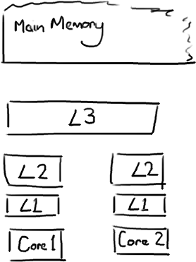
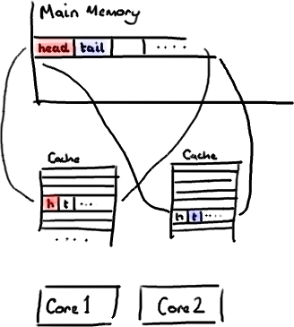
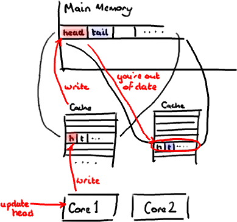

神奇的缓存行填充
================================================================================
## 计算机入门
CPU是你机器的心脏，最终由它来执行所有运算和程序。主内存（RAM）是你的数据（包括代码行）存放的地方。
本文将忽略硬件驱动和网络之类的东西，因为Disruptor的目标是尽可能多的在内存中运行。

**CPU和主内存之间有好几层缓存**，因为即使直接访问主内存也是非常慢的。**如果你正在多次对一块数据做
相同的运算，那么在执行运算的时候把它加载到离CPU很近的地方就有意义了**（比如一个循环计数－你不想每次
循环都跑到主内存去取这个数据来增长它吧）。

**越靠近CPU的缓存越快也越小。所以L1缓存很小但很快(译注：L1表示一级缓存)，并且紧靠着在使用它的CPU内
核。L2大一些，也慢一些，并且仍然只能被一个单独的CPU核使用。L3在现代多核机器中更普遍，仍然更大，更慢，
并且被单个插槽上的所有CPU核共享。最后，你拥有一块主存，由全部插槽上的所有CPU核共享**。

**当CPU执行运算的时候，它先去L1查找所需的数据，再去L2，然后是L3，最后如果这些缓存中都没有，所需的数
据就要去主内存拿。走得越远，运算耗费的时间就越长。所以如果你在做一些很频繁的事，你要确保数据在L1缓存中**。

| 从CPU到 | 大约需要的CPU周期 | 大约需要的时间 |
| :------------- | :------------- | :------------- |
| 主存 |  | 约60-80纳秒 |
| QPI 总线传输(between sockets, not drawn) |  | 约20ns |
| L3 cache | 约40-45 cycles, | 约15ns |
| L2 cache | 约10 cycles, | 约3ns |
| L1 cache | 约3-4 cycles, | 约1ns |
| 寄存器 | 1 cycle |  |

如果你的目标是让端到端的延迟只有 10毫秒，而其中花80纳秒去主存拿一些未命中数据的过程将占很重的一块。

## 缓存行
现在需要注意一件有趣的事情，数据在缓存中不是以独立的项来存储的，如不是一个单独的变量，也不是一个单
独的指针。**缓存是由缓存行组成的，通常是64字节**（译注：这篇文章发表时常用处理器的缓存行是64字节
的，比较旧的处理器缓存行是32字节），**并且它有效地引用主内存中的一块地址**。一个Java的long类型是
8字节，因此 **在一个缓存行中可以存8个long类型的变量**。

(为了简化，我将忽略多级缓存)非常奇妙的是如果你访问一个long数组，当数组中的一个值被加载到缓存中，它
会额外加载另外7个。因此你能非常快地遍历这个数组。**事实上，你可以非常快速的遍历在连续的内存块中分配
的任意数据结构**。

因此如果你数据结构中的项在内存中 **不是彼此相邻的**（ **链表**，我正在关注你呢），你将 **得不到免
费缓存加载所带来的优势。并且在这些数据结构中的每一个项都可能会出现缓存未命中**。

不过，所有 **这种免费加载有一个弊端**。设想你的long类型的数据不是数组的一部分。设想它只是一个单独
的变量。让我们称它为head，这么称呼它其实没有什么原因。然后再设想在你的类中有另一个变量紧挨着它。让
我们直接称它为tail。现在，**当你加载head到缓存的时候，你也免费加载了tail**。

听想来不错。直到你意识到 **tail正在被你的生产者写入，而head正在被你的消费者写入**。这两个变量实际
上并不是密切相关的，**而事实上却要被两个不同内核中运行的线程所使用**。

设想你的 **消费者更新了head的值。缓存中的值和内存中的值都被更新了，而其他所有存储head的缓存行都会
都会失效**，因为其它缓存中head不是最新值了。**请记住我们必须以整个缓存行作为单位来处理**（译注：
**这是CPU的实现所规定的**，详细可参见深入分析Volatile的实现原理），**不能只把head标记为无效**。

现在如果一些 **正在其他内核中运行的进程只是想读tail的值，整个缓存行需要从主内存重新读取。那么一个和
你的消费者无关的线程读一个和head无关的值，它被缓存未命中给拖慢了**。

**当然如果两个独立的线程同时写两个不同的值会更糟。因为每次线程对缓存行进行写操作时，每个内核都要把另
一个内核上的缓存块无效掉并重新读取里面的数据。你基本上是遇到两个线程之间的写冲突了，尽管它们写入的是不
同的变量**。

这叫作“**伪共享**”（译注：可以理解为 **错误的共享**），**因为每次你访问head你也会得到tail，而且每
次你访问tail，你也会得到head。这一切都在后台发生，并且没有任何编译警告会告诉你，你正在写一个并发访问
效率很低的代码**。

## 解决方案－神奇的缓存行填充

ddd
