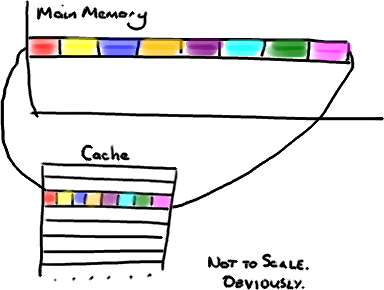

神奇的缓存行填充
================================================================================
## 计算机入门
CPU是你机器的心脏，最终由它来执行所有运算和程序。主内存（RAM）是你的数据（包括代码行）存放的地方。
本文将忽略硬件驱动和网络之类的东西，因为Disruptor的目标是尽可能多的在内存中运行。

**CPU和主内存之间有好几层缓存**，因为即使直接访问主内存也是非常慢的。**如果你正在多次对一块数据做
相同的运算，那么在执行运算的时候把它加载到离CPU很近的地方就有意义了**（比如一个循环计数－你不想每次
循环都跑到主内存去取这个数据来增长它吧）。

**越靠近CPU的缓存越快也越小。所以L1缓存很小但很快(译注：L1表示一级缓存)，并且紧靠着在使用它的CPU内
核。L2大一些，也慢一些，并且仍然只能被一个单独的CPU核使用。L3在现代多核机器中更普遍，仍然更大，更慢，
并且被单个插槽上的所有CPU核共享。最后，你拥有一块主存，由全部插槽上的所有CPU核共享**。

**当CPU执行运算的时候，它先去L1查找所需的数据，再去L2，然后是L3，最后如果这些缓存中都没有，所需的数
据就要去主内存拿。走得越远，运算耗费的时间就越长。所以如果你在做一些很频繁的事，你要确保数据在L1缓存中**。

| 从CPU到 | 大约需要的CPU周期 | 大约需要的时间 |
| :------------- | :------------- | :------------- |
| 主存 |  | 约60-80纳秒 |
| QPI 总线传输(between sockets, not drawn) |  | 约20ns |
| L3 cache | 约40-45 cycles, | 约15ns |
| L2 cache | 约10 cycles, | 约3ns |
| L1 cache | 约3-4 cycles, | 约1ns |
| 寄存器 | 1 cycle |  |

如果你的目标是让端到端的延迟只有 10毫秒，而其中花80纳秒去主存拿一些未命中数据的过程将占很重的一块。

## 缓存行
现在需要注意一件有趣的事情，数据在缓存中不是以独立的项来存储的，如不是一个单独的变量，也不是一个单独
的指针。**缓存是由缓存行组成的，通常是64字节**（译注：这篇文章发表时常用处理器的缓存行是64字节的，
比较旧的处理器缓存行是32字节），**并且它有效地引用主内存中的一块地址**。一个Java的long类型是8字节，
因此 **在一个缓存行中可以存8个long类型的变量**。

ddd
