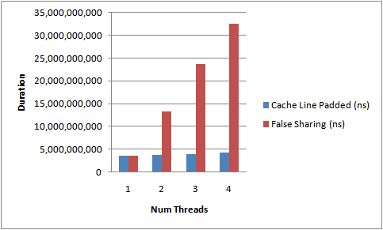

伪共享
================================================================================
缓存系统中是以 **缓存行**（`cache line`）为单位存储的。缓存行是 **2的整数幂** 个连续字节，一般
为`32-256`个字节。最常见的缓存行大小是`64`个字节。**当多线程修改互相独立的变量时，如果这些变量共
享同一个缓存行，就会无意中影响彼此的性能，这就是伪共享**。**缓存行上的写竞争** 是运行在`SMP`系统
中并行线程实现可伸缩性最重要的限制因素。有人将伪共享描述成无声的性能杀手，因为从代码中很难看清楚是
否会出现伪共享。

**为了让可伸缩性与线程数呈线性关系，就必须确保不会有两个线程往同一个变量或缓存行中写。两个线程写同
一个变量可以在代码中发现。为了确定互相独立的变量是否共享了同一个缓存行，就需要了解内存布局**，或找个
工具告诉我们。**Intel VTune就是这样一个分析工具**。本文中我将解释Java对象的内存布局以及我们该如
何 **填充缓存行以避免伪共享**。


上图说明了 **伪共享的问题**。在核心`1`上运行的线程想更新变量`X`，同时核心`2`上的线程想要更新变量
`Y`。不幸的是，这两个变量在同一个缓存行中。每个线程都要去竞争缓存行的所有权来更新变量。如果核心`1`
获得了所有权，缓存子系统将会使核心`2`中对应的缓存行失效。当核心2获得了所有权然后执行更新操作，核心
`1`就要使自己对应的缓存行失效。这会来来回回的经过L3缓存，大大影响了性能。如果互相竞争的核心位于不
同的插槽，就要额外横跨插槽连接，问题可能更加严重。

## Java内存布局(Java Memory Layout)
**对于HotSpot JVM，所有对象都有两个字长的对象头。第一个字是由24位哈希码和8位标志位（如锁的状态
或作为锁对象）组成的Mark Word。第二个字是对象所属类的引用。如果是数组对象还需要一个额外的字来存
储数组的长度。每个对象的起始地址都对齐于8字节以提高性能。因此当封装对象的时候为了高效率，对象字段
声明的顺序会被重排序成下列基于字节大小的顺序**：
1. doubles(8)和longs(8)
2. ints(4)和floats(4)
3. shorts(2)和chars(2)
4. booleans(1)和bytes(1)
5. references(4/8)
6. <子类字段重复上述顺序>

了解这些之后就 **可以在任意字段间用7个long来填充缓存行**。在Disruptor里我们对RingBuffer的cursor
和BatchEventProcessor的序列进行了 **缓存行填充**。

为了展示其性能影响，我们启动几个线程，每个都更新它自己独立的计数器。计数器是volatile long类型的，
所以其它线程能看到它们的进展。
```java
public final class FalseSharing implements Runnable {

  public final static int NUM_THREADS = 4; // change
  public final static long ITERATIONS = 500L * 1000L * 1000L;
  private final int arrayIndex;

  private static VolatileLong[] longs = new VolatileLong[NUM_THREADS];

  static {
    for (int i = 0; i < longs.length; i++) {
      longs[i] = new VolatileLong();
    }
  }

  public FalseSharing(final int arrayIndex) {
    this.arrayIndex = arrayIndex;
  }

  public static void main(final String[] args) throws Exception {
    final long start = System.nanoTime();
    runTest();
    System.out.println("duration = " + (System.nanoTime() - start));
  }

  private static void runTest() throws InterruptedException {
    Thread[] threads = new Thread[NUM_THREADS];
    for (int i = 0; i < threads.length; i++) {
      threads[i] = new Thread(new FalseSharing(i));
    }
    for (Thread t : threads) {
      t.start();
    }
    for (Thread t : threads) {
      t.join();
    }
  }

  public void run() {
    long i = ITERATIONS + 1;
    while (0 != --i) {
      longs[arrayIndex].value = i;
    }
  }

  public final static class VolatileLong {
    public volatile long value = 0L;
    public long p1, p2, p3, p4, p5, p6; // comment out
  }
}
```

## 结果(Results)
运行上面的代码，**增加线程数以及添加/移除缓存行的填充**，下面的图描述了我得到的结果。这是在我4核
Nehalem上测得的运行时间。



从不断上升的测试所需时间中能够明显看出伪共享的影响。**没有缓存行竞争时，我们几近达到了随着线程数的
线性扩展**。这并不是个完美的测试，因为我们不能确定这些`VolatileLong`会布局在内存的什么位置。它们
是独立的对象。但是 **经验告诉我们同一时间分配的对象趋向集中于一块**。所以你也看到了，**伪共享可能
是无声的性能杀手**。
