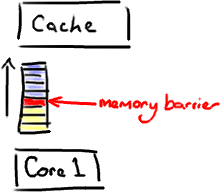

揭秘内存屏障
================================================================================
## 什么是内存屏障？
**它是一个CPU指令**。没错，又一次，我们在讨论CPU级别的东西，以便获得我们想要的性能（`Martin`著
名的`Mechanical Sympathy`理论）。基本上，它是这样一条指令：
1. **确保一些特定操作执行的顺序**。
2. **影响一些数据的可见性**(可能是某些指令执行后的结果)。

**编译器和CPU可以在保证输出结果一样的情况下对指令重排序，使性能得到优化。插入一个内存屏障，相当于
告诉CPU和编译器先于这个命令的必须先执行，后于这个命令的必须后执行**。



**内存屏障另一个作用是强制更新一次不同CPU的缓存**。例如，一个写屏障会把这个屏障写入的数据刷新到缓
存，这样任何试图读取该数据的线程将得到最新值，而不用考虑到底是被哪个cpu核心或者哪颗CPU执行的。

## 和Java有什么关系？
这里有个神奇咒语叫 **volatile** (我觉得这个词在Java规范中从未被解释清楚)。如果你的字段是`volatile`，
**Java内存模型将在写操作后插入一个写屏障指令，在读操作前插入一个读屏障指令**。


这意味着如果你 **对一个volatile字段进行写操作**，你必须知道：
1. **一旦你完成写入，任何访问这个字段的线程将会得到最新的值**。
2. **在你写入前，会保证所有之前发生的事已经发生，并且任何更新过的数据值也是可见的，因为内存屏障会
把之前的写入值都刷新到缓存**。

## 举个例子呗！
很高兴你这样说了。又是时候让我来画几个甜甜圈了。**RingBuffer的指针(cursor)**（译注：指向队尾元
素）属于一个神奇的 **volatile变量**，同时也是我们 **能够不用锁操作就能实现Disruptor的原因之一**。


**生产者** 将会取得 **下一个Entry**（或者是 **一批**），并可对它（们）作任意改动，把它（们）更
新为任何想要的值。如你所知，在所有改动都完成后，**生产者对ring buffer调用commit方法来更新序列号**
（译注:**把cursor更新为该Entry的序列号**）。**对volatile字段(cursor)的写操作创建了一个内存屏
障，这个屏障将刷新所有缓存里的值（或者至少相应地使得缓存失效）**。这时候，消费者们能获得最新的序列
号码(8)，并且因为内存屏障保证了它之前执行的指令的顺序，消费者们可以确信生产者对7号Entry所作的改动
已经可用。

## 那么消费者那边会发生什么？
**消费者中的序列号是volatile类型的**，会被若干个外部对象读取——其他的下游消费者可能在跟踪这个消费
者。`ProducerBarrier/RingBuffer`(取决于你看的是旧的还是新的代码)跟踪它以确保环没有出现重叠
（wrap）的情况（译注：**为了防止下游的消费者和上游的消费者对同一个Entry竞争消费，导致在环形队列中
互相覆盖数据，下游消费者要对上游消费者的消费情况进行跟踪**）。


所以，如果你的下游消费者(`C2`)看见前一个消费者(`C1`)在消费号码为`12`的`Entry`，当`C2`的读取也
到了`12`，它在更新序列号前将可以获得`C1`对该`Entry`的所作的更新。基本来说就是，`C1`更新序列号前
对ring buffer的所有操作（如上图 **黑色** 所示），必须先发生，待`C2`拿到`C1`更新过的序列号之后，
`C2`才可以为所欲为（如上图 **蓝色** 所示）。

## 对性能的影响
**内存屏障作为另一个CPU级的指令，没有锁那样大的开销。内核并没有在多个线程间干涉和调度。但凡事都是
有代价的**。内存屏障的确是有开销的——**编译器/cpu不能重排序指令，导致不可以尽可能地高效利用CPU，
另外刷新缓存亦会有开销**。所以不要以为用volatile代替锁操作就一点事都没。

你会注意到 **Disruptor的实现对序列号的读写频率尽量降到最低**。对volatile字段的每次读或写都是相
对高成本的操作。但是，**也应该认识到在批量的情况下可以获得很好的表现**。如果你知道不应对序列号频繁
读写，那么很合理的想到，**先获得一整批Entries，并在更新序列号前处理它们**。这个技巧对生产者和消费
者都适用。以下的例子来自BatchConsumer:
```java

```


ddd
