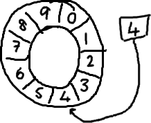
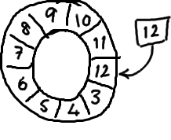

Ringbuffer的特别之处
================================================================================
最近，我们开源了 **LMAX Disruptor**，它是我们的交易系统吞吐量快（LMAX是一个新型的交易平台，
**号称能够单线程每秒处理数百万的订单**）的关键原因。为什么我们要将其开源？我们意识到对高性能编程
领域的一些传统观点，有点不对劲。**我们找到了一种更好、更快地在线程间共享数据的方法**，如果不公开
于业界共享的话，那未免太自私了。同时开源也让我们觉得看起来更酷。

首先介绍 **ringbuffer**。我对Disruptor的最初印象就是ringbuffer。但是后来我意识到尽管ringbuffer
是整个模式（Disruptor）的核心，但是 **Disruptor对ringbuffer的访问控制策略才是真正的关键点所
在**。

## ringbuffer到底是什么？
嗯，正如名字所说的一样，**它是一个环（首尾相接的环），你可以把它用做在不同上下文（线程）间传递数据
的buffer**。

**基本来说，ringbuffer拥有一个序号，这个序号指向数组中下一个可用的元素**。（校对注：如下图右边
的图片表示序号，这个序号指向数组的索引4的位置。）

随着你不停地填充这个buffer（可能也会有相应的读取），**这个序号会一直增长，直到绕过这个环**。

ddd
