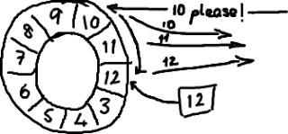

Ringbuffer的特别之处
================================================================================
最近，我们开源了 **LMAX Disruptor**，它是我们的交易系统吞吐量快（LMAX是一个新型的交易平台，
**号称能够单线程每秒处理数百万的订单**）的关键原因。为什么我们要将其开源？我们意识到对高性能编程
领域的一些传统观点，有点不对劲。**我们找到了一种更好、更快地在线程间共享数据的方法**，如果不公开
于业界共享的话，那未免太自私了。同时开源也让我们觉得看起来更酷。

首先介绍 **ringbuffer**。我对Disruptor的最初印象就是ringbuffer。但是后来我意识到尽管ringbuffer
是整个模式（Disruptor）的核心，但是 **Disruptor对ringbuffer的访问控制策略才是真正的关键点所
在**。

## ringbuffer到底是什么？
嗯，正如名字所说的一样，**它是一个环（首尾相接的环），你可以把它用做在不同上下文（线程）间传递数据
的buffer**。

**基本来说，ringbuffer拥有一个序号，这个序号指向数组中下一个可用的元素**。（校对注：如下图右边
的图片表示序号，这个序号指向数组的索引4的位置。）

随着你不停地填充这个buffer（可能也会有相应的读取），**这个序号会一直增长，直到绕过这个环**。

**要找到数组中当前序号指向的元素**，可以通过mod操作：`sequence mod array length = array index`。
以上面的ringbuffer为例（java的mod语法）：**12 % 10 = 2**，很简单吧。事实上，上图中的ringbuffer
只有10个槽完全是个意外。**如果槽的个数是2的N次方更有利于基于二进制的计算机进行计算**。（校对注：
**2的N次方换成二进制就是1000，100，10，1这样的数字，sequence &（array length－1）= array index，
比如一共有8槽，3 &（8－1）= 3，HashMap就是用这个方式来定位数组元素的，这种方式比取模的速度更快。**）

## 那又怎么样？
你会发现，我们的实现方式，特点在于：**没有尾指针。我们只维护了一个指向下一个可用位置的序号**。这种
实现是经过深思熟虑的。**我们选择用环形buffer的最初原因就是想要提供可靠的消息传递。我们需要将已经被
服务发送过的消息保存起来，这样当另外一个服务通过nak (校对注：拒绝应答信号)告诉我们没有成功收到消息
时，我们能够重新发送给他们**。听起来，环形buffer非常适合这个场景。它维护了一个指向尾部的序号，当收
到nak(校对注：拒绝应答信号)请求，**可以重发从那一点到当前序号之间的所有消息**：

我们实现的ring buffer和大家常用的队列之间的区别是，**我们不删除buffer中的数据，也就是说这些数据
一直存放在buffer中，直到新的数据覆盖他们。我们不需要尾指针的原因。ringbuffer本身并不控制是否需要
重叠**。

## 它为什么如此优秀？
之所以ringbuffer采用这种数据结构，是因为 **它在可靠消息传递方面有很好的性能**。这就够了，不过它
还有一些其他的优点。

**首先，因为它是数组，所以要比链表快**，而且有一个容易预测的访问模式。（译者注：**数组内元素的内存
地址的连续性存储的**）。这是对CPU缓存友好的—也就是说，**在硬件级别，数组中的元素是会被预加载的，因
此在ringbuffer当中，cpu无需时不时去主存加载数组中的下一个元素**。（校对注：**因为只要一个元素被
加载到缓存行，其他相邻的几个元素也会被加载进同一个缓存行**）

**其次，你可以为数组预先分配内存，使得数组对象一直存在（除非程序终止）**。这就意味着 **不需要花大量
的时间用于垃圾回收**。此外，不像链表那样，需要为每一个添加到其上面的对象创造节点对象—对应的，当删除
节点时，需要执行相应的内存清理操作。

## 缺少的部分
我并没有在本文中介绍　**如何避免ringbuffer产生重叠，以及如何对ringbuffer进行读写操作**。你可能
注意到了我将ringbuffer和链表那样的数据结构进行比较，因为我并认为链表是实际问题的标准答案。

当你将Disruptor和基于队列之类的实现进行比较时，事情将变得很有趣。**队列通常注重维护队列的头尾元素，
添加和删除元素等。所有的这些我都没有在ringbuffer里提到，这是因为ringbuffer不负责这些事情，我们把
这些操作都移到了数据结构（ringbuffer）的外部**。
