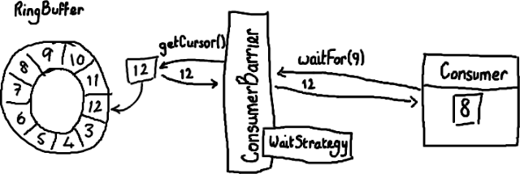
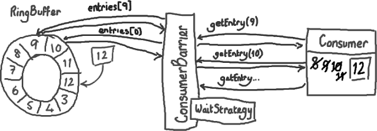

如何从Ringbuffer读取
================================================================================
## ConsumerBarrier与消费者
这里我要稍微反过来介绍，**因为总的来说读取数据这一过程比写数据要容易理解**。假设通过一些“魔法”已
经把数据写入到Ring Buffer了，怎样从Ring Buffer读出这些数据呢？



消费者(`Consumer`)是一个想从`Ring Buffer`里读取数据的线程，它可以访问`ConsumerBarrier`对象
——**这个对象由RingBuffer创建并且代表消费者与RingBuffer进行交互。就像Ring Buffer显然需要一个
序号才能找到下一个可用节点一样，消费者也需要知道它将要处理的序号**——每个消费者都需要找到下一个它要
访问的序号。在上面的例子中，消费者处理完了`Ring Buffer`里序号`8`之前（包括`8`）的所有数据，那么
它期待访问的下一个序号是`9`。

**消费者可以调用ConsumerBarrier对象的waitFor()方法，传递它所需要的下一个序号**：
```java
final long availableSeq = consumerBarrier.waitFor(nextSequence);
```
**ConsumerBarrier返回RingBuffer的最大可访问序号**——在上面的例子中是`12`。**ConsumerBarrier
有一个WaitStrategy方法来决定它如何等待这个序号**，我现在不会去描述它的细节，代码的注释里已经概括
了每一种WaitStrategy的优点和缺点。

## 接下来怎么做？
接下来，**消费者会一直原地停留，等待更多数据被写入Ring Buffer。并且，一旦数据写入后消费者会收到
通知——节点9，10，11和12已写入。现在序号12到了，消费者可以让ConsumerBarrier去拿这些序号节点里
的数据了**。



拿到了数据后，消费者(`Consumer`)会更新自己的标识(`cursor`)。

你应该已经感觉得到，**这样做是怎样有助于平缓延迟的峰值了**——以前需要逐个节点地询问“我可以拿下一个
数据吗？现在可以了么？现在呢？”，消费者(`Consumer`)现在只需要简单的说“当你拿到的数字比我这个要大
的时候请告诉我”，函数返回值会告诉它有多少个新的节点可以读取数据了。因为这些新的节点的确已经写入了数
据（`Ring Buffer`本身的序号已经更新），而且消费者对这些节点的唯一操作是读而不是写，因此访问不用
加锁。这太好了，不仅代码实现起来可以更加安全和简单，而且不用加锁使得速度更快。


ddd
