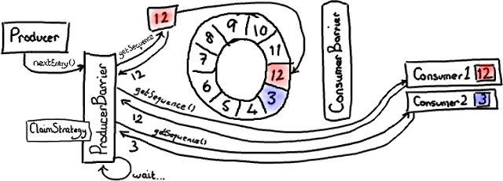

写入Ringbuffer
================================================================================
本文的重点是：**不要让Ring重叠；如何通知消费者；生产者一端的批处理；以及多个生产者如何协同工作**。

## ProducerBarriers
**Disruptor代码给消费者提供了一些接口和辅助类，但是没有给写入Ring Buffer的生产者提供接口。这是
因为除了你需要知道生产者之外，没有别人需要访问它**。尽管如此，Ring Buffer还是与消费端一样提供了一
个 **ProducerBarrier** 对象，让生产者通过它来写入Ring Buffer。

**写入Ring Buffer的过程涉及到两阶段提交**（`two-phase commit`）。**首先，你的生产者需要申请
buffer里的下一个节点。然后，当生产者向节点写完数据，它将会调用ProducerBarrier的commit方法**。

那么让我们首先来看看第一步。“**给我Ring Buffer里的下一个节点**”，这句话听起来很简单。的确，从生
产者角度来看它很简单：**简单地调用ProducerBarrier的nextEntry()方法**，这样会返回给你一个Entry
对象，这个对象就是Ring Buffer的下一个节点。

## ProducerBarrier如何防止Ring Buffer重叠
在后台，由`ProducerBarrier`负责所有的交互细节来从Ring Buffer中找到下一个节点，然后才允许生产
者向它写入数据。

ddd
