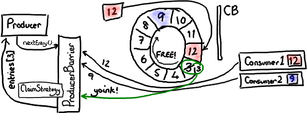
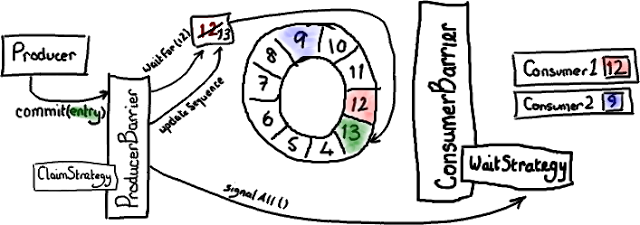
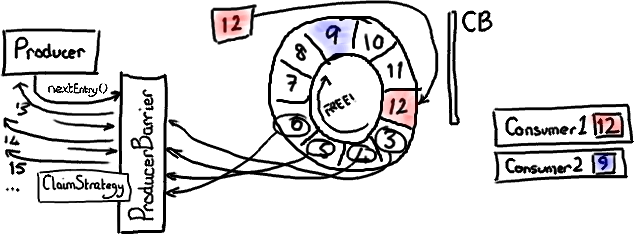
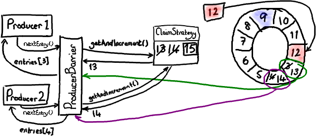
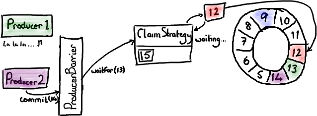
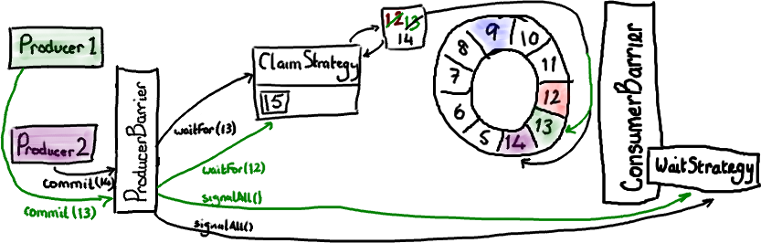

写入Ringbuffer
================================================================================
本文的重点是：**不要让Ring重叠；如何通知消费者；生产者一端的批处理；以及多个生产者如何协同工作**。

## ProducerBarriers
**Disruptor代码给消费者提供了一些接口和辅助类，但是没有给写入Ring Buffer的生产者提供接口。这是
因为除了你需要知道生产者之外，没有别人需要访问它**。尽管如此，Ring Buffer还是与消费端一样提供了一
个 **ProducerBarrier** 对象，让生产者通过它来写入Ring Buffer。

**写入Ring Buffer的过程涉及到两阶段提交**（`two-phase commit`）。**首先，你的生产者需要申请
buffer里的下一个节点。然后，当生产者向节点写完数据，它将会调用ProducerBarrier的commit方法**。

那么让我们首先来看看第一步。“**给我Ring Buffer里的下一个节点**”，这句话听起来很简单。的确，从生
产者角度来看它很简单：**简单地调用ProducerBarrier的nextEntry()方法**，这样会返回给你一个Entry
对象，这个对象就是Ring Buffer的下一个节点。

## ProducerBarrier如何防止Ring Buffer重叠
在后台，由`ProducerBarrier`负责所有的交互细节来从Ring Buffer中找到下一个节点，然后才允许生产
者向它写入数据。

在这幅图中，我们假设只有一个生产者写入Ring Buffer。过一会儿我们再处理多个生产者的复杂问题。

**ConsumerTrackingProducerBarrier对象拥有所有正在访问Ring Buffer的消费者列表**。这看起来
有点儿奇怪－我从没有期望ProducerBarrier了解任何有关消费端那边的事情。但是等等，这是有原因的。
因为我们不想与队列“混为一谈”（队列需要追踪队列的头和尾，它们有时候会指向相同的位置），**Disruptor
由消费者负责通知它们处理到了哪个序列号，而不是Ring Buffer。所以，如果我们想确定我们没有让
Ring Buffer重叠，需要检查所有的消费者们都读到了哪里**。

在上图中，有一个消费者顺利的读到了最大序号`12`（用 **红色/粉色高亮**）。第二个消费者有点儿落后——
可能它在做`I/O`操作之类的——它停在序号`3`。因此消费者`2`在赶上消费者`1`之前要跑完整个`Ring Buffer`
一圈的距离。

**现在生产者想要写入Ring Buffer中序号3占据的节点，因为它是Ring Buffer当前游标的下一个节点。但是
ProducerBarrier明白现在不能写入，因为有一个消费者正在占用它。所以，ProducerBarrier停下来自旋
(spins)，等待，直到那个消费者离开**。

## 申请下一个节点
现在可以想像消费者`2`已经处理完了一批节点，并且向前移动了它的序号。可能它挪到了序号`9`（因为消费端
的批处理方式，现实中我会预计它到达`12`，但那样的话这个例子就不够有趣了）。

上图显示了当消费者`2`挪动到序号`9`时发生的情况。在这张图中我已经忽略了`ConsumerBarrier`，因为它
没有参与这个场景。

`ProducerBarier`会看到下一个节点——序号`3`那个已经可以用了。它会抢占这个节点上的`Entry`（我还没
有特别介绍 **Entry对象，基本上它是一个放写入到某个序号的Ring Buffer数据的桶**），把下一个序号`13`
更新成`Entry`的序号，然后把`Entry`返回给生产者。生产者可以接着往`Entry`里写入数据。

## 提交新的数据
两阶段提交的第二步是——对，**提交**。

绿色表示最近写入的`Entry`，序号是`13`。当生产者结束向`Entry`写入数据后，它会要求`ProducerBarrier`
提交。`ProducerBarrier`先等待`Ring Buffer`的游标追上当前的位置（对于单生产者这毫无意义－比如，
我们已经知道游标到了`12`，而且没有其他人正在写入`Ring Buffer`）。然后`ProducerBarrier`更新
`Ring Buffer`的游标到刚才写入的`Entry`序号－在我们这儿是`13`。接下来，`ProducerBarrier`会让消费
者知道`buffer`中有新东西了。它戳一下`ConsumerBarrier`上的`WaitStrategy`对象说－“喂，醒醒！有事
情发生了！”（注意－不同的`WaitStrategy`实现以不同的方式来实现提醒，取决于它是否采用阻塞模式。）

现在消费者`1`可以读`Entry 13`的数据，消费者`2`可以读`Entry 13`以及前面的所有数据，然后它们都过
得很`happy`。

## ProducerBarrier上的批处理
有趣的是 **Disruptor可以同时在生产者和消费者​两端实现批处理**。还记得伴随着程序运行，消费者`2`最后
达到了序号`9`吗？**ProducerBarrier可以在这里做一件很狡猾的事－它知道Ring Buffer的大小，也知道最
慢的消费者位置。因此它能够发现当前有哪些节点是可用的**。

如果`ProducerBarrier`知道`Ring Buffer`的游标指向`12`，而最慢的消费者在`9`的位置，它就可以让生
产者写入节点`3`，`4`，`5`，`6`，`7`和`8`，中间不需要再次检查消费者的位置。

## 多个生产者的场景
在上面的图中我稍微撒了个谎。我暗示了`ProducerBarrier`拿到的序号直接来自`Ring Buffer`的 **游标**。
然而，如果你看过代码的话，**你会发现它是通过ClaimStrategy获取的**。我省略这个对象是为了简化示意图，
在单个生产者的情况下它不是很重要。

**在多个生产者的场景下，你还需要其他东西来追踪序号。这个序号是指当前可写入的序号**。注意这和“向
`Ring Buffer`的游标加`1`”不一样————**如果你有一个以上的生产者同时在向Ring Buffer写入，就有可能
出现某些Entry正在被生产者写入但还没有提交的情况**。

让我们复习一下如何申请写入节点。**每个生产者都向ClaimStrategy申请下一个可用的节点**。生产者`1`拿到
序号`13`，这和上面单个生产者的情况一样。生产者`2`拿到序号`14`，尽管`Ring Buffer`的当前游标仅仅指向
`12`。这是因为 **ClaimSequence不但负责分发序号，而且负责跟踪哪些序号已经被分配**。现在每个生产者都
拥有自己的写入节点和一个崭新的序号。我把生产者`1`和它的写入节点涂上绿色，把生产者`2`和它的写入节点涂
上可疑的粉色－看起来像紫色。

现在假设生产者`1`还生活在童话里，因为某些原因没有来得及提交数据。生产者`2`已经准备好提交了，并且向
`ProducerBarrier`发出了请求。

就像我们先前在`commit`示意图中看到的一样，**ProducerBarrier只有在Ring Buffer游标到达准备提交的
节点的前一个节点时它才会提交。在当前情况下，游标必须先到达序号`13`我们才能提交节点`14`的数据。但是我们
不能这样做，因为生产者`1`正盯着一些闪闪发光的东西，还没来得及提交。因此`ClaimStrategy`就停在那儿自旋
(spins)，直到`Ring Buffer`游标到达它应该在的位置**。

现在生产者`1`从迷糊中清醒过来并且申请提交节点`13`的数据（生产者`1`发出的绿色箭头代表这个请求）。
`ProducerBarrier`让ClaimStrategy先等待Ring Buffer的游标到达序号`12`，当然现在已经到了。因此
`Ring Buffer`移动游标到`13`，让`ProducerBarrier`戳一下`WaitStrategy`告诉所有人都知道`Ring Buffer`
有更新了。现在`ProducerBarrier`可以完成生产者`2`的请求，让`Ring Buffer`移动游标到`14`，并且通知所
有人都知道。

你会看到，**尽管生产者在不同的时间完成数据写入，但是Ring Buffer的内容顺序总是会遵循nextEntry()的初始
调用顺序**。也就是说，**如果一个生产者在写入Ring Buffer的时候暂停了，只有当它解除暂停后，其他等待中的
提交才会立即执行**。

**更新：最近的RingBuffer​版本去掉了Producer Barrier**。
