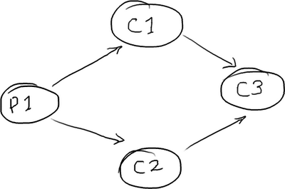
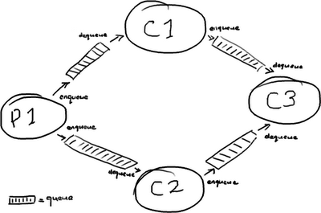
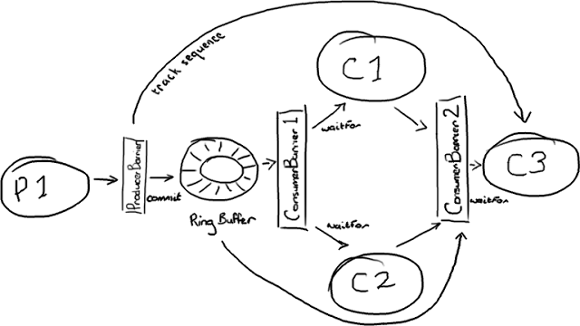

解析Disruptor关系组装
================================================================================
现在我已经讲了`RingBuffer`​本身，如何从它读取以及如何向它写入​。从逻辑上来说，下一件要做的事情就
是 **把所有的东西拼装到在一起**。

我前面提到过 **多生产者的情况————他们通过ProducerBarrier保证写入操作顺序与可控**。我也提到过简
单场景下的多消费者数据访问。**更多的消费者的场景会变得更加复杂，我们​实现了一些聪明的机制允许多个消
费者在访问Ring Buffer的时候互相等待（依赖）**。像很多应用里，有一连串的工作需要在实际执行业务逻辑
之前完成 (`happen before`) —— 例如，在做任何操作之前，我们都必须先保证消息写入磁盘。

`Disruptor`论文​和性能测试里包含了你可能想到的一些基本结构。我准备讲一下其中最有趣的那个。

## 菱形结构
`DiamondPath1P3CPerfTest​`（一个类文件，没有展示出来）展示了一个并不罕见的结构————**独立的一个
生产者和三个消费者**。最棘手的一点是：**第三个消费者必须等待前两个消费者处理完成后，才能开始工作**。

**消费者C3也许是你的业务逻辑。消费者C1可能在备份接收到的数据，而消费者C2可能在准备数据或者别的东西**。

## 用队列实现菱形结构
在一个 **SEDA-风格的架构**（见文档，没有列出来）​中，每个处理阶段都会用队列分开：

你也许从这里看到了问题的端倪：**一条消息从P1传输到C3要完整的穿过四个队列，每个队列在消息进入队列和
取出队列时都会产生消耗成本**。

## 用Disruptor实现菱形结构
**在Disruptor​的世界里，一切都由一个单独的Ring Buffer管理**：

这张图看起来更复杂。**不过所有的参与者都只依赖Ring Buffer 作为一个单独的联结点，而且所有的交互都是基于 Barrier 对象与检查依赖的目标序号来实现的。

生产者这边比较简单，它是我在 上文​ 中描述过的单生产者模型。有趣的是，生产者并不需要关心所有的消费者。它只关心消费者 C3，如果消费者 C3 处理完了 Ring Buffer 的某一个节点，那么另外两个消费者肯定也处理完了。因此，只要 C3 的位置向前移动，Ring Buffer 的后续节点就会空闲出来。

管理消费者的依赖关系需要两个 ConsumerBarrier 对象。第一个仅仅与 Ring Buffer 交互，C1 和 C2 消费者向它申请下一个可访问节点。第二个 ConsumerBarrier 只知道消费者 C1 和 C2，它返回两个消费者访问过的消息序号中较小的那个。

ddd
