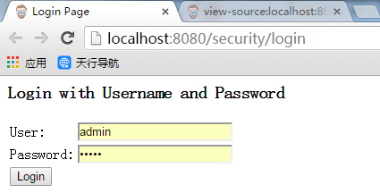

初识Web应用安全的Java配置
=============================================================================
跟传统情况下，我们在过滤器中做权限验证类似，`Spring Secuirty`也是在`Filter`中进行权限验证。因此使用`Java`代码配置
`Spring Security`主要是这两个步骤：
1. 创建过滤器
2. 注册过滤器

### 第一步：创建过滤器
第一步，是使用`Java`代码创建`Spring Security`的配置。这段配置创建一个`Servlet Filter`：**springSecurityFilterChain**，
其负责应用中的所有安全，包括：保护应用的`URLS`，验证提交的`username`和`password`，重定向到登录页面等。通过以下代码可以看到使用
`Java`配置`Spring Security`的基础案例：
```java
import org.springframework.beans.factory.annotation.Autowired;
import org.springframework.security.config.annotation.authentication.builders.AuthenticationManagerBuilder;
import org.springframework.security.config.annotation.web.builders.HttpSecurity;
import org.springframework.security.config.annotation.web.configuration.EnableWebSecurity;
import org.springframework.security.config.annotation.web.configuration.WebSecurityConfigurerAdapter;
     
@EnableWebSecurity
public class SecurityConfig extends WebSecurityConfigurerAdapter{
    @Autowired
    public void configureGlobal(AuthenticationManagerBuilder auth) throws Exception {
        auth.inMemoryAuthentication().withUser("user").password("password").roles("USER");
    } 
}
```
方法名`configureGlobal`是无关紧要的，重要的是在一个添加了 **@EnableWebSecurity, @EnableGlobalMethodSecurity** 
或者 **@EnableGlobalAuthentication** 注解的类里面，注入 **AuthenticationManagerBuilder**。

这段代码内容很少，但事实上已经做了很多的默认安全验证，包括（列出主要部分）：
1. 访问应用中的每个URL都需要进行验证；
2. 生成一个登陆表单；
3. 允许用户使用`username`和`password`来登陆；
4. 允许用户注销；
5. `CSRF`攻击拦截；
6. `Session Fixation`攻击；

### 注册过滤器
下一步是注册`springSecurityFilterChain`。这个可以借助`Spring3.1`引入的`WebApplicationInitializer`完成。`SpringSecurity`
提供了一个基类`AbstractSecurityWebApplicationInitializer`来确保`springSecurityFilterChain`被注册。对于如何使用
`AbstractSecurityWebApplicationInitializer`，这要依据`Spring Secuirty`是否项目中的唯一的`Spring`组件而有所不同。

#### 项目中已经使用了spring mvc
如果在我们的应用程序中已经使用了`Spring`，那么在我们的应用中可能已经有了一个`WebApplicationInitializer`来加载我们的配置。
此时我们应该在已经存在的`ApplicationContext`中注册`Spring Security`。例如，如果我们已经使用`Spring mvc`，那么我们的代码应该是如下所示：
```java
import org.springframework.security.web.context.*;
     
public class SecurityWebApplicationInitializer extends AbstractSecurityWebApplicationInitializer {
     
}
```
这段代码仅仅会将`springSecurityFilterChain`注册到应用中，并作用于每个`url`。此时我们的`SecurityConfig`类依然会被已经存在的
`ApplicationInitializer`加载。例如，我们使用`Spring mvc`，它将会被添加到 **`getRootConfigClasses()`**。
```java
public class MvcWebApplicationInitializer extends AbstractAnnotationConfigDispatcherServletInitializer {
    //Specify @Configuration and/or @Component classes to be provided to the root application context.
    @Override
    protected Class<?>[] getRootConfigClasses() {
        return new Class[] { SecurityConfig.class };
    }
    // ... other overrides ...
}
```
#### 运行项目
将以上代码部署到`Tomcat`中运行，通过浏览器访问任何页面都会被重新定位到一个登陆页面，截图如下：



这个页面是`Spring Security`自动帮我们生成的。我们可以使用之前配置的用户名和密码进行登录。自动生成这个页面的代码位于类
`DefaultLoginPageGeneratingFilter`的`generateLoginPageHtml`方法中。
