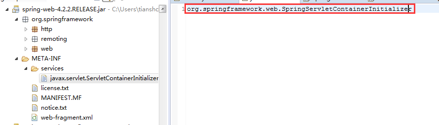

创建与注册过滤器流程的源码分析
================================================================================
### 过滤器创建流程的源码分析
当我们在 **任意一个类** 上添加了一个注解 **`@EnableWebSecurity`**，就可以创建一个名为 **`springSecurityFilterChain`**的Filter。
在上一节中，我们是在一个自定义的`SecurityConfig`类上加了这个注解。`SecurityConfig`类同时也继承了`WebSecurityConfigurerAdapter`类，
不过需要注意的是，这个过滤器的创建是通过`@EnableWebSecurity`完成的，与是否继承这个类无关。关于`WebSecurityConfigurerAdapter`这个类我们
在后面会详细讲解，目前所需知道的是，即使我们自定义的类，不继承这个类，也可以自动帮我们创建一个`Filter`。

我们带着2个问题来考虑这个名字为`springSecurityFilterChain`的`Filter`的创建过程:
1. 这个`Filter`是在哪里创建的?
2. 这个`Filter`的实现类是什么?

#### springSecurityFilterChain过滤器的创建的位置
为什么在一个类上添加一个`@EnableWebSecurity`注解后，就可以自动创建一个`Filter`呢？我们首先看一下`@EnableWebSecurity`的源码：
```java
@Retention(value = java.lang.annotation.RetentionPolicy.RUNTIME)
@Target(value = { java.lang.annotation.ElementType.TYPE })
@Documented
@Import({ WebSecurityConfiguration.class, ObjectPostProcessorConfiguration.class,SpringWebMvcImportSelector.class })
@EnableGlobalAuthentication
@Configuration
public @interface EnableWebSecurity {
    /**
    * Controls debugging support for Spring Security. Default is false.
    * @return if true, enables debug support with Spring Security
    */
    boolean debug() default false;
}
```
可以看到，这个注解上面加了`@Configuration`、`@EnableGlobalAuthentication`、`@Import`三个注解，因此，当我们把这个注解加在某个类之上，
就相当于在这个类上面同时加上了这三个注解。我们将这个注解加在`SecurityConfig`类上，意味着相当于在`SecurityConfig`类上加上了这个三个注解。

其中`@Import`这个注解中导入了三个配置类：`WebSecurityConfiguration` 、`ObjectPostProcessorConfiguration` 、
`SpringWebMvcImportSelector`，我们的`Filter`实际上就是由 **`WebSecurityConfiguration`** 这个类创建，查看其核心部分源码：
```java
@Configuration
public class WebSecurityConfiguration implements ImportAware, BeanClassLoaderAware {
    private WebSecurity webSecurity;
    ....
    private List<SecurityConfigurer<Filter, WebSecurity>> webSecurityConfigurers;
    ....
     
    //创建一个名为springSecurityFilterChain的Filter
    @Bean(name = AbstractSecurityWebApplicationInitializer.DEFAULT_FILTER_NAME)
    public Filter springSecurityFilterChain() throws Exception {
        boolean hasConfigurers = webSecurityConfigurers != null && !webSecurityConfigurers.isEmpty();
        if (!hasConfigurers) {
        WebSecurityConfigurerAdapter adapter = objectObjectPostProcessor.postProcess(
            new WebSecurityConfigurerAdapter() {}
        );
        webSecurity.apply(adapter);
    }
    return webSecurity.build();
    }
    ....
}
```
可以看到这个配置类中生成了一个名字为`AbstractSecurityWebApplicationInitializer.DEFAULT_FILTER_NAME`的`Filter`
(读者目前不要过多关注实现细节，后面会详细讲解)，这是一个静态常量，其定义如下：
```java
public abstract class AbstractSecurityWebApplicationInitializer implements WebApplicationInitializer {
     
    ....
    public static final String DEFAULT_FILTER_NAME = "springSecurityFilterChain";
    ....
}
```
因此，这段配置的作用实际上是，创建一个`Spring Bean`，`Bean`的类型是`Filter`，名字为`springSecurityFilterChain`。
只要我们保证自定义的`SecuirtyConfig`类，可以被`Spring`扫描到，就可以帮助我们创建这个`Filter`了。 

#### springSecurityFilterChain过滤器的类型是什么
在上面的分析中，我们可以看到`Filter`的创建时通过`WebSecurity`对象的`build`方法完成的。我们先看一下`WebSecurity`对象的部分文档注释：
```
The WebSecurity is created by WebSecurityConfiguration to create the FilterChainProxy known as the Spring Security Filter Chain (springSecurityFilterChain). 
```
这段话大致的意思是，`WebSecurity`由`WebSecurityConfiguration`创建，而`WebSecurity`的作用是用于创建一个类型为`FilterChainProxy`的过滤器，
`FilterChainProxy`是`Filter`的子类，我们所说的创建一个名字为 **`springSecurityFilterChain`**的过滤器，实际上过滤器的具体类型就是**`FilterChainProxy`**。

### 过滤器注册过程的源码分析
笔者以读者在项目中使用了`Spring MVC`的情况进行源码分析讲解注册流程。

在`servlet3.0`规范中，提供了一个`javax.servlet.ServletContainerInitializer`接口，来帮助我们做`web`应用的初始化操作，例如动态注册`Servelt`、
`Filter`、`Listener`等。定义如下：
```java
package javax.servlet;
     
import java.util.Set;
public interface ServletContainerInitializer {
    public void onStartup(Set<Class<?>> c, ServletContext ctx) throws ServletException; 
}
```
假设我们的项目中使用了`SpringMVC`，那么肯定会依赖`spring-web-x.x.x.jar`。在这个`jar`中，我们可以找到以下的文件
`/META-INF/services/javax.servlet.ServletContainerInitializer`。以笔者的依赖为例，这个文件中的内容如下：



**根据`servlet3.0`规范，`servlet`容器要负责创建这个文件中定义的类**，在这里就是`SpringServletContainerInitializer`类，
其需要是`ServletContainerInitializer`的实现，因此其必然实现了`onStart()`方法，源码如下：
```java
@HandlesTypes(WebApplicationInitializer.class)
public class SpringServletContainerInitializer implements ServletContainerInitializer {
    @Override
    public void onStartup(Set<Class<?>> webAppInitializerClasses, ServletContext servletContext)
        throws ServletException {
        List<WebApplicationInitializer> initializers = new LinkedList<WebApplicationInitializer>();
        if (webAppInitializerClasses != null) {
            for (Class<?> waiClass : webAppInitializerClasses) {
                // Be defensive: Some servlet containers provide us with invalid classes,
                // no matter what @HandlesTypes says...
                //对于非接口、非抽象类的class对象，通过反射创建实例
                if (!waiClass.isInterface() && !Modifier.isAbstract(waiClass.getModifiers()) &&
                    WebApplicationInitializer.class.isAssignableFrom(waiClass)) {
                    try {
                        initializers.add((WebApplicationInitializer) waiClass.newInstance());
                    }catch (Throwable ex) {
                        throw new ServletException("Failed to instantiate WebApplicationInitializer class", ex);
                    }
                }
            }
        }
    	if (initializers.isEmpty()) {
            servletContext.log("No Spring WebApplicationInitializer types detected on classpath");
            return;
    	}
        AnnotationAwareOrderComparator.sort(initializers);
    	servletContext.log("Spring WebApplicationInitializers detected on classpath: " + initializers);
        //调用所有实例的onStart方法
    	for (WebApplicationInitializer initializer : initializers) {
    	    initializer.onStartup(servletContext);
    	}
    }
}
```
这个类上有一个注解 **`@HandlesTypes(WebApplicationInitializer.class)`**，根据`Servelt3.0`规范，容器要负责以`Set`集合的方式传递注解中
指定的类型的所有子类(包括子接口、实现类等)的`class`对象。因此`WebApplicationInitializer`对象的所有子类(包括子接口等)都会在调用
`SpringServletContainerInitializer`类的`onStart`方法的时候被传入。而`Spring Security`的`AbstractSecurityWebApplicationInitializer`
类是`Spring web`提供的`WebApplicationInitializer`的抽象子类，因此会被传入。而`WebApplicationInitializer`也是一个接口，其也定义了一个
`onstart`方法，在代码的最后，调用了所有`WebApplicationInitializer`子类实例的`onstart`方法。不过由于`AbstractSecurityWebApplicationInitializer`
是抽象类，而代码中`if`判断逻辑指明了，只有普通的`java`类才会被创建实例，才有机会被调用`start`方法，所以我们必须要自定义一个类`SecurityWebApplicationInitializer`
继承`AbstractSecurityWebApplicationInitializer`，这样`AbstractSecurityWebApplicationInitializer`中的`onstart`方法才有机会被调用。
而我们的自动注册就是在这个类的`onstart`方法中被调用。`AbstractSecurityWebApplicationInitializer`类核心代码如下：
```java
public abstract class AbstractSecurityWebApplicationInitializer implements WebApplicationInitializer {
    .....
    public final void onStartup(ServletContext servletContext) throws ServletException {
        beforeSpringSecurityFilterChain(servletContext);
        if (configurationClasses != null) {
            AnnotationConfigWebApplicationContext rootAppContext = new AnnotationConfigWebApplicationContext();
            rootAppContext.register(configurationClasses);
            servletContext.addListener(new ContextLoaderListener(rootAppContext));
        }
        if (enableHttpSessionEventPublisher()) {
            servletContext.addListener("org.springframework.security.web.session.HttpSessionEventPublisher");
        }
        servletContext.setSessionTrackingModes(getSessionTrackingModes());
        insertSpringSecurityFilterChain(servletContext);//完成springSecurityFilterChain的注册
        afterSpringSecurityFilterChain(servletContext);
    }
    .....
}
```
上述代码中的`insertSpringSecurityFilterChain(servletContext)`完成了事实上的`Filter`的注册。因为我们之前创建的`Filter`实际上是`Spring Context`
中的一个`Bean`，因此当我们在`insertSpringSecurityFilterChain`方法中传入`servletContext`的时候，实际上我们就可以根据`bean`的名称
"`springSecurityFilterChain`"获取到这个`Bean`。`Spring Web`会根据创建一个代理的`Filter`类，`DelegatingFilterProxy`，这个类中维护了一个非常重要的字段
`targetBeanName`，在我们这里这个字段的值是`springSecurityFilterChain`。而`DelegatingFilterProxy`在执行的时候，会根据`targetBeanName`，
找到对应的以`Spring Bean`方式提供的`Filter`来处理。因此事实上完成了注册流程。


