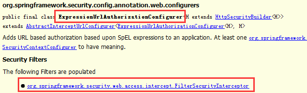
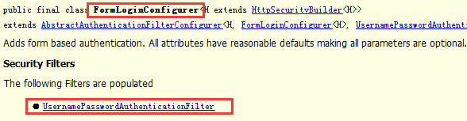
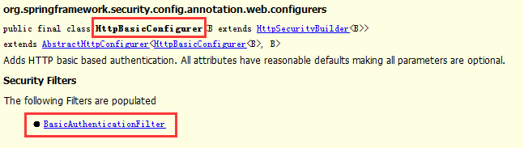
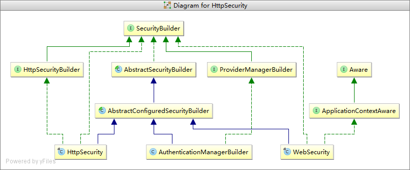
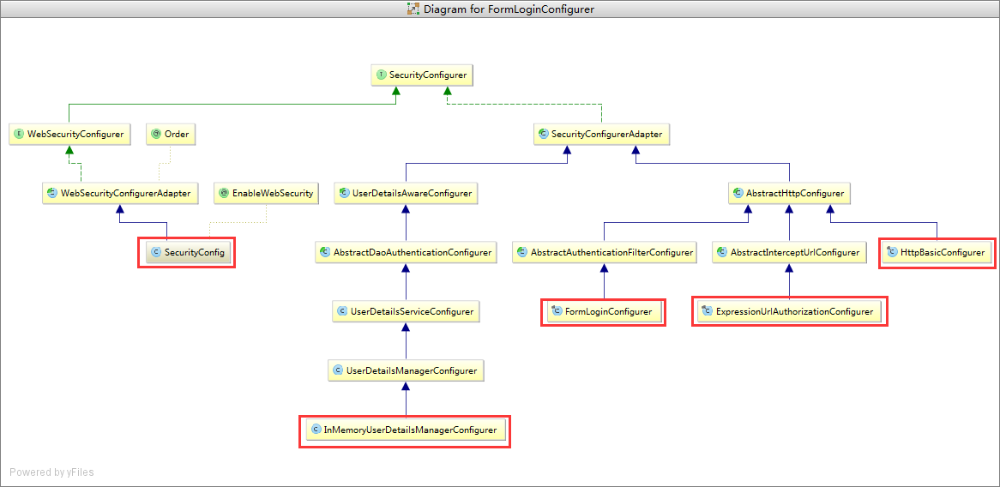
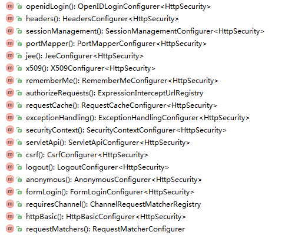

HttpSecurity对象与源码解读
=========================================================================
到目前为止，我们编写的`SecurityConfig`类中只是包含了如何验证用户的信息。但是`Spring Security`如何知道我们希望所有的用户都被验证呢？
`Spring Security`是怎么知道我们希望支持表单形式的验证呢？**原因是我们的`SecurityConfig`类继承了`WebSecurityConfigurerAdapter`，
而其在`configure(HttpSecurity http)`中提供了一些默认的配置**。

默认的配置如下：
```java
protected void configure(HttpSecurity http) throws Exception {
    logger.debug("Using default configure(HttpSecurity). 
        If subclassed this will potentially override subclass configure(HttpSecurity).");
    http.authorizeRequests()
        .anyRequest()
        .authenticated()
        .and()
        .formLogin()
        .and()
        .httpBasic();
}
```
上面的默认配置的作用：
+ 要求访问应用的所有用户都要被验证；
+ 允许所有用户可以通过表单进行验证；
+ 允许所有请求通过`Http Basic`验证；

`Java`配置中的 **`and()`方法类似于`xml`配置中的结束标签**，`and()`方法返回的对象还是`HttpSecurity`，方便我们继续对
`HttpSecurity`进行配置。

### 默认的HttpSecurity配置源码解读
我们已经知道`WebSecurityConfigurerAdapter`对象的`configure(HttpSecurity http)`方法，会帮我们对`HttpSecurity`对象做一些默认的配置。
总的来说：`HttpSecurity`是`SecurityBuilder`接口的一个实现类，从名字上我们就可以看出这是一个`HTTP`安全相关的构建器。
当然我们在构建的时候可能需要一些配置，当我们调用`HttpSecurity`对象的方法时，实际上就是在进行配置。

例如在默认的安全配置中：
```java
http.authorizeRequests()
    .anyRequest()
    .authenticated()
    .and()
    .formLogin()
    .and()
    .httpBasic();
```
`authorizeRequests()`，`formLogin()`、`httpBasic()`这三个方法返回的分别是`ExpressionUrlAuthorizationConfigurer`、
`FormLoginConfigurer`、`HttpBasicConfigurer`，他们都是 **`SecurityConfigurer`接口的实现类**，分别代表的是不同类型的安全配置器。
因此，从总的流程上来说，当我们在进行配置的时候，需要一个 **安全构建器SecurityBuilder**(例如我们这里的`HttpSecurity`)，
`SecurityBuilder`实例的创建需要有若干安全配置器`SecurityConfigurer`实例的配合。

配置的最终结果是什么？**基本上每个`SecurityConfigurer`子类都对应一个或多个过滤器**。我们分别查看`ExpressionUrlAuthorizationConfigurer`、
`FormLoginConfigurer`、`HttpBasicConfigurer`三个类的`JavaDoc`：







可见`ExpressionUrlAuthorizationConfigurer`、`FormLoginConfigurer`、`Htt`pBasicConfigurer`三个配置器对应的`Filter`分别是
`FilterSecurityInterceptor`、`UsernamePasswordAuthenticationFilter`、`BasicAuthenticationFilter`。

**而`HttpSecuirty`内部维护了一个`Filter`的`List`集合，我们添加的各种安全配置器对应的`Filter`最终都会被加入到这个`List`集合中**。

从更高的层面来说，`SecurityBuilder`和`SecurityConfigurer`实现类都有很多。

#### SecurityBuilder的类图



#### SecurityConfigurer的类图
由于`SecurityConfigurer`的类图过于复杂，以下只列目前我们已经接触到的几个(红色圈标记):



虽然`SecurityBuilder`是需要使用到`SecurityConfigurer`，不过根据功能划分，**一个`SecurityBuilder`只能支持部分的`SecurityConfigurer`**，
而不是所有。例如对于`HttpSecurity`来说，其支持的`SecurityConfigurer`定义在`HttpSecurity`类的源码中：



可以看到这些方法的返回类型都是XXXConfigurer，**表示的是`HttpSecurity`这个`SecurityBuilder`支持的`SecurityConfiguer`**。
对于其他的`SecurityBuilder`实现类也是类似，其支持的`SecurityConfiguer`都定义在自己的源码中。

前面我们已经提到，当我们在一个类上添加 **`@EnableWebSecurity`注解** 后，`Spring Security`会自动帮助我们创建一个名字为的
**`springSecurityFilterChain`过滤器**。这个过滤器实际上只是 **`Spring Security`框架验证请求的一个入口**，到底如何验证请求实际上
是要依赖于我们如何配置`Spring Security`。我们以上面提到的 **`WebSecurityConfigurerAdapter`默认的`configuer(HttpSecurity)`
方法** 进行说明。配置的核心代码如下：
```java
http.authorizeRequests()
    .anyRequest()
    .authenticated()
    .and()
    .formLogin()
    .and()
    .httpBasic();
```
以`and()`方法作为切分，可以划分为`3`个部分，**你可以认为每个部分实际上都是配置了一个过滤器**。首先我们来观察`authorizeRequests()`，
`formLogin()`、`httpBasic()`三个方法的实现：
```java
public final class HttpSecurity extends AbstractConfiguredSecurityBuilder<DefaultSecurityFilterChain, HttpSecurity>
    implements SecurityBuilder<DefaultSecurityFilterChain>,HttpSecurityBuilder<HttpSecurity>{
    ...
    public ExpressionUrlAuthorizationConfigurer<HttpSecurity>.ExpressionInterceptUrlRegistry authorizeRequests() 
        throws Exception {
        return getOrApply(new ExpressionUrlAuthorizationConfigurer<HttpSecurity>()).getRegistry();
    }
    public FormLoginConfigurer<HttpSecurity> formLogin() throws Exception {
        return getOrApply(new FormLoginConfigurer<HttpSecurity>());
    }
    public HttpBasicConfigurer<HttpSecurity> httpBasic() throws Exception {
        return getOrApply(new HttpBasicConfigurer<HttpSecurity>());
    }
    ...
}	
```
这三个方法最终返回的分别是`ExpressionUrlAuthorizationConfigurer`、`FormLoginConfigurer`、`HttpBasicConfigurer`。事实上，
这都是`SecurityConfigurerAdapter`的子类，`SecurityConfigurerAdapter`是的`SecurityConfigurer`接口抽象子类。

而这`3`个方法内部又都调用了`getOrApply`方法：
```java
private <C extends SecurityConfigurerAdapter<DefaultSecurityFilterChain, HttpSecurity>> C getOrApply(C configurer) 
    throws Exception {
    C existingConfig = (C) getConfigurer(configurer.getClass());
    if (existingConfig != null) {
        return existingConfig;
    }
    return apply(configurer);
}
```


