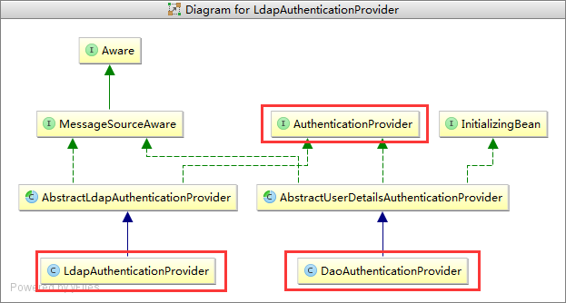
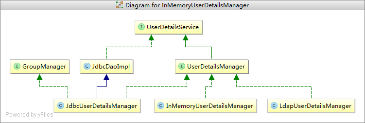

认证(Authentication)与源码解读
===============================================================================
在`Spring Security`中，认证过程称之为 **`Authentication`(验证)**，指的是建立系统使用者信息(`principal`)的过程。
使用者可以是一个 **用户、设备、或者其他可以在我们的应用中执行某种操作的其他系统**。

到目前为止，我们只是在`SecurityConfig`类中进行了最基础的认证配置。现在我们来看一些更加高级的认证配置。

### 基于内存的验证
我们已经看过一个在内存中配置单个用户验证的配置，以下的代码可以配置多个用户：
```java
@Autowired
public void configureGlobal(AuthenticationManagerBuilder auth) throws Exception {
    auth.inMemoryAuthentication()
        .withUser("user").password("password").roles("USER")
        .and()
        .withUser("admin").password("password").roles("USER", "ADMIN");
}
```

### JDBC验证
接下来你将看到对于基于`JDBC`验证的支持。以下案例假设你已经在你的应用中定义一个`DataSource`：
```java
@Autowired
private DataSource dataSource;

@Autowired
public void configureGlobal(AuthenticationManagerBuilder auth) throws Exception {
    auth.jdbcAuthentication()
        .dataSource(dataSource)
        .withDefaultSchema()
        .withUser("user").password("password").roles("USER")
        .and()
        .withUser("admin").password("password").roles("USER", "ADMIN");
}
```

### AuthenticationProvider
我们可以自定义一个`AuthenticationProvider`，并使其作为`Spring`的`Bean`。例如以下代码是假设有一个自定义的类
`SpringAuthenticationProvider`，其实现了`AuthenticationProvider`的配置。
```java
@Bean
public SpringAuthenticationProvider springAuthenticationProvider() {
    return new SpringAuthenticationProvider();
}
```

#### UserDetailsService
我们还可以自定义一个`UserDetailsService`，来实现验证。以下代码假设`SpringDataUserDetailsService`实现了
`UserDetailsService`。
```java
@Bean
public SpringDataUserDetailsService springDataUserDetailsService() {
    return new SpringDataUserDetailsService();
}
```
我们同样还可以配置`PasswordEncoder`，来指定密码的编码方式：
```java
@Bean
public BCryptPasswordEncoder passwordEncoder() {
    return new BCryptPasswordEncoder();
}
```
完整示例：
```java
@Bean
public UserDetailsService userDetailsService() {
    return new CustomUserDetailsService();
}

@Bean
public PasswordEncoder passwordEncoder(){
    return new Md5PasswordEncoder();
}

@Bean
public AuthenticationProvider authenticationProvider(){
    DaoAuthenticationProvider authenticationProvider = new DaoAuthenticationProvider();
    authenticationProvider.setUserDetailsService(userDetailsService());
    authenticationProvider.setPasswordEncoder(passwordEncoder());
    return authenticationProvider;
}

public void configureGlobal(AuthenticationManagerBuilder auth) throws Exception {
    //auth.userDetailsService(userDetailsService());
    auth.authenticationProvider(authenticationProvider());
}
```

### 源码解读
首先不管是哪一种验证方式(内存、`JDBC`还是`LDAP`)，我们都是通过一个自动注入的`AuthenticationManagerBuilder`对象来完成的。

从名字中就可以看出，这个类是用于构建`AuthenticationManager`。**那么`AuthenticationManager`是什么呢**？
其作用是 **对用户提交的用户名和密码进行验证**。

#### AuthenticationManagerBuilder的创建流程源码分析
再次回顾我们的`SecurityConfig`类，我们在这个类上添加了`@EnableWebSecurity`注解，其可以帮助我们创建
`Spring Security`工作过程中要使用到的`Filter`。而在这个注解的源码中，我们可以看到，
其还引入了一个 **`@EnableGlobalAuthentication`** 注解，其源码如下：
```java
@Retention(value = java.lang.annotation.RetentionPolicy.RUNTIME)
@Target(value = { java.lang.annotation.ElementType.TYPE })
@Documented
@Import(AuthenticationConfiguration.class)          //导入配置类AuthenticationConfiguration
@Configuration
public @interface EnableGlobalAuthentication { }
```
可以看到在这个注解中，我们又导入了另外一个配置类`AuthenticationConfiguration`。而`AuthenticationManagerBuilder`
对象就是由这个类提供的，核心源码如下：
```java
@Configuration
public class AuthenticationConfiguration {
    ...
    @Bean
    public AuthenticationManagerBuilder authenticationManagerBuilder(
        ObjectPostProcessor<Object> objectPostProcessor) {
        return new AuthenticationManagerBuilder(objectPostProcessor);
    }
    ...
}
```
可以看到这个配置类中，配置了一个类型为`AuthenticationManagerBuilder`的`Bean`。

#### AuthenticationManager的创建流程源码分析
与`HttpSecurity`类似，`AuthenticationManagerBuilder`也是`SecurityBuilder`的一个子类。不同的是，
`HttpSecurity`使用到的`SecurityConfiguer`基本上最终产生的都是一个过滤器，而`AuthenticationManagerBuilder`
使用到`SecurityConfiguer`最终产生的都是`AuthenticationManager`的一个子类实例`ProviderManager`。
`ProviderManager`类的创建是通过`performBuild`方法创建的。
```java
protected ProviderManager performBuild() throws Exception {
    if (!isConfigured()) {
        logger.debug("No authenticationProviders and no parentAuthenticationManager defined. Returning null.");
        return null;
    }
    //创建ProviderManager实例
    ProviderManager providerManager = new ProviderManager(authenticationProviders,parentAuthenticationManager);
    if (eraseCredentials != null) {
        providerManager.setEraseCredentialsAfterAuthentication(eraseCredentials);
    }
    if (eventPublisher != null) {
        providerManager.setAuthenticationEventPublisher(eventPublisher);
    }
    providerManager = postProcess(providerManager);
    return providerManager;
}
```
那么`AuthenticationManager`或者说`ProviderManager`到底是干什么的呢？其是 **用于管理验证提供者**。
前面我们已经看到了`SpringSecurity`支持基于`JDBC`、`LADP`等多种验证方式，实际上每一种方式都对应一个`provider`。
如果我们需要联合使用多种验证方式，`ProviderManager`就可以帮助我们来管理这些`provider`，例如先用谁验证，后用谁验证，
以及是否只要有一个`provider`验证成功就算用户已经成功验证等。

#### AuthenticationProvider创建流程
我们已经知道`AuthenticationManagerBuilder`会帮助我们创建一个`AuthenticationManager`的子类实例`ProviderManager`，
其是用于管理`AuthenticationProvider`的。

`AuthenticationManagerBuilder`的`inMemoryAuthentication()`、`jdbcAuthentication()`、`ldapAuthentication()`
这三个方法分别返回的`InMemoryUserDetailsManagerConfigurer`、`JdbcUserDetailsManagerConfigurer`、
`LdapAuthenticationProviderConfigurer`三个`SecurityConfiguer`子类实例，最终会帮助我创建各自对应的`provider`。

我们列出`inMemoryAuthentication()`、`jdbcAuthentication()`、`ldapAuthentication()`的源码：
```java
public InMemoryUserDetailsManagerConfigurer<AuthenticationManagerBuilder> inMemoryAuthentication()
    throws Exception {
    return apply(new InMemoryUserDetailsManagerConfigurer<AuthenticationManagerBuilder>());//调用apply方法
}
//-------------------------------
public JdbcUserDetailsManagerConfigurer<AuthenticationManagerBuilder> jdbcAuthentication()
    throws Exception {
    return apply(new JdbcUserDetailsManagerConfigurer<AuthenticationManagerBuilder>());//调用apply方法
}
//-------------------------------
public LdapAuthenticationProviderConfigurer<AuthenticationManagerBuilder> ldapAuthentication()
    throws Exception {
    return apply(new LdapAuthenticationProviderConfigurer<AuthenticationManagerBuilder>());//调用apply方法
}
```
其中`InMemoryUserDetailsManagerConfigurer`和`JdbcUserDetailsManagerConfigurer`对应的`provider`都是
`DaoAuthenticationProvider`。`LdapAuthenticationProviderConfigurer`对应的是`LdapAuthenticationProvider`。

很明显的，这两个`provider`都是`AuthenticationProvider`的子类。



#### UserDetailsService创建流程
前面提到`InMemoryUserDetailsManagerConfigurer`、`JdbcUserDetailsManagerConfigurer`、
`LdapAuthenticationProviderConfigurer`分别对应一个`AuthenticationProvider`。

特别的，他们各自还对应一个`UserDetailsService`的三个子类实例：`InMemoryUserDetailsManager`、`JdbcUserDetailsManager`、
`LdapUserDetailManager`。

类图如下：




