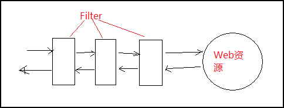
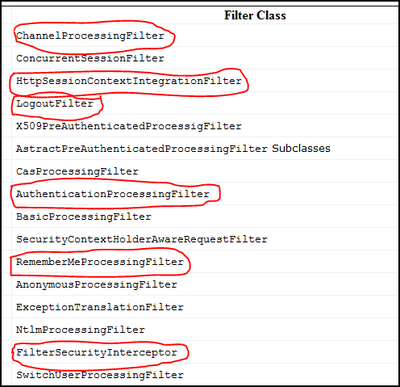
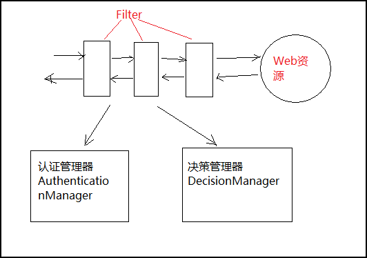
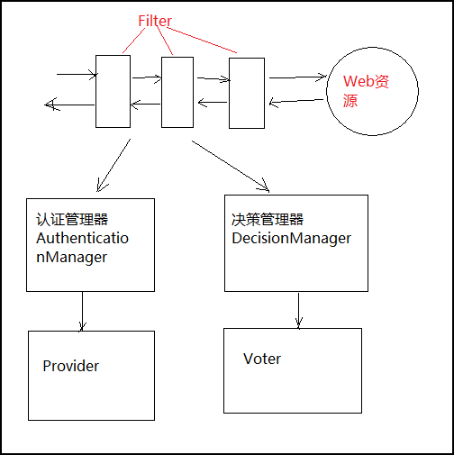
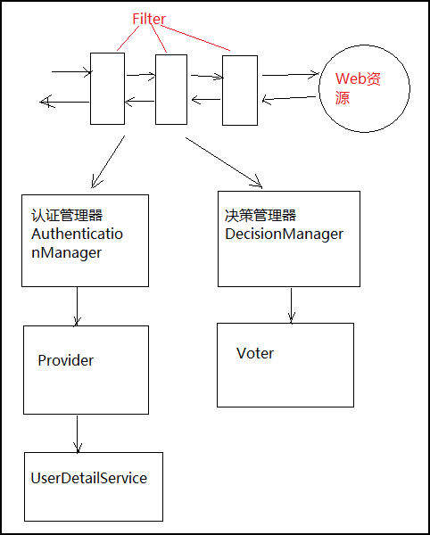
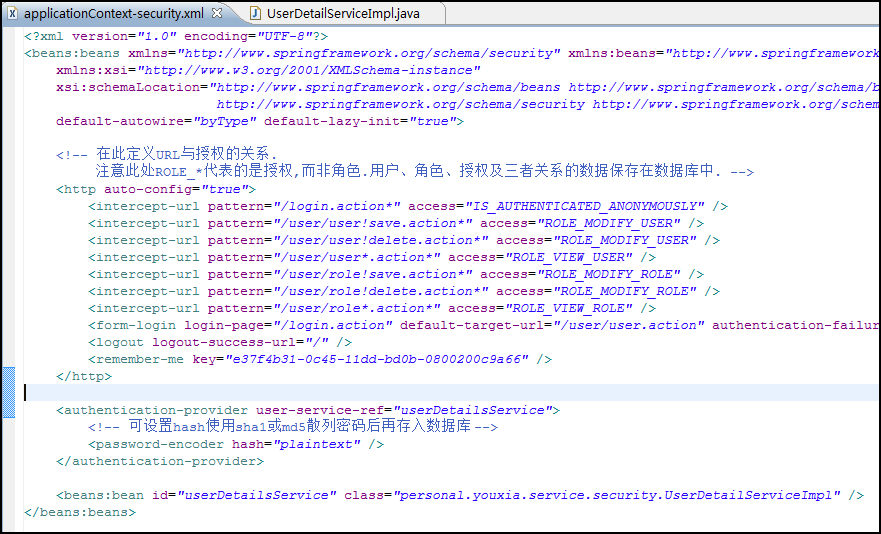
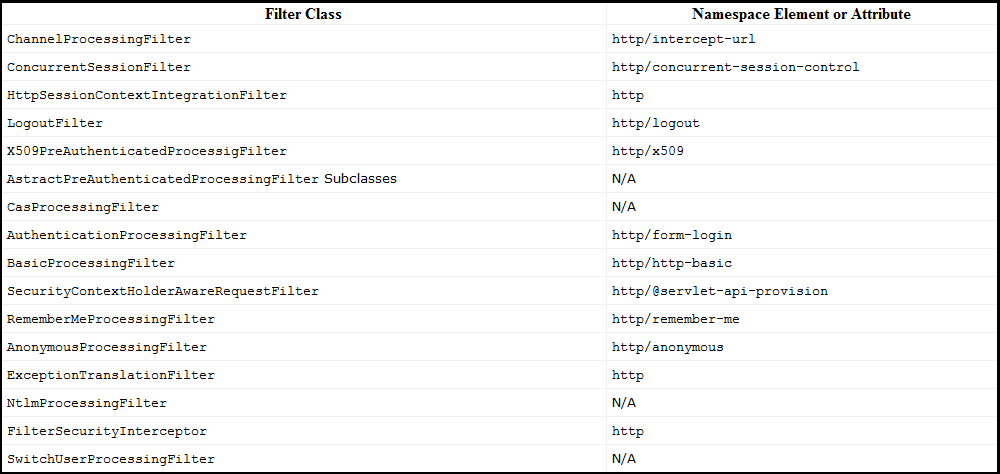

Spring security框架原理
================================================================================
如果要 **对`Web`资源进行保护**，最好的办法莫过于 **`Filter`**，要想 **对方法调用进行保护**，最好的办法莫过于 **AOP**。
`Spring security`对`Web`资源的保护，就是靠`Filter`实现的。如下图： 

一般来说，我们的`Filter`都是配置在`web.xml`中，但是`Spring security`不一样，它在`web.xml`中配置的只是一个 **代理**，
而 **真正起作用的`Filter`是作为`Bean`配置在`Spring`中的**。`web.xml`中的代理依次调用这些`Bean`，就实现了对`Web`资源的保护，
同时这些`Filter`作为`Bean`被`Spring`管理，所以实现`AOP`也很简单。 

`Spring security`提供的`Filter`也不少，有十多个，一个一个学起来比较复杂。但是对于我们｀Web｀开发者来说，常用的就那么几个，
如下图中的被红圈圈标记出来的： 

从上到下，它们实现的功能依次是：
1. 用来过滤哪些请求必须用`https`协议, 哪些请求必须用`http`协议, 哪些请求随便用哪个协议都行；
2. 从`Session`中提取用户的认证信息；
3. 退出登录；
4. 登录；
5. 记住用户；
6. 所有的应用必须配置这个`Filter`。 

这些`Filter`并不直接处理用户的认证，也不直接处理用户的授权，而是把它们交给了 **认证管理器** 和 **决策管理器**。
如下图： 

其实这两个管理器自己也不做事，**认证管理器把任务交给了`Provider`**，而 **决策管理器则把任务交给了`Voter`**，如下图： 

现在我要告诉你们，这里的`Provider`和`Voter`也是不需要我们写代码的。不要崩溃，快到目标了。`Spring security`提供了多个`Provider`的实现类，
**如果我们想用数据库来储存用户的认证数据，那么我们就选择`DaoAuthenticationProvider`。对于`Voter`，我们一般选择`RoleVoter`就够用了，
它会根据我们配置文件中的设置来决定是否允许某一个用户访问制定的Web资源**。

**而`DaoAuthenticationProvider`也是不直接操作数据库的，它把任务委托给了`UserDetailService`**，如下图： 

而我们要做的就是实现这个`UserDetailService`，实现自己的`UserDetailService`，它就是连接我们的数据库和`Spring Security`的桥梁。
`UserDetailService`的要求也很简单，只需要一个 **返回`org.springframework.security.userdetails.User`对象的
`loadUserByUsername(String userName)`方法**。因此，怎么设计数据库都可以，不管我们是用一个表还是两个表还是三个表，也不管我们是用户-授权，
还是用户-角色-授权，还是用户-用户组-角色-授权，这些具体的东西`Spring security`统统不关心，它只关心返回的那个`User`对象，
至于怎么从数据库中读取数据，那就是我们自己的事了。

反过来再看看上面的过程，我们发现，即使我们要做的只是实现自己的`UserDetailService`类，但是我们不得不在`Spring`中配置那一大堆的`Bean`，
包括几个`Filter`，几个`Manager`，几个`Provider`和`Voter`，而这些配置往往都是重复的无谓的。好在`Spring security`也认识到了这个问题，
所以，它设计了一个 **`<http>`标签**，让`Spring security`的配置得到了简化。大家可以下面示例：

下图是官方文章中的传统 **`Filter`** 设置和 **`<http>`** 元素之间的对应关系：  

