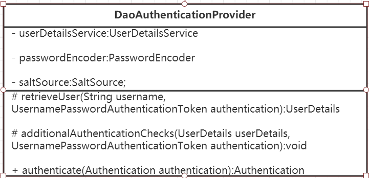

Spring security核心组件
==================================================================
### SecurityContextHolder
`SecurityContextHolder`用于 **存储安全上下文（security context）的信息**。当前操作的用户是谁，该用户是否已经被认证，他拥有哪些角色权限等，
这些都被保存在`SecurityContextHolder`中。`SecurityContextHolder`默认使用`ThreadLocal`策略来存储认证信息。看到`ThreadLocal`也就意味着，
这是一种与线程绑定的策略。`Spring Security`在用户登录时自动绑定认证信息到当前线程，在用户退出时，自动清除当前线程的认证信息。但这一切的前提，
是你在`web`场景下使用`Spring Security`，而如果是`Swing`界面，`Spring`也提供了支持，`SecurityContextHolder`的策略则需要被替换，
鉴于我的初衷是基于`web`来介绍`Spring Security`，所以这里以及后续，非web的相关的内容都一笔带过。

#### 获取当前用户的信息
因为身份信息是与线程绑定的，所以可以在程序的任何地方使用静态方法获取用户信息。一个典型的获取当前登录用户的姓名的例子如下所示：
```java
Object principal = SecurityContextHolder.getContext().getAuthentication().getPrincipal();
if (principal instanceof UserDetails) {
    String username = ((UserDetails)principal).getUsername();
} else {
    String username = principal.toString();
}
```
`getAuthentication()`返回了认证信息，再次`getPrincipal()`返回了身份信息，`UserDetails`便是`Spring`对身份信息封装的一个接口。

### Authentication
先看看这个接口的源码长什么样：
```java
package org.springframework.security.core;                                      // <1>
public interface Authentication extends Principal, Serializable {               // <1>
    Collection<? extends GrantedAuthority> getAuthorities();                    // <2>
    Object getCredentials();                                                    // <2>
    Object getDetails();                                                        // <2>
    Object getPrincipal();                                                      // <2>
    boolean isAuthenticated();                                                  // <2>
    void setAuthenticated(boolean var1) throws IllegalArgumentException;
}
```
1. <1>：`Authentication`是`spring security`包中的接口，直接继承自`Principal`类，而`Principal`是位于
`java.security`包中的。可以见得，`Authentication`在`spring security`中是最高级别的 **身份/认证** 的抽象。
2. <2>：由这个顶级接口，我们可以得到用户拥有的 **权限信息列表，密码，用户细节信息，用户身份信息，认证信息**。

上一节中，`authentication.getPrincipal()`返回了一个`Object`，我们将`Principal`强转成了`Spring Security`中
最常用的`UserDetails`，这在`Spring Security`中非常常见，接口返回`Object`，使用`instanceof`判断类型，强转成对应的具体实现类。
接口详细解读如下：
+ **`getAuthorities()`，权限信息列表**，默认是`GrantedAuthority`接口的一些实现类，通常是代表权限信息的一系列字符串。
+ **`getCredentials()`，密码信息**，用户输入的密码字符串，在认证过后通常会被移除，用于保障安全。
+ **`getDetails()`，细节信息**，`web`应用中的实现接口通常为`WebAuthenticationDetails`，它记录了访问者的`ip`地址和`sessionId`的值。
+ **`getPrincipal()`，身份信息**，大部分情况下返回的是`UserDetails`接口的实现类，也是框架中的常用接口之一。

#### Spring Security是如何完成身份认证的？
1. 用户名和密码被过滤器获取到，封装成`Authentication`，通常情况下是`UsernamePasswordAuthenticationToken`这个实现类。
2. `AuthenticationManager`身份管理器负责验证这个`Authentication`。
3. 认证成功后，`AuthenticationManager`身份管理器返回一个被填充满了信息的（包括上面提到的权限信息，身份信息，细节信息，
但密码通常会被移除）`Authentication`实例。
4. `SecurityContextHolder`安全上下文容器将第3步填充了信息的`Authentication`，通过
`SecurityContextHolder.getContext().setAuthentication(…)`方法，设置到其中。

### AuthenticationManager
`AuthenticationManager`（接口）是认证相关的核心接口，也是发起认证的出发点，因为在实际需求中，我们可能会允许用户使用用户名+密码登录，
同时允许用户使用邮箱+密码，手机号码+密码登录，甚至，可能允许用户使用指纹登录，所以说`AuthenticationManager`一般不直接认证，
`AuthenticationManager`接口的常用实现类`ProviderManager`内部会维护一个`List<AuthenticationProvider>`列表，存放多种认证方式，
实际上这是委托者模式的应用（`Delegate`）。也就是说，核心的认证入口始终只有一个：`AuthenticationManager`，不同的认证方式：用户名+密码
（`UsernamePasswordAuthenticationToken`），邮箱+密码，手机号码+密码登录，则对应了三个`AuthenticationProvider`。
**熟悉`shiro`的朋友可以把`AuthenticationProvider`理解成`Realm`**。在默认策略下，只需要通过一个`AuthenticationProvider`的认证，
即可被认为是登录成功。

只保留了关键认证部分的`ProviderManager`源码：
```java
public class ProviderManager implements AuthenticationManager, MessageSourceAware,InitializingBean {
    // 维护一个AuthenticationProvider列表
    private List<AuthenticationProvider> providers = Collections.emptyList();
    public Authentication authenticate(Authentication authentication) throws AuthenticationException {
        Class<? extends Authentication> toTest = authentication.getClass();
        AuthenticationException lastException = null;
        Authentication result = null;
        // 依次认证
        for (AuthenticationProvider provider : getProviders()) {
            if (!provider.supports(toTest)) {
                continue;
            }
            try {
                result = provider.authenticate(authentication);
                if (result != null) {
                    copyDetails(authentication, result);
                    break;
                }
            }
            ...
            catch (AuthenticationException e) {
                lastException = e;
            }
        }
        // 如果有Authentication信息，则直接返回
        if (result != null) {
            if (eraseCredentialsAfterAuthentication && (result instanceof CredentialsContainer)) {
                //移除密码
                ((CredentialsContainer) result).eraseCredentials();
            }
            //发布登录成功事件
            eventPublisher.publishAuthenticationSuccess(result);
            return result;
        }
        ...
        //执行到此，说明没有认证成功，包装异常信息
        if (lastException == null) {
            lastException = new ProviderNotFoundException(messages.getMessage(
                "ProviderManager.providerNotFound",
                new Object[] { toTest.getName() },
                "No AuthenticationProvider found for {0}"));
        }
        prepareException(lastException, authentication);
        throw lastException;
    }
}
```
`ProviderManager`中的`List`，会依照次序去认证，认证成功则立即返回，若认证失败则返回`null`，下一个`AuthenticationProvider`会继续尝试认证，
如果所有认证器都无法认证成功，则`ProviderManager`会抛出一个`ProviderNotFoundException`异常。

到这里，如果不纠结于`AuthenticationProvider`的实现细节以及安全相关的过滤器，认证相关的核心类其实都已经介绍完毕了：
**身份信息的存放容器SecurityContextHolder，身份信息的抽象Authentication，身份认证器AuthenticationManager及其认证流程**。

### DaoAuthenticationProvider
`AuthenticationProvider`最最最常用的一个实现便是`DaoAuthenticationProvider`。顾名思义，`Dao`正是数据访问层的缩写，
也暗示了这个身份认证器的实现思路。



按照我们最直观的思路，怎么去认证一个用户呢？用户前台提交了用户名和密码，而数据库中保存了用户名和密码，认证便是负责比对同一个用户名，
提交的密码和保存的密码是否相同便是了。**在`Spring Security`中，提交的用户名和密码，被封装成了 `UsernamePasswordAuthenticationToken`，
而根据用户名加载用户的任务则是交给了`UserDetailsService`，在`DaoAuthenticationProvider`中，对应的方法便是`retrieveUser`，
虽然有两个参数，但是`retrieveUser`只有第一个参数起主要作用，返回一个`UserDetails`。还需要完成`UsernamePasswordAuthenticationToken`
和`UserDetails`密码的比对，这便是交给`additionalAuthenticationChecks`方法完成的，如果这个`void`方法没有抛异常，则认为比对成功。
比对密码的过程，用到了`PasswordEncoder`和`SaltSource`**，密码加密和盐的概念相信不用我赘述了，它们为保障安全而设计，都是比较基础的概念。

如果你已经被这些概念搞得晕头转向了，不妨这么理解`DaoAuthenticationProvider`：它获取用户提交的用户名和密码，比对其正确性，如果正确，
返回一个数据库中的用户信息（假设用户信息被保存在数据库中）。

### UserDetails与UserDetailsService
上面不断提到了`UserDetails`这个接口，它代表了最详细的用户信息，这个接口涵盖了一些必要的用户信息字段，具体的实现类对它进行了扩展。
```java
public interface UserDetails extends Serializable {
    Collection<? extends GrantedAuthority> getAuthorities();
    String getPassword();
    String getUsername();
    boolean isAccountNonExpired();
    boolean isAccountNonLocked();
    boolean isCredentialsNonExpired();
    boolean isEnabled();
}
```
它和`Authentication`接口很类似，比如它们都拥有`username`，`authorities`，区分他们也是本文的重点内容之一。
`Authentication`的`getCredentials()`与`UserDetails`中的`getPassword()`需要被区分对待，前者是用户提交的密码凭证，
后者是用户正确的密码，认证器其实就是对这两者的比对。`Authentication`中的`getAuthorities()`实际是由`UserDetails`的`getAuthorities()`
传递而形成的。还记得`Authentication`接口中的`getUserDetails()`方法吗？其中的`UserDetails`用户详细信息便是经过了`AuthenticationProvider`
之后被填充的。
```java
public interface UserDetailsService {
    UserDetails loadUserByUsername(String username) throws UsernameNotFoundException;
}
```
`UserDetailsService`和`AuthenticationProvider`两者的职责常常被人们搞混，关于他们的问题在文档的`FAQ`和`issues`中屡见不鲜。
记住一点即可，**`UserDetailsService`只负责从特定的地方（通常是数据库）加载用户信息**，仅此而已，记住这一点，可以避免走很多弯路。
`UserDetailsService`常见的实现类有`JdbcDaoImpl`，`InMemoryUserDetailsManager`，前者从数据库加载用户，后者从内存中加载用户，
也可以自己实现`UserDetailsService`，通常这更加灵活。

### 架构概览图
为了更加形象的理解上述我介绍的这些核心类，附上一张按照我的理解，所画出`Spring Security`的一张非典型的`UML`图：


