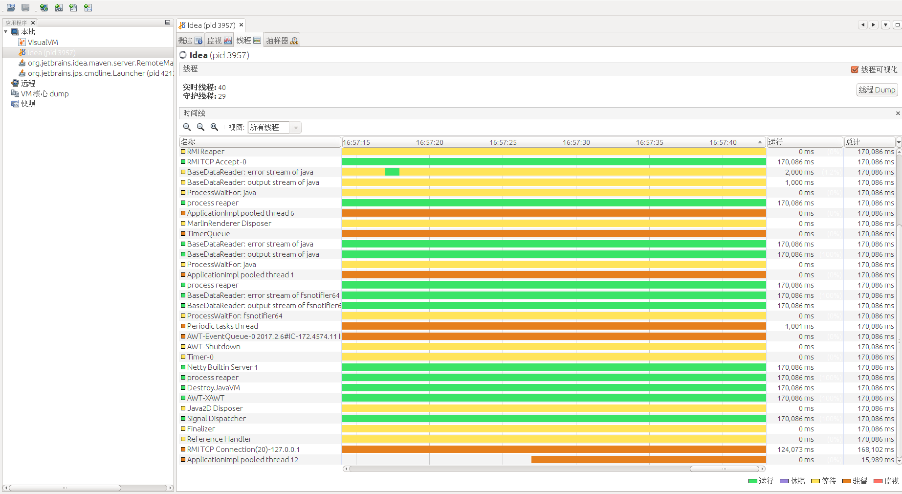

线程监视
====================================================================
一个真实的`Java`系统运行时往往有上百个线程在运行，如果没有相应的工具可以对这些线程进行监视，那么这些线程
对于我们来说就成了黑盒。而我们在开发过程中进行代码调试、定位问题，甚至是定位线上环境（生产环境）中的问题时
往往都需要将线程变为白盒，即我们要能够知道系统中特定时刻存在哪些线程、这些线程处于什么状态以及这些线程具体
是在做什么事情。

**`JDK`自带的工具`jvisualvm`可以实现线程的监视，它适合于在开发和测试环境中监视`Java`系统中的线程情况**。
下图展示了使用`jvisualvm`监视一个运行的`idea`实例中的线程情况，这包括有哪些线程，以及这些线程的状态和调用栈。

当然，**如果是线上环境**，我们可能不便使用`jvisualvm`。**此时可以使用`JDK`自带的另外一个工具`jstack`**。
`jstack`是一个命令行工具，通过它可以获取指定`Java`进程的线程信息。