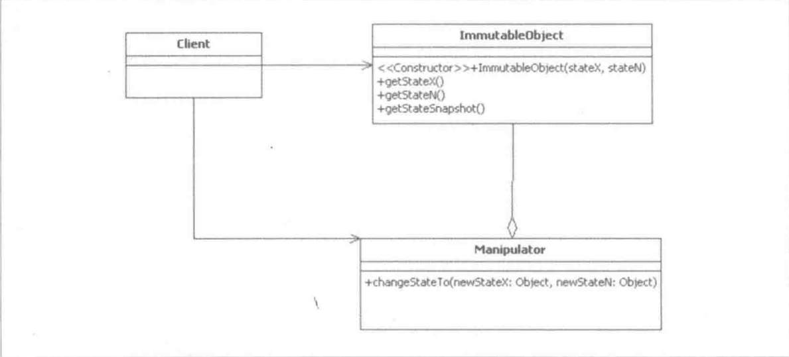

Immutable Object模式的架构
==================================================================================
**`Immutable Object`模式将现实世界中状态可变的实体建模为状态不可变对象，并通过创建不同的状态不可变的对象来反映
现实世界实体的状态变更**。

`Immutable Object`模式的主要参与者有以下几种，其类图如下：

+ **`ImmutableObject`**：负责存储一组不可变状态。该参与者不对外暴露任何可以修改其状态的方法，其主要方法及职责如下：
    + **getStateX,getStateN**：这些`getter`方法返回其所属`ImmutableObject`实例所维护的状态相关变量的值。
    这些变量在对象实例化时通过其构造器的参数获得值。
    + **getStateSnapshot**：返回其所属`ImmutableObject`实例维护的一组状态的快照。
+ **Manipulator**：负责维护`ImmutalbeObject`所建模的现实世界实体状态的变更。当相应的现实实体状态变更时，该参与者负责生成新的`ImmutableObject`的实例，以反映新的状态。
    + **changeStateTo**：根据新的状态值生成新的`ImmutableObject`的实例。

不可变对象的使用主要包括以下几种类型：
+ **获取单个状态的值**：调用不可变对象的相关`getter`方法即可实现。
+ **获取一组状态的快照**：不可变对象可以提供一个`getter`方法，该方法需要对其返回值做防御性复制或者返回一个只读的对象，
以避免其状态对外泄露而被改变。
+ **生成新的不可变对象实例**：当被建模对象的状态发生变化的时候，创建新的不可变对象实例来反映这种变化。

**一个严格意义上不可变对象要满足以下所有条件**：
+ **类本身使用`final`修饰**：防止其子类改变其定义的行为。
+ **所有字段都是用`final`修饰的**：使用`final`修饰不仅仅是从语义上说明被修饰字段的引用不可改变。更重要的是这个语义在
多线程环境下由`JMM`（`Java Memory Model`）保证了被修饰字段所引用对象的初始化安全，**即`final`修饰的字段在其他线程可见时，
它必定是初始化完成的**。相反，非`final`修饰的字段由于缺少这种保证，可能导致一个线程“看到”一个字段的时候，
它还未被初始化完成，从而可能导致一些不可预料的结果。
+ **在对象的创建过程中，`this`关键字没有泄露给其他类**：防止其他类（如该类的内部匿名类）在对象创建过程中修改其状态。
+ **任何字段，若其引用了其他状态可变的对象（如集合、数组等），则这些字段必须是`private`修饰的，并且这些字段值不能对外暴露**。
若有相关方法要返回这些字段值，应该进行防御性复制（`Defensive Copy`）。
