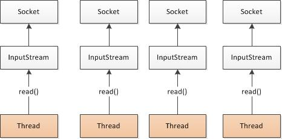
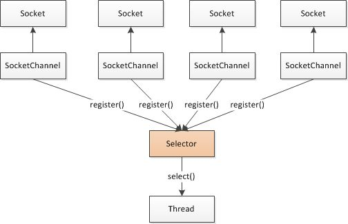

Java网络编程
====================================================================
最早的`Java`（1995 ~ 2002）引入了足够多的面向对象`facade`（门面）来隐藏一些棘手的细节问题，
但是创建一个复杂的客户端/服务器协议仍然需要大量的样板代码（以及相当多的底层研究才能使它整个流畅地运行起来）。

那些最早期的`Java API`（`java.net`）只支持由本地系统套接字库提供的所谓的阻塞函数。下面代码清单展示
了一个使用了这些函数调用的服务器代码的普通示例：
```java
//创建一个新的ServerSocket，用以监听指定端口上的连接请求
ServerSocket serverSocket = new ServerSocket(portNumber);
//对accept()方法的调用将被阻塞，直到一个连接建立
Socket socket = serverSocket.accept();
//这些流对象都派生于该套接字的流对象
BufferedReader in = new BufferedReader(new InputStreamReader(socket.getInputStream()));
PrintWriter out = new PrintWriter(socket.getOutputStream(), true);
//如果客户端发送了“Done”，则退出处理循环
String request, response;
while((request = in.readLine()) != null) {
    if("Done".equals(request)) {
        break;
    }
    //请求被传递给服务器的处理方法
    response = processRequest(request);
    //服务器的响应被发送给客户端
    out.println(response);
}
```
上面的代码实现了`Socket API`的基本模式之一。以下是最重要的几点：
+ `ServerSocket`上的 **`accept()`方法将会一直阻塞到一个连接建立**，随后返回一个新的`Socket`用于客户端和服务器
之间的通信。该`ServerSocket`将继续监听传入的连接。
+ `BufferedReader`和`PrintWriter`都衍生自`Socket`的输入输出流。前者从一个字符输入流中读取文本，
后者打印对象的格式化的表示到文本输出流。
+ **`readLine()`方法将会阻塞**，直到一个由换行符或者回车符结尾的字符串被读取。

**这段代码片段将只能同时处理一个连接**，要管理多个并发客户端，需要为每个新的客户端`Socket`创建一个新的`Thread`。
如下图：



让我们考虑一下这种方案的影响。
+ **第一，在任何时候都可能有大量的线程处于休眠状态，只是等待输入或者输出数据就绪，这可能算是一种资源浪费**。
+ **第二，需要为每个线程的调用栈都分配内存，其默认值大小区间为`64KB`到`1MB`，具体取决于操作系统**。
+ **第三，即使`Java`虚拟机（`JVM`）在物理上可以支持非常大数量的线程，但是远在到达该极限之前，上下文切换所带来的
开销就会带来麻烦**，例如，在达到`10000`个连接的时候。

虽然这种并发方案对于支撑中小数量的客户端来说还算可以接受，但是为了支撑`100000`或者更多的并发连接所需要的资源使得它很不理想。

### Java NIO
上面的代码清单中，代码底层的阻塞系统调用之外，**本地套接字库很早就提供了非阻塞调用，其为网络资源的利用率提供了相当
多的控制**。
+ 可以使用`setsockopt()`方法配置套接字，以便 **读/写调用在没有数据的时候立即返回**。
+ 可以使用 **操作系统的事件通知`API`（I/O多路复用）** 注册一组非阻塞套接字，以确定它们中是否有任何的套接字已经有数据可供读写。

`Java`对于非阻塞`I/O`的支持是在`2002`年引入的，位于`JDK1.4`的`java.nio`包中。

### 选择器



如上图，展示了一个非阻塞设计，其实际上消除了前面所描述的（阻塞I/O）那些弊端。

**`Class java.nio.channels.Selector`是`Java`的非阻塞`I/O`实现的关键**。它使用了事件通知`API`以确定在一组
非阻塞套接字中有哪些已经就绪能够进行`I/O`相关的操作。因为可以在任何的时间检查任意的读操作或者写操作的完成状态，
所以如上图，**一个单一的线程便可以处理多个并发的连接**。

总体来看，与阻塞`I/O`模型相比，**这种模型提供了更好的资源管理**：
+ **使用较少的线程便可以处理许多连接，因此也减少了内存管理和上下文切换所带来开销**；
+ **当没有`I/O`操作需要处理的时候，线程也可以被用于其他任务**。

尽管已经有许多直接使用`Java NIO API`的应用程序被构建了，但是要做到如此正确和安全并不容易。特别是，
在高负载下可靠和高效地处理和调度`I/O`操作是一项繁琐且容易出错的任务，最好留给高性能的网络编程转家————Netty。


