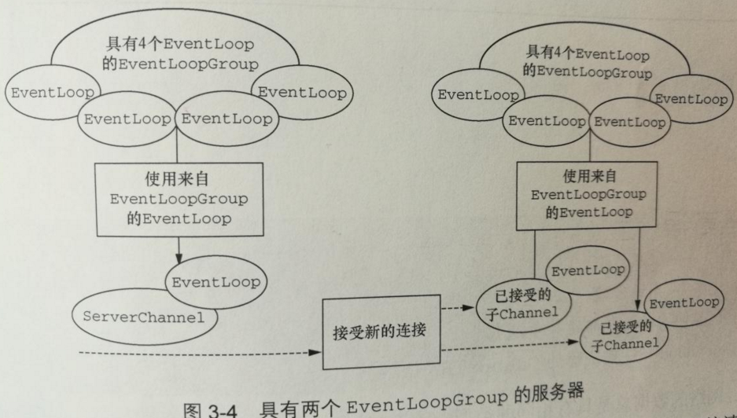

引导
======================================================================
**Netty的引导类为应用程序的网络层配置提供了容器**，这涉及将一个进程绑定到 **某个指定的端口**，
或者将一个进程连接到另一个运行在某个 **指定主机** 的 **指定端口** 上的进程。通常来说，
我们把前面的用例称作 **引导一个服务器**，后面的用例称作 **引导一个客户端**。

因此，有两种类型的引导：一种用于客户端（简单地称为`Bootstrap`），而另一种（`ServerBootstrap`）用于服务器。
无论你的应用程序使用哪种协议或者处理哪种类型的数据，**唯一决定它使用哪种引导类的是它是作为一个客户端
还是作为一个服务器**。

| 类别 | Bootstrap | ServerBootstrap |
|:---------|:---------|:------------|
| 网络编程中的作用 | 连接到远程主机和端口 | 绑定到一个本地端口 |
| EventLoopGroup的数目 | 1 | 2(**注1：也可以是1**) |

```
注1：实际上，ServerBootstrap类也可以只使用一个EventLoopGroup，此时其将在两个场景下共用同一个
EventLoopGroup。
```

引导一个客户端只需要一个`EventLoopGroup`，**但是一个`ServerBootstrap`则需要两个（也可以是同一个实例）**。
为什么呢？

**因为服务器需要两组不同的`Channel`。第一组将只包含一个`ServerChannel`，代表服务器自身的已绑定到某个本地
端口的正在监听的套接字。而第二组将包含所有已创建的用来处理客户端连接（对于每个服务器已经接受的连接都有一个）
的`Channel`**。



与`ServerChannel`相关联的`EventLoopGroup`将分配一个负责为连接请求创建`Channel`的`EventLoop`。
一旦连接被接受，第二个`EventLoopGroup`就会给它的`Channel`分配一个`EventLoop`。

