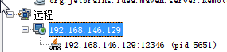
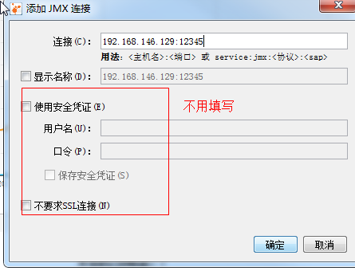
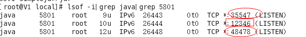

使用jvisualvm并利用JMX监控远程jvm实例
================================================================================
##　远程服务器启动Jar程序
对foo.jar这个可执行Jar包，执行启动命令：
```shell
$ java -Dcom.sun.management.jmxremote.port=12345 -Dcom.sun.management.jmxremote.ssl=false      
      -Dcom.sun.management.jmxremote.authenticate=false -jar foo.jar
```
```
注：

1. 12345为需要监控的端口，远程机器需要开启
2. foo.jar为程序名称
```

## 本机jvisualvm添加监控





## 可能出现的异常
异常情况：`VisualVM`无法使用`service:jmx:rmi:///jndi/rmi:///jmxrmi`连接到远程JVM实例。
这时只要 **关闭远程机器的防火墙即可**。

### 原因
**除了JMX server指定的监听端口号外，JMXserver还会监听到两个随机端口号**，可以通过命`grep <pid>`
来查看当前java进程需要监听的随机端口号：
```shell
$ lsof -i|grep java|grep 5801
```

