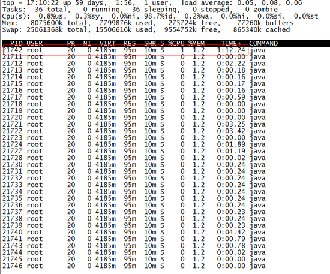

jstack找出最耗cpu的线程并定位代码
================================================================================
**jstack可以定位到线程堆栈，根据堆栈信息我们可以定位到具体代码，所以它在JVM性能调优中使用得非常
多**。下面我们来一个实例找出某个Java进程中最耗费CPU的Java线程并定位堆栈信息，用到的命令有`ps`、
`top`、`printf`、`jstack`、`grep`。

**第一步先找出Java进程ID**，服务器上的Java应用名称为`mrf-center`：
```shell
$ ps -ef | grep mrf-center | grep -v grep
```
或者直接：
```shell
$ jps -l
```
从中找到`mrf-center`对应的进程ID。

得到进程ID为`21711`，**第二步找出该进程内最耗费CPU的线程**，可以使用：
```shell
#第一种方法(21711是进程号)
$ ps -Lfp 21711

#第二种方法(21711是进程号)
$ ps -mp 21711 -o THREAD, tid, time

#第三种方法(21711是进程号)
$ top -Hp 21711
```
这里我们使用第三个，输出如下：



**TIME列就是各个Java线程耗费的CPU时间**，CPU时间最长的是线程ID为`21742`的线程，执行命令：
```shell
$ printf "%x\n" 21742
```
得到`21742`的十六进制值为`54ee`（后面会用到）。

终于轮到`jstack`上场了，它用来输出进程`21711`的堆栈信息，然后 **根据线程ID的十六进制值grep**，
如下：
```shell
$ jstack 21711 | grep 54ee
```
```
"PollIntervalRetrySchedulerThread" prio=10 tid=0x00007f950043e000 nid=0x54ee in Object.wait()
```
可以看到CPU消耗在`PollIntervalRetrySchedulerThread`这个类的`Object.wait()`，我找了下我
的代码，定位到下面的代码：
```java
// Idle wait
getLog().info("Thread [" + getName() + "] is idle waiting...");
schedulerThreadState = PollTaskSchedulerThreadState.IdleWaiting;
long now = System.currentTimeMillis();
long waitTime = now + getIdleWaitTime();
long timeUntilContinue = waitTime - now;
synchronized(sigLock) {
  try {
    if(!halted.get()) {
      sigLock.wait(timeUntilContinue);
    }
  }
  catch (InterruptedException ignore) {
  }
}
```
它是 **轮询任务的空闲等待代码**，上面的`sigLock.wait(timeUntilContinue)`就对应了前面的
`Object.wait()`。
