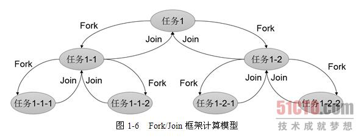

分而治之：Fork-Join框架
=====================================================================
**“分而治之”** 一直是一个非常有效地处理大量数据的方法。著名的 **`MapReduce`** 也是采取了分而治之的思想。
简单来说，就是如果你要处理1000个数据，但是你并不具备处理1000个数据的能力，那么你可以只处理其中的10个，
然后，分阶段处理100次，将100次的结果进行合成，那就是最终想要的对原始1000个数据的处理结果。

`Fork`一词的原始含义是吃饭用的叉子，也有分叉的意思。在Linux平台中，函数`fork()`用来创建子进程，
使得系统进程可以多一个执行分支。在Java中也沿用了类似的命名方式。

而`join()`的含义在之前的章节已经解释过，这里也是相同的意思，表示等待。也就是使用`fork()`后系统多
了一个执行分支（线程），所以需要等待这个执行分支执行完毕，才有可能得到最终的结果，因此`join()`就表示等待。

在实际使用中，如果毫无顾忌地使用`fork()`开启线程进行处理，那么很有可能导致系统开启过多的线程而严重影响
性能。所以，在JDK中，给出了一个 **`ForkJoinPool`线程池**，对于`fork()`方法并不急着开启线程，而是提交给
`ForkJoinPool`线程池进行处理，以节省系统资源。`Fork/Join`进行数据处理时的总体结构如下图：



**由于线程池的优化，提交的任务和线程数量并不是一对一的关系。在绝大多数情况下，一个物理线程实际上是需要处理
多个逻辑任务的。因此，每个线程必然需要拥有一个任务队列。因此，在实际执行过程中，可能遇到这么一种情况：
线程A已经把自己的任务都执行完成了，而线程B还有一堆任务等着处理，此时，线程A就会“帮助”线程B，从线程B的
任务队列中拿一个任务过来处理，尽可能地达到平衡。一个要注意的地方是，当线程试图帮助别的线程时，总是从任务
队列的底部开始拿数据，而线程试图执行自己的任务时，则是从相反的顶部开始拿。因此这种行为也十分有利于避免
数据竞争**。

下面我们来看一下`ForkJoinPool`的一个重要的接口：
```java
public <T> ForkJoinPool<T> submit(ForkJoinTask<T> task);
```
**你可以向`ForkJoinPool`线程池提交一个`ForkJoinTask`任务。所谓`ForkJoinTask`任务就是支持`fork()`
分解以及`join()`等待的任务。`ForkJoinTask`有两个重要的子类，`RecursiveAction`和`RecursiveTask`。
它们分别表示没有返回值的任务和可以携带返回值的任务**。

下面我们简单地展示`ForkJoin`框架的使用，这里用来计算数列求和：
```java
package concurrent;

import java.util.ArrayList;
import java.util.List;
import java.util.concurrent.ExecutionException;
import java.util.concurrent.ForkJoinPool;
import java.util.concurrent.ForkJoinTask;
import java.util.concurrent.RecursiveTask;

public class CountTask extends RecursiveTask<Long> {

    private static final int THRESHOLD = 10000;
    private long start;
    private long end;

    public CountTask(long start, long end) {
        this.start = start;
        this.end = end;
    }

    @Override
    protected Long compute() {
        long sum = 0;
        boolean canCompute = end - start < THRESHOLD;
        if (canCompute) {
            for (long i = start; i <= end; i++) {
                sum += i;
            }
        } else {
            //分成100个任务, 注意这里的步长是随意的，(2*end+start)/100，对结果也没有变化
            long step = (end + start) / 100;
            List<CountTask> subTasks = new ArrayList<>();
            long pos = start;
            //100的循环中，有许多情况 pos > lastOne，造成CountTask中的循环不会执行
            for (int i = 0; i < 100; i++) {
                long lastOne = pos + step;
                if (lastOne > end) lastOne = end;
                CountTask ct = new CountTask(pos, lastOne);
                pos += step + 1;
                subTasks.add(ct);
                ct.fork();
            }
            for (CountTask c : subTasks) {
                sum += c.join();
            }
        }
        return sum;
    }

    public static void main(String[] args) throws InterruptedException, ExecutionException {
        ForkJoinPool pool = new ForkJoinPool();
        CountTask task = new CountTask(0, 200000L);
        ForkJoinTask<Long> result = pool.submit(task);
        System.out.println("sum = " + result.get());
    }
}
```
由于计算数列的和必然需要函数返回值的，因此选择`RecursiveTask`作为任务的模型。`CountTask`继承自`RecursiveTask`，
可以返回求和后的结果。如果任务可以直接执行，那么直接进行求和，返回结果。否则，就对任务再次分解。
每次分解时，简单地将原有任务划分成100个等规模的小任务，并使用`fork()`提交子任务。之后，等待所有的子任务结束，
并将结果再次求和。

在使用`ForkJoin`时需要注意，如果任务的划分层次很深，一直得不到返回，那么可能出现两种情况：
第一，**系统内的线程数量越积越多，导致性能严重下降**。第二，**函数的调用层次变得很深，最终导致栈溢出**。
不同版本的JDK内部实现机制可能有差异，从而导致其表现不同。

此外，`ForkJoin`线程池使用一个 **无锁的栈** 来管理空闲线程。**如果一个工作线程暂时取不到可用的任务，则可能会
被挂起，挂起的线程将会被压入由线程池维护的栈中。待将来有任务可用时，再从栈中唤醒这些线程**。
