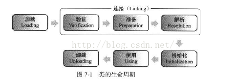

JVM类加载机制详解之JVM类加载过程
================================================================================
首先抛出几个自己学习过程中一直疑惑的问题：
+ 什么是类加载？什么时候进行类加载？
+ 什么是类初始化？什么时候进行类初始化？
+ 什么时候会为变量分配内存？
+ 什么时候会为变量赋默认初值？什么时候会为变量赋程序设定的初值？
+ 类加载器是什么？
+ 如何编写一个自定义的类加载器？

首先，在代码编译后，就会生成JVM（Java虚拟机）能够识别的二进制字节流文件（`*.class`）。而JVM把
Class文件中的类描述数据从文件加载到内存，并对数据进行校验、转换解析、初始化，使这些数据最终成为可
以被JVM直接使用的Java类型，这个说来简单但实际复杂的过程叫做 **JVM的类加载机制**。

**Class文件中的“类”从加载到JVM内存中，到卸载出内存过程有七个生命周期阶段。类加载机制包括了前五
个阶段**。如下图：

## 1.类的加载
我们平常说的加载大多不是指的类加载机制，只是类加载机制中的第一步加载。**在这个阶段，JVM主要完成三
件事**：
1. 通过一个类的全限定名（包名与类名）来获取定义此类的二进制字节流（Class文件）。而获取的方式，
可以通过jar包、war包、网络中获取、JSP文件生成等方式。
2. 将这个字节流所代表的静态存储结构转化为方法区的运行时数据结构。这里只是转化了数据结构，并未合并
数据。（**方法区就是用来存放已被加载的类信息，常量，静态变量，编译后的代码的运行时内存区域**）
3. 在内存中生成一个代表这个类的java.lang.Class对象，作为方法区这个类的各种数据的访问入口。这个
Class对象并没有规定是在Java堆内存中，它比较特殊，虽为对象，但存放在方法区中。

## 2.类的连接
类加载后生成了类的java.lang.Class对象，接着会进入连接阶段，**连接阶段负责将类的二进制数据合并
入JRE（Java运行时环境）中**。类的连接大致分 **三个阶段**。
1. **验证**：验证被加载后的类是否有正确的结构，类数据是否会符合虚拟机的要求，确保不会危害虚拟机
安全。
2. **准备：为类的静态变量（static filed）在方法区分配内存，并赋默认初值（0值或null值）**。如
`static int a = 100;` 静态变量`a`就会在准备阶段被赋默认值0。对于 **一般的成员变量是在类实例
化时候，随对象一起分配在堆内存中**。另外，**静态常量（static final filed）会在准备阶段赋程序
设定的初值**，如`static final int a = 666;` 静态常量`a`就会在准备阶段被直接赋值为666，对于
**静态变量，这个操作是在初始化阶段进行的**。
3. **解析**：将类的二进制数据中的 **符号引用换为直接引用**。

## 3.类的初始化
类初始化是类加载的最后一步，**除了加载阶段，用户可以通过自定义的类加载器参与，其他阶段都完全由虚
拟机主导和控制**。到了初始化阶段才真正执行Java代码。**类的初始化的主要工作是为静态变量赋程序设定
的初值**。如`static int a = 100;` **在准备阶段，`a`被赋默认值0，在初始化阶段就会被赋值为100**。
