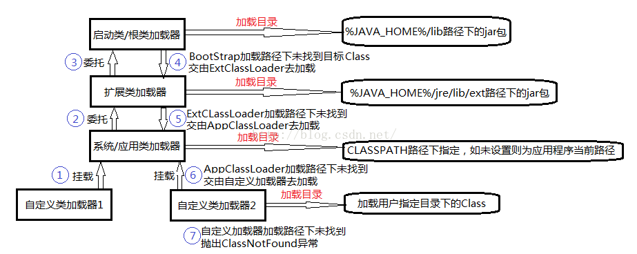

JVM类加载机制详解之类加载器与双亲委派模型
================================================================================
类加载机制的第一个阶段：类的加载。实现这个工作的代码块被称为：**类加载器**。

**类加载器的作用不仅仅是实现类的加载，它还与类的“相等”判定有关**，关系着Java“相等”判定方法的返
回结果，**只有在满足如下三个类“相等”判定条件，才能判定两个类相等**。
1. **两个类来自同一个Class文件**。
2. **两个类是由同一个虚拟机加载**。
3. **两个类是由同一个类加载器加载**。

## 1.Java“相等”判定相关方法
1. 判断两个实例对象的引用是否指向内存中同一个实例对象，使用Class对象的`equals()`方法：
`obj1.equals(obj2)`。
2. 判断实例对象是否为某个类、接口或其子类、子接口的实例对象，使用Class对象的`isInstance()`方
法：`class.isInstance(obj)`。
3. 判断实例对象是否为某个类、接口的实例，使用`instanceof`关键字：`obj instanceof class`。
4. **判断一个类是否为另一个类本身或其子类、子接口，可以使用Class对象的`isAssignableFrom()`方
法：`class1.isAssignableFrom(class2)`**。

## 2.JVM类加载器分类
+ **Bootstrap ClassLoader**：**启动类加载器**，也叫根类加载器，**它负责加载Java的核心类库**，
加载如(`$JAVA_HOME/lib`)目录下的`rt.jar`（包含System、String这样的核心类）这样的核心类库。
**根类加载器非常特殊，它不是java.lang.ClassLoader的子类，它是JVM自身内部由C/C++实现的，并不
是Java实现的**。
+ **Extension ClassLoader**：**扩展类加载器，它负责加载扩展目录(`$JAVA_HOME%/jre/lib/ext`)
下的jar包**，用户可以把自己开发的类打成jar包放在这个目录下即可扩展核心类以外的新功能。
+ **System ClassLoader\APP ClassLoader**：**系统类加载器或称为应用程序类加载器，是加载
CLASSPATH环境变量所指定的jar包与类路径**。一般来说，用户自定义的类就是由APP ClassLoader加载的。


## 3.各种类加载器间关系
以 **组合关系** 复用父类加载器的父子关系，注意，**这里的父子关系并不是以继承关系实现的**。
```java
public class Main {
    public static void main(String[] args) {
        //获取系统/应用类加载器
        ClassLoader appClassLoader = ClassLoader.getSystemClassLoader();
        System.out.printf("系统/应用类加载器：%s%s", appClassLoader, System.lineSeparator());
        //获取系统/应用类加载器的父类加载器，得到扩展类加载器
        ClassLoader extClassLoader = appClassLoader.getParent();
        System.out.printf("扩展类加载器：%s%s", extClassLoader, System.lineSeparator());
        System.out.printf("扩展类加载器的加载路径：%s%s", System.getProperty("java.ext.dirs"),
            System.lineSeparator());
        //获取扩展类加载器的父加载器，但因根类加载器并不是用Java实现的所以不能获取
        System.out.printf("扩展类的父类加载器：%s%s", extClassLoader.getParent(), System.lineSeparator());
    }
}
```

## 4.类加载器的双亲委派加载机制
**当一个类收到了类加载请求，他首先不会尝试自己去加载这个类，而是把这个请求委派给父类去完成，每一
个层次类加载器都是如此，因此所有的加载请求都应该传送到启动类加载其中，只有当父类加载器反馈自己无
法完成这个请求的时候（在它的加载路径下没有找到所需加载的Class），子类加载器才会尝试自己去加载**。

这个过程如下图标号过程所示：


